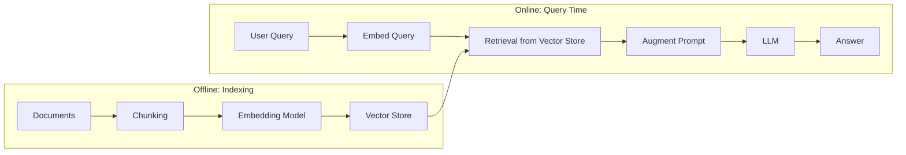

# 01. RAG Fundamentals

## Overview

Retrieval-Augmented Generation (RAG) is an architectural pattern that enhances Large Language Model (LLM) responses by dynamically injecting relevant external knowledge into the prompt at inference time. Instead of relying solely on knowledge baked into model weights during training, RAG retrieves fresh, domain-specific, or private information from an external knowledge base.

---

## Why This Exists

LLMs like GPT-4 and Claude are trained on massive corpora of text, but they have hard limits:

1. **Training cutoff** — Knowledge frozen at a point in time
2. **Private knowledge** — Cannot know your company's internal documents
3. **Context size** — Cannot fit entire knowledge bases in a prompt
4. **Hallucination** — Confidently generates plausible-but-wrong information when uncertain

RAG solves all four by separating the "what the model knows" from "what the model can look up."

---

## Problem Being Solved

```
Problem: "Answer questions about our internal security policies, which change quarterly."

Without RAG:
  - LLM doesn't know your policies
  - Fine-tuning is expensive and requires retraining every quarter
  - Stuffing all policies into every prompt wastes tokens and hits context limits

With RAG:
  - Policies stored in a vector database
  - Relevant sections retrieved per question
  - LLM generates answer grounded in retrieved text
```

More broadly, RAG solves the tension between:
- **Parametric knowledge** — stored in model weights (static, expensive to update)
- **Non-parametric knowledge** — stored in external databases (dynamic, cheap to update)

---

## Core Concepts

### Parametric vs. Non-Parametric Knowledge

| Type | Where Stored | Update Cost | Access Speed |
|------|-------------|-------------|--------------|
| Parametric | Model weights | Full retraining or fine-tuning | Instant (already in model) |
| Non-parametric | External DB | Upsert a document | Retrieval latency |

RAG makes LLMs into **hybrid systems** that combine both.

### The Knowledge Freshness Problem

LLMs go stale. GPT-4's training data has a cutoff. New CVEs, new regulations, new products — none of these exist in the model. RAG injects fresh knowledge without retraining.

### Hallucination and Grounding

Hallucination happens when a model generates text that is fluent and confident but factually wrong. This is not a bug — it's an emergent property of how language models work (next-token prediction doesn't guarantee factual accuracy).

RAG **grounds** the model by providing authoritative source text. A well-designed RAG system essentially says: "Only answer from this retrieved context, and if you don't find the answer there, say so."

### Context Windows as Retrieval Budget

Modern LLMs support 128K–1M token context windows. You could, in theory, stuff all your documents in. But:
- **Cost** scales with tokens
- **Attention dilution** — models perform worse with very long contexts
- **Latency** increases with context size
- **Relevance** — you want signal, not noise

RAG solves this by only injecting the *most relevant* chunks.

---

## Internal Architecture



Two pipelines:
1. **Indexing pipeline** (offline) — Processes documents into searchable vectors
2. **Query pipeline** (online) — Retrieves relevant chunks and augments LLM prompt

---

## Execution Flow

### Indexing Phase

```
1. Load documents (PDF, HTML, markdown, DB records, etc.)
2. Clean and preprocess (strip boilerplate, normalize whitespace)
3. Chunk documents into smaller pieces
4. Embed each chunk using an embedding model
5. Store (chunk_text, embedding_vector, metadata) in vector DB
```

### Query Phase

```
1. Receive user query
2. Embed the query using the same embedding model
3. Search vector DB for K most similar chunks (by cosine similarity)
4. Optionally: filter by metadata, rerank results
5. Build prompt: [system prompt] + [retrieved chunks] + [user query]
6. Send to LLM
7. Return response (optionally with citations)
```

---

## Basic Example

```python
# Minimal RAG in pure Python (framework-agnostic)
from openai import OpenAI
import numpy as np

client = OpenAI()

# Toy "vector store" (in production: Chroma, Qdrant, Pinecone, etc.)
DOCUMENTS = [
    "Our refund policy allows returns within 30 days of purchase.",
    "Products must be in original packaging to be eligible for return.",
    "Digital downloads are non-refundable after access is granted.",
]

def embed(text: str) -> list[float]:
    response = client.embeddings.create(
        model="text-embedding-3-small",
        input=text
    )
    return response.data[0].embedding

def cosine_similarity(a: list[float], b: list[float]) -> float:
    a, b = np.array(a), np.array(b)
    return float(np.dot(a, b) / (np.linalg.norm(a) * np.linalg.norm(b)))

def retrieve(query: str, k: int = 2) -> list[str]:
    query_emb = embed(query)
    doc_embs = [embed(doc) for doc in DOCUMENTS]
    scores = [(cosine_similarity(query_emb, e), doc) for e, doc in zip(doc_embs, DOCUMENTS)]
    scores.sort(reverse=True)
    return [doc for _, doc in scores[:k]]

def rag_answer(query: str) -> str:
    chunks = retrieve(query)
    context = "\n\n".join(chunks)
    
    response = client.chat.completions.create(
        model="gpt-4o-mini",
        messages=[
            {"role": "system", "content": "Answer ONLY based on the context below. If the answer is not in the context, say 'I don't know'."},
            {"role": "user", "content": f"Context:\n{context}\n\nQuestion: {query}"}
        ]
    )
    return response.choices[0].message.content

# Usage
print(rag_answer("Can I return a digital download?"))
# → "No, digital downloads are non-refundable after access is granted."
```

---

## Practical Example

```python
# Production-closer RAG with metadata and source citations
from dataclasses import dataclass, field
from openai import OpenAI
import numpy as np
import uuid

@dataclass
class Document:
    id: str = field(default_factory=lambda: str(uuid.uuid4()))
    text: str = ""
    embedding: list[float] = field(default_factory=list)
    metadata: dict = field(default_factory=dict)

@dataclass
class RetrievalResult:
    document: Document
    score: float

class SimpleRAGPipeline:
    def __init__(self, model: str = "gpt-4o-mini", embed_model: str = "text-embedding-3-small"):
        self.client = OpenAI()
        self.model = model
        self.embed_model = embed_model
        self.index: list[Document] = []

    def _embed(self, text: str) -> list[float]:
        resp = self.client.embeddings.create(model=self.embed_model, input=text)
        return resp.data[0].embedding

    def add_document(self, text: str, metadata: dict | None = None) -> Document:
        doc = Document(text=text, embedding=self._embed(text), metadata=metadata or {})
        self.index.append(doc)
        return doc

    def retrieve(self, query: str, k: int = 3) -> list[RetrievalResult]:
        q_emb = np.array(self._embed(query))
        results = []
        for doc in self.index:
            d_emb = np.array(doc.embedding)
            score = float(np.dot(q_emb, d_emb) / (np.linalg.norm(q_emb) * np.linalg.norm(d_emb)))
            results.append(RetrievalResult(document=doc, score=score))
        return sorted(results, key=lambda r: r.score, reverse=True)[:k]

    def query(self, question: str, k: int = 3) -> dict:
        results = self.retrieve(question, k=k)
        context_parts = []
        for i, r in enumerate(results, 1):
            source = r.document.metadata.get("source", f"doc_{i}")
            context_parts.append(f"[{i}] Source: {source}\n{r.document.text}")
        
        context = "\n\n".join(context_parts)
        system_prompt = (
            "You are a helpful assistant. Answer ONLY based on the provided context. "
            "Cite sources using [number] notation. "
            "If the answer is not in the context, respond: 'I don't have that information.'"
        )
        
        response = self.client.chat.completions.create(
            model=self.model,
            messages=[
                {"role": "system", "content": system_prompt},
                {"role": "user", "content": f"Context:\n{context}\n\nQuestion: {question}"}
            ]
        )
        
        return {
            "answer": response.choices[0].message.content,
            "sources": [r.document.metadata.get("source") for r in results],
            "scores": [r.score for r in results],
        }

# Usage
pipeline = SimpleRAGPipeline()
pipeline.add_document(
    "Kubernetes pods are the smallest deployable units.",
    metadata={"source": "k8s-docs", "section": "concepts"}
)
pipeline.add_document(
    "A Deployment ensures a specified number of pod replicas are running.",
    metadata={"source": "k8s-docs", "section": "workloads"}
)

result = pipeline.query("What is the smallest deployable unit in Kubernetes?")
print(result["answer"])
print("Sources:", result["sources"])
```

---

## Production Example

See [30. Complete Production Project](./30-complete-production-project.md) for a full-scale production RAG system. The key additions beyond the basic example:

- Async retrieval with connection pooling
- Persistent vector store (Qdrant/Chroma)
- Metadata filtering (by tenant, date, document type)
- Hybrid search (BM25 + dense)
- Reranking layer
- Streaming responses
- Evaluation and observability
- Rate limiting and auth

---

## Common Use Cases

| Use Case | Why RAG Fits |
|----------|-------------|
| Enterprise Q&A over internal docs | Docs are private, change frequently |
| Customer support bot | Product knowledge changes with releases |
| Legal document analysis | Jurisdiction-specific, high-stakes accuracy |
| Security threat intelligence | CVE database updates daily |
| Code assistant with private codebase | Model doesn't know your repo |
| Medical information retrieval | Requires authoritative sourcing |
| Financial analysis | Real-time data, regulatory requirements |

---

## When To Use

- You have domain-specific or private knowledge the model doesn't have
- Knowledge changes frequently (weekly, monthly)
- You need source attribution / auditability
- You want to reduce hallucination on factual questions
- Fine-tuning is too expensive or slow for your update cycle
- You need to serve multiple customers with different knowledge bases

---

## When Not To Use

- **Pure reasoning tasks** — Math proofs, code generation from specs don't need retrieval
- **Conversational chitchat** — No knowledge base needed
- **Very small knowledge bases** — If you have 50 docs, just stuff them in the prompt
- **Latency-critical real-time systems** — Sub-10ms SLAs don't accommodate retrieval round-trips
- **Highly structured data** — SQL databases are better for tabular, relational queries

---

## Common Mistakes

1. **Treating RAG as a chatbot feature, not a search system** — Retrieval quality is the bottleneck
2. **Not cleaning source documents** — Boilerplate text pollutes the index
3. **Using default chunk size (e.g., 1000 chars) without tuning** — Chunk size affects retrieval recall
4. **Not handling the "I don't know" case** — LLM will hallucinate if context is empty or irrelevant
5. **Embedding full documents instead of chunks** — Large embeddings lose granularity
6. **Using one embedding model for indexing, another for querying** — Vectors must be in the same space
7. **No metadata** — Without metadata you cannot filter, trace, or manage documents

---

## Best Practices

- **Separate indexing from query pipelines** — They have different SLAs
- **Version your embedding model** — Changing models requires full re-embedding
- **Design metadata schema upfront** — It's hard to add later
- **Use hybrid search** — Pure semantic search misses exact keyword matches
- **Measure retrieval quality independently** — Don't use LLM answer quality as a proxy
- **Implement graceful degradation** — If retrieval fails, respond with "I don't know" rather than hallucinating
- **Store source documents separately** — Vector DB stores embeddings; keep originals in object storage

---

## Production Patterns

### Pattern 1: Cache-Augmented RAG
```
Common queries → cached responses (avoid re-retrieval)
Cache key = semantic hash of query (not exact match)
TTL based on document update frequency
```

### Pattern 2: Tiered Retrieval
```
Fast path: Exact match cache → return immediately
Medium path: Metadata filter + vector search → return in 100ms
Slow path: Full corpus vector search → return in 500ms
```

### Pattern 3: Fallback Chain
```
1. Try: Local vector store (fast, cheap)
2. Fallback: Web search (fresh, broader)
3. Fallback: LLM general knowledge + disclaimer
```

---

## Performance Considerations

| Stage | Typical Latency | Optimization |
|-------|----------------|--------------|
| Query embedding | 10–50ms | Batch or cache |
| Vector search | 5–50ms | HNSW index, approximate search |
| Reranking | 50–200ms | Smaller reranker model |
| LLM generation | 500ms–5s | Streaming, smaller model |

Total naive RAG: ~600ms–5.5s  
Optimized RAG: ~200ms–2s

---

## Cost Optimization

- **Embedding cost** — $0.02/1M tokens (text-embedding-3-small). Embed once, reuse.
- **Retrieval cost** — Mostly infrastructure. Tune K to avoid over-fetching.
- **LLM cost** — Biggest cost. Compress context before sending. Use smaller models for simple queries.
- **Cache** — Semantic caching can reduce LLM calls by 30–60% for repeated queries.

---

## Security Considerations

- **Prompt injection** — Users can inject instructions via document content
- **Data leakage** — Retrieved chunks from one tenant visible to another
- **Source poisoning** — Malicious documents injected into the index
- **Access control** — Not all users should retrieve all documents

See [24. Security](./24-security.md) for complete coverage.

---

## Evaluation Metrics

| Metric | Measures | Tool |
|--------|---------|------|
| Retrieval Precision@K | Are retrieved chunks relevant? | RAGAS |
| Retrieval Recall | Are all relevant chunks found? | RAGAS |
| Faithfulness | Is the answer grounded in retrieved context? | RAGAS |
| Answer Relevance | Does the answer address the question? | RAGAS |
| Answer Correctness | Is the answer factually correct? | Human eval |

---

## Related Concepts

- [02. Information Retrieval Fundamentals](02-information-retrieval.md)
- [03. Embeddings](03-embeddings.md)
- [11. Naive RAG](11-naive-rag.md)
- [12. Advanced RAG](12-advanced-rag.md)
- [21. RAG Evaluation](21-rag-evaluation.md)

---

## Interview Questions

**Q: What is the difference between fine-tuning and RAG?**  
A: Fine-tuning bakes knowledge into weights (expensive, static). RAG retrieves knowledge at runtime (cheap to update, dynamic). RAG is preferred when knowledge changes frequently; fine-tuning is preferred for teaching the model style, format, or domain-specific reasoning patterns.

**Q: What is the "lost in the middle" problem?**  
A: LLMs perform best with relevant context at the beginning or end of the prompt. Context in the middle of long prompts is attended to less effectively. RAG systems should be aware of chunk ordering when building the context window.

**Q: Can RAG hallucinate?**  
A: Yes. RAG reduces but doesn't eliminate hallucination. The LLM can still hallucinate if: (1) retrieved chunks are irrelevant, (2) the model ignores the context, or (3) the answer requires reasoning beyond what's retrieved.

**Q: When would you choose a knowledge graph over a vector database for RAG?**  
A: When your domain has rich entity relationships, multi-hop reasoning is needed, or you need structured traversal. Example: "Find all vulnerabilities in libraries used by Service X" requires graph traversal, not similarity search.

---

## References

- Lewis, P. et al. (2020). [Retrieval-Augmented Generation for Knowledge-Intensive NLP Tasks](https://arxiv.org/abs/2005.11401)
- Gao, Y. et al. (2023). [RAG for LLMs: A Survey](https://arxiv.org/abs/2312.10997)
- Izacard, G. & Grave, E. (2021). [Leveraging Passage Retrieval with Generative Models for Open Domain QA](https://arxiv.org/abs/2007.01282)
- OpenAI. [Embeddings Guide](https://platform.openai.com/docs/guides/embeddings)

---

## Summary

RAG exists because LLMs have static, bounded knowledge. It solves knowledge freshness, privacy, hallucination, and context limits by retrieving relevant external knowledge at inference time. The core pattern is: **Embed documents → Store vectors → Embed query → Retrieve similar chunks → Augment prompt → Generate grounded answer**.

RAG is not a single algorithm — it's an architectural pattern with many variants (see topics 11–20). The fundamentals covered here apply to every RAG variant you'll encounter.
