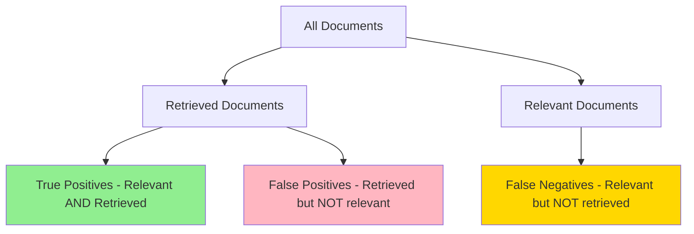
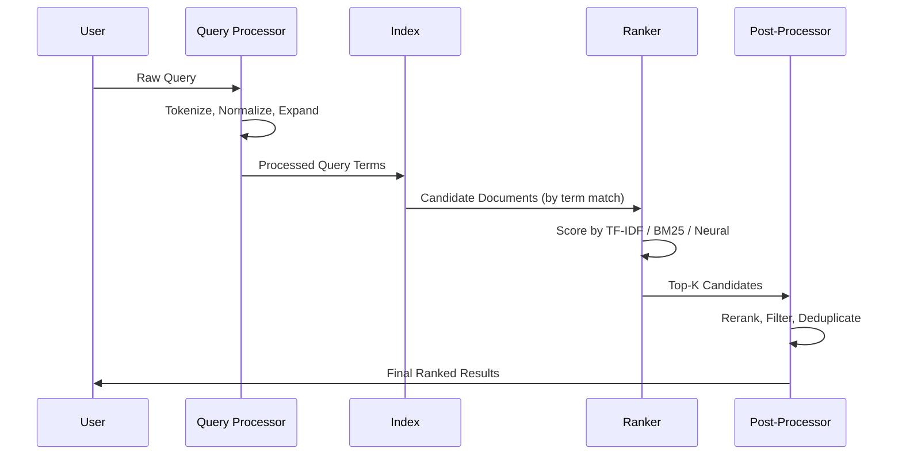

# 02. Information Retrieval Fundamentals

## Overview

Information Retrieval (IR) is the science of finding relevant information from large collections in response to a query. RAG is applied IR — every design decision in a RAG system maps back to classical IR concepts. Understanding IR fundamentals makes you a better RAG engineer.

---

## Why This Exists

Before RAG, before search engines, there was the problem: "I have 10,000 documents. How do I find the one that answers my question without reading all of them?"

IR solves this by building **indexes** — pre-computed data structures that enable fast lookup — and developing **ranking functions** that order results by estimated relevance.

---

## Problem Being Solved

```
Challenge: Given a collection C of N documents and a query Q,
efficiently return the subset of documents in C most relevant to Q.

Brute force: Compare Q to every document. O(N) per query. Fails at scale.
IR solution: Pre-compute inverted indexes and vector indexes. O(log N) per query.
```

---

## Core Concepts

### The Vocabulary of IR

| Term | Definition |
|------|-----------|
| **Query** | The information need expressed by the user |
| **Document** | Any unit of retrievable content (web page, paragraph, sentence) |
| **Corpus** | The collection of documents being searched |
| **Index** | Pre-computed data structure for fast retrieval |
| **Relevance** | How well a document satisfies the query's information need |
| **Ranking** | Ordering documents by estimated relevance |
| **Recall** | Fraction of relevant documents that were retrieved |
| **Precision** | Fraction of retrieved documents that are relevant |

### Precision and Recall

These are the two fundamental tradeoffs in any retrieval system:

```
Precision@K = (Relevant documents in top K) / K

Recall@K = (Relevant documents in top K) / (Total relevant documents)
```



**The precision-recall tradeoff:**
- Retrieve more documents → higher recall, lower precision
- Retrieve fewer documents → higher precision, lower recall
- RAG systems need both: retrieve only relevant chunks (precision) but don't miss any (recall)

### F1 Score

$$F_1 = 2 \times \frac{\text{Precision} \times \text{Recall}}{\text{Precision} + \text{Recall}}$$

Harmonic mean of precision and recall. Used as a single retrieval quality number.

### Mean Reciprocal Rank (MRR)

$$MRR = \frac{1}{|Q|} \sum_{i=1}^{|Q|} \frac{1}{\text{rank}_i}$$

Measures whether the first relevant result appears high in the ranking. Critical for RAG — you want the best chunk in position 1.

### Normalized Discounted Cumulative Gain (NDCG)

$$DCG_K = \sum_{i=1}^{K} \frac{rel_i}{\log_2(i+1)}$$

Rewards systems that put highly relevant documents at the top. Position matters. NDCG@5 is the gold standard for retrieval quality in production RAG systems.

---

## Internal Architecture

### Inverted Index (Keyword Search)

The foundation of keyword/BM25 search:

```
Documents:
  Doc1: "the cat sat on the mat"
  Doc2: "the cat ate the rat"
  Doc3: "the rat sat on the mat"

Inverted Index:
  "cat"  → {Doc1: [2], Doc2: [2]}
  "sat"  → {Doc1: [3], Doc3: [3]}
  "rat"  → {Doc2: [5], Doc3: [2]}
  "mat"  → {Doc1: [6], Doc3: [6]}

Query: "cat mat"
  → Docs containing "cat": {Doc1, Doc2}
  → Docs containing "mat": {Doc1, Doc3}
  → Intersection: {Doc1}  ← ranked first
```

Inverted indexes enable O(1) lookup per term. This is how Elasticsearch and BM25 work.

### Vector Index (Semantic Search)

Documents are embedded into a high-dimensional vector space. Similar documents cluster together. Query finds nearest neighbors:

```
Embedding space (simplified to 2D):
  [technical docs] ──────── [legal docs]
         |                        |
    [product docs]           [policy docs]

Query: "refund policy" → embeds near [policy docs]
Retrieved: policy-related documents, even without exact keyword match
```

See [03. Embeddings](03-embeddings.md) and [05. Vector Databases](05-vector-databases.md) for implementation details.

---

## Retrieval Models

### Boolean Retrieval

Oldest model. Documents either match or don't. No ranking.

```python
# Boolean AND query
def boolean_and(query_terms: list[str], index: dict) -> set[str]:
    result = None
    for term in query_terms:
        doc_set = set(index.get(term, []))
        result = doc_set if result is None else result & doc_set
    return result or set()
```

**Problem:** No notion of relevance — 10,000 documents might match.

### TF-IDF (Term Frequency–Inverse Document Frequency)

Classic ranking function. Scores how important a term is to a document relative to the corpus:

$$TF\text{-}IDF(t, d, D) = TF(t, d) \times IDF(t, D)$$

Where:
$$TF(t, d) = \frac{\text{count of } t \text{ in } d}{\text{total terms in } d}$$

$$IDF(t, D) = \log\left(\frac{N}{|\{d \in D : t \in d\}|}\right)$$

```python
import math
from collections import Counter

def compute_tfidf(term: str, document: list[str], corpus: list[list[str]]) -> float:
    # TF: how often term appears in this document
    tf = document.count(term) / len(document)
    
    # IDF: inverse of how many documents contain the term
    df = sum(1 for doc in corpus if term in doc)
    idf = math.log(len(corpus) / (df + 1))  # +1 for smoothing
    
    return tf * idf
```

**Insight:** Common words ("the", "is") get low IDF scores. Rare but discriminative words get high IDF.

### BM25 (Best Match 25)

The standard keyword retrieval algorithm. Improves TF-IDF with:
- Term frequency saturation (diminishing returns for repeated terms)
- Document length normalization

$$BM25(d, q) = \sum_{t \in q} IDF(t) \cdot \frac{TF(t,d) \cdot (k_1 + 1)}{TF(t,d) + k_1 \cdot \left(1 - b + b \cdot \frac{|d|}{avgdl}\right)}$$

Where:
- $k_1 \approx 1.5$ — controls term frequency saturation
- $b \approx 0.75$ — controls document length normalization
- $avgdl$ — average document length in corpus

```python
# BM25 using rank_bm25 library
from rank_bm25 import BM25Okapi

corpus = [
    "the cat sat on the mat",
    "the cat ate the rat",
    "the rat sat on the mat"
]

tokenized_corpus = [doc.split() for doc in corpus]
bm25 = BM25Okapi(tokenized_corpus)

query = "cat mat"
tokenized_query = query.split()
scores = bm25.get_scores(tokenized_query)
top_docs = bm25.get_top_n(tokenized_query, corpus, n=2)

print(scores)    # [0.82, 0.31, 0.41]
print(top_docs)  # ["the cat sat on the mat", "the rat sat on the mat"]
```

BM25 is the backbone of hybrid search in modern RAG systems.

---

## Execution Flow



---

## Basic Example

```python
# Complete IR pipeline from scratch
from collections import defaultdict, Counter
import math
import re

class SimpleIRSystem:
    def __init__(self):
        self.documents: list[str] = []
        self.inverted_index: dict[str, list[int]] = defaultdict(list)
        self.tfidf_cache: dict[tuple, float] = {}
    
    def _tokenize(self, text: str) -> list[str]:
        return re.findall(r'\b\w+\b', text.lower())
    
    def add_document(self, text: str) -> int:
        doc_id = len(self.documents)
        self.documents.append(text)
        
        for term in set(self._tokenize(text)):
            self.inverted_index[term].append(doc_id)
        
        return doc_id
    
    def _idf(self, term: str) -> float:
        df = len(self.inverted_index.get(term, []))
        if df == 0:
            return 0.0
        return math.log(len(self.documents) / df)
    
    def _tf(self, term: str, doc_id: int) -> float:
        tokens = self._tokenize(self.documents[doc_id])
        return tokens.count(term) / len(tokens) if tokens else 0.0
    
    def search(self, query: str, k: int = 5) -> list[tuple[int, float, str]]:
        query_terms = self._tokenize(query)
        
        # Candidate documents (union of postings lists)
        candidates = set()
        for term in query_terms:
            candidates.update(self.inverted_index.get(term, []))
        
        # Score each candidate
        scored = []
        for doc_id in candidates:
            score = sum(
                self._tf(term, doc_id) * self._idf(term)
                for term in query_terms
            )
            scored.append((doc_id, score, self.documents[doc_id]))
        
        return sorted(scored, key=lambda x: x[1], reverse=True)[:k]

# Usage
ir = SimpleIRSystem()
ir.add_document("Python is a programming language for data science")
ir.add_document("Machine learning uses Python and TensorFlow")
ir.add_document("Data science involves statistics and Python programming")

results = ir.search("Python data science")
for doc_id, score, text in results:
    print(f"[{score:.3f}] {text}")
```

---

## Practical Example

```python
# IR metrics evaluation
from dataclasses import dataclass

@dataclass
class RetrievalEvaluation:
    query: str
    retrieved_ids: list[str]
    relevant_ids: set[str]
    k: int

    def precision_at_k(self) -> float:
        top_k = self.retrieved_ids[:self.k]
        relevant_in_top_k = sum(1 for doc_id in top_k if doc_id in self.relevant_ids)
        return relevant_in_top_k / self.k if self.k > 0 else 0.0
    
    def recall_at_k(self) -> float:
        top_k = self.retrieved_ids[:self.k]
        relevant_in_top_k = sum(1 for doc_id in top_k if doc_id in self.relevant_ids)
        return relevant_in_top_k / len(self.relevant_ids) if self.relevant_ids else 0.0
    
    def reciprocal_rank(self) -> float:
        for rank, doc_id in enumerate(self.retrieved_ids, 1):
            if doc_id in self.relevant_ids:
                return 1.0 / rank
        return 0.0
    
    def ndcg_at_k(self) -> float:
        def dcg(order: list[str]) -> float:
            return sum(
                (1 if doc_id in self.relevant_ids else 0) / math.log2(i + 2)
                for i, doc_id in enumerate(order[:self.k])
            )
        
        ideal = sorted(self.retrieved_ids[:self.k], key=lambda d: d in self.relevant_ids, reverse=True)
        ideal_dcg = dcg(ideal)
        return dcg(self.retrieved_ids) / ideal_dcg if ideal_dcg > 0 else 0.0

# Evaluate a set of queries
def evaluate_retriever(evaluations: list[RetrievalEvaluation]) -> dict:
    return {
        "mean_precision": sum(e.precision_at_k() for e in evaluations) / len(evaluations),
        "mean_recall": sum(e.recall_at_k() for e in evaluations) / len(evaluations),
        "mrr": sum(e.reciprocal_rank() for e in evaluations) / len(evaluations),
        "mean_ndcg": sum(e.ndcg_at_k() for e in evaluations) / len(evaluations),
    }

import math
evals = [
    RetrievalEvaluation("python tutorial", ["doc1", "doc2", "doc3"], {"doc1", "doc3"}, k=3),
    RetrievalEvaluation("machine learning", ["doc4", "doc1", "doc5"], {"doc4"}, k=3),
]
metrics = evaluate_retriever(evals)
print(metrics)
```

---

## Production Example

```python
# Production IR evaluation pipeline with RAGAS-style metrics
import asyncio
from typing import Callable

class RetrievalBenchmark:
    """Automated evaluation of retrieval quality across a test set."""
    
    def __init__(self, retriever: Callable[[str, int], list[str]]):
        self.retriever = retriever
        self.test_cases: list[dict] = []
    
    def add_test_case(self, query: str, relevant_doc_ids: list[str]):
        self.test_cases.append({
            "query": query,
            "relevant_ids": set(relevant_doc_ids)
        })
    
    async def run(self, k: int = 5) -> dict:
        results = []
        for case in self.test_cases:
            retrieved = self.retriever(case["query"], k)
            eval_result = RetrievalEvaluation(
                query=case["query"],
                retrieved_ids=retrieved,
                relevant_ids=case["relevant_ids"],
                k=k
            )
            results.append(eval_result)
        
        metrics = evaluate_retriever(results)
        
        # Identify worst-performing queries
        worst = sorted(results, key=lambda r: r.precision_at_k())[:3]
        metrics["worst_queries"] = [
            {"query": r.query, "precision": r.precision_at_k()}
            for r in worst
        ]
        
        return metrics
```

---

## Common Use Cases

| IR Concept | RAG Application |
|-----------|----------------|
| Inverted index | BM25 in hybrid search |
| TF-IDF / BM25 | Keyword matching in sparse retrieval |
| NDCG@K | Measuring retrieval quality |
| MRR | Ensuring best chunk is ranked first |
| Precision@K | Tuning top-K parameter |
| Recall@K | Ensuring no relevant chunk is missed |
| Query expansion | Improving coverage for vague queries |

---

## When To Use

Apply IR principles whenever:
- Designing retrieval ranking functions
- Tuning the K parameter in top-K retrieval
- Evaluating whether your retrieval step is the bottleneck
- Choosing between keyword, semantic, or hybrid search
- Building evaluation datasets for RAG systems

---

## When Not To Use

Pure keyword IR (without semantic search) fails when:
- Query uses different vocabulary than documents (synonyms, paraphrases)
- Queries are conceptual ("explain the consequences of X") not keyword-like
- Documents are in multiple languages

---

## Common Mistakes

1. **Optimizing for precision only** — Miss critical context (low recall)
2. **Optimizing for recall only** — Flood LLM with irrelevant context (low precision)
3. **Not normalizing text** — Casing and punctuation affect BM25 scores
4. **Ignoring stop words** — "the", "is" inflate term frequency without adding meaning
5. **Never computing IR metrics** — Cannot know if retrieval improved or regressed

---

## Best Practices

- Always measure both precision and recall — they're always in tension
- Use NDCG@5 as your primary offline retrieval metric
- Build a "golden dataset" of (query, relevant_doc_ids) pairs
- Separate retrieval evaluation from generation evaluation
- Run IR metrics on every pipeline change (regression testing)
- Start with BM25 as baseline — it's surprisingly strong and fast

---

## Performance Considerations

| Algorithm | Index Build | Query Time | Memory |
|-----------|------------|------------|--------|
| Boolean | O(N×M) | O(K) | Low |
| TF-IDF | O(N×M) | O(V) | Medium |
| BM25 | O(N×M) | O(V) | Medium |
| Dense (FAISS) | O(N×d) | O(N) brute / O(log N) HNSW | High |

Where N=docs, M=avg terms per doc, V=vocab size, d=embedding dim, K=result count.

---

## Evaluation Metrics

| Metric | Formula | Range | Interpretation |
|--------|---------|-------|----------------|
| Precision@K | TP/(TP+FP) in top K | 0–1 | Higher = fewer irrelevant results |
| Recall@K | TP/(TP+FN) in top K | 0–1 | Higher = fewer missed relevant docs |
| F1@K | Harmonic mean of P@K, R@K | 0–1 | Balanced measure |
| MRR | Avg reciprocal rank of first relevant | 0–1 | Higher = relevant result appears earlier |
| NDCG@K | Normalized discounted CG | 0–1 | Higher = better ranking quality |
| MAP | Mean average precision | 0–1 | Over all queries, good overall metric |

---

## Related Concepts

- [03. Embeddings](03-embeddings.md) — Dense retrieval
- [09. Hybrid Search](09-hybrid-search.md) — Combining BM25 + dense
- [10. Reranking](10-reranking.md) — Second-stage ranking
- [21. RAG Evaluation](21-rag-evaluation.md) — Applying IR metrics to RAG

---

## Interview Questions

**Q: What's the difference between precision and recall? Which matters more for RAG?**  
A: Precision measures how many retrieved results are relevant. Recall measures how many relevant results were retrieved. For RAG, both matter: low precision floods the LLM with irrelevant context (wasted tokens, degraded answers); low recall misses critical information (incomplete answers). In practice, optimize recall first (don't miss important context), then precision (cut irrelevant noise).

**Q: Why is BM25 still used alongside neural search in 2024?**  
A: BM25 excels at exact keyword matching, product codes, named entities, and short queries. Neural search excels at semantic similarity. Hybrid search (BM25 + dense) consistently outperforms either alone on most benchmarks.

**Q: What is the "vocabulary mismatch problem"?**  
A: When the user's query uses different words than the document ("automobile" vs "car"). TF-IDF and BM25 fail here because they match on exact terms. Dense embeddings solve this by mapping semantically similar concepts to nearby vectors.

---

## References

- Manning, C. et al. (2008). [Introduction to Information Retrieval](https://nlp.stanford.edu/IR-book/)
- Robertson, S. & Zaragoza, H. (2009). [The Probabilistic Relevance Framework: BM25 and Beyond](https://www.staff.city.ac.uk/~sb317/papers/foundations_bm25_review.pdf)
- Järvelin, K. & Kekäläinen, J. (2002). Cumulated Gain-Based Evaluation of IR Techniques. ACM TOIS.

---

## Summary

Information Retrieval is the scientific foundation of RAG. The core metrics — precision, recall, MRR, NDCG — directly measure retrieval quality. BM25 remains a strong baseline for keyword matching. Dense/vector retrieval solves vocabulary mismatch. Hybrid search combines both. Every RAG system is an IR system — and treating it as one (with proper evaluation) is what separates production RAG from demo RAG.
