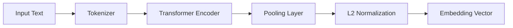
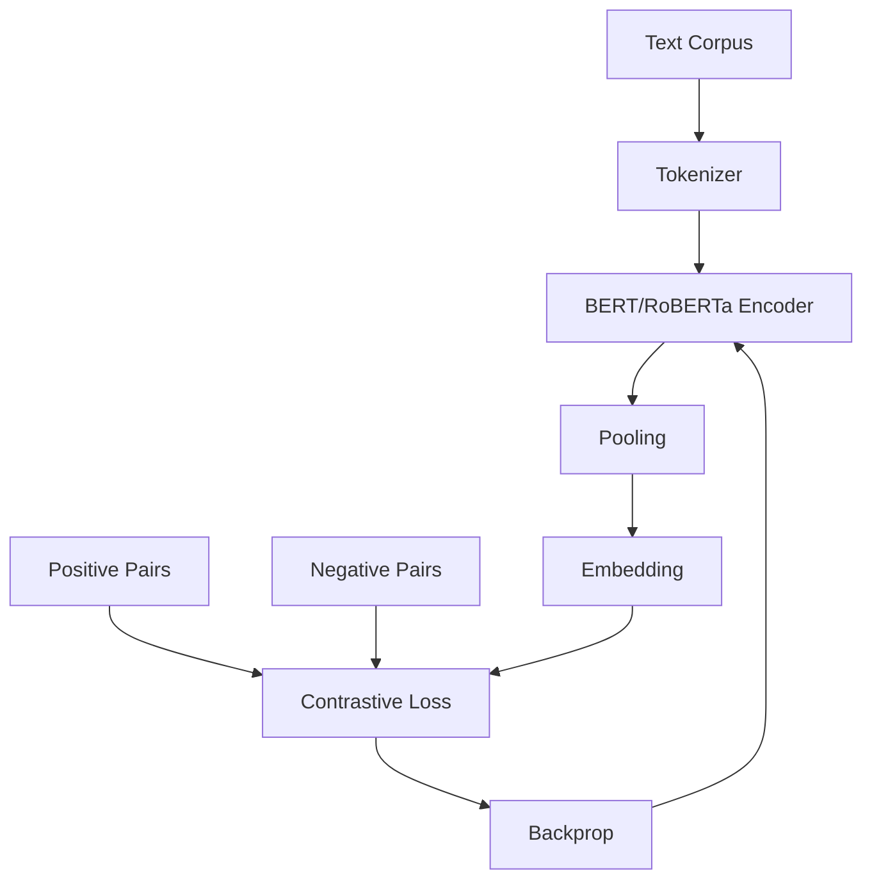
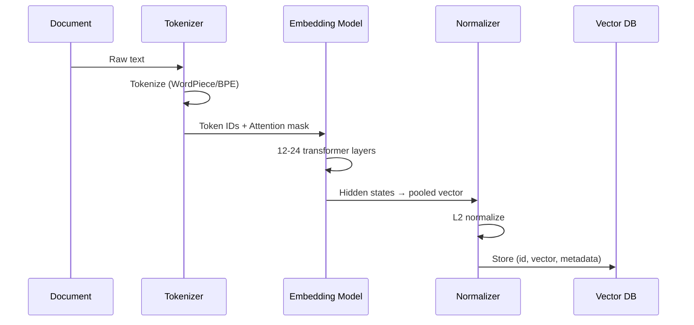

# 03. Embeddings

## Overview

Embeddings are dense numerical representations of text (or images, audio, code, etc.) in a high-dimensional vector space where semantic similarity corresponds to geometric proximity. They are the foundational technology enabling semantic search in RAG systems.

---

## Why This Exists

Computers can't understand meaning — they operate on numbers. Embeddings bridge that gap by mapping discrete symbols (words, sentences, documents) to continuous vector spaces where:
- "dog" and "puppy" are close
- "king - man + woman ≈ queen"
- A question about Python and a tutorial on Python have similar vectors

Without embeddings, RAG would be limited to keyword matching (BM25), which fails on paraphrase, synonymy, and conceptual queries.

---

## Problem Being Solved

```
Problem: Find documents relevant to "how do I restart a web server"

BM25 matches: "restart", "web", "server" → misses:
  - "reload nginx configuration"
  - "bounce the application process"
  - "service apache2 restart"

Embeddings match: All of the above, because they cluster semantically
  - "restart web server" ≈ "reload nginx" ≈ "restart apache service"
  in the embedding space
```

---

## Core Concepts

### What Is a Vector?

An embedding is just a list of floating-point numbers:

```python
"hello world" → [0.021, -0.134, 0.782, ..., 0.003]  # 1536 dimensions for ada-002
```

Each dimension encodes some learned feature of the input. The dimensions aren't individually interpretable — the meaning is encoded in the geometric relationships between vectors.

### The Embedding Space

```
              [programming]
                   |
     [Python] --- [code] --- [JavaScript]
                   |
              [debugging]

     [dog] --- [pet] --- [cat]
                |
             [animal]

The space encodes semantic proximity.
```

### Why High Dimensionality?

In low dimensions (2D, 3D), you can't encode enough semantic distinctions. Modern embeddings use 768–3072 dimensions. The "curse of dimensionality" is managed by specialized data structures (HNSW, IVF).

---

## Embedding Models

### Architecture: Transformer-Based Encoders

Most modern embedding models are bidirectional transformers (BERT-style) trained with contrastive learning objectives:



**Pooling strategies:**
- **[CLS] token** — Use the classification token representation (BERT)
- **Mean pooling** — Average all token representations (most common today)
- **Max pooling** — Take maximum across token representations

### Key Models Comparison

| Model | Dimensions | Max Tokens | Context | Cost | Notes |
|-------|-----------|-----------|---------|------|-------|
| `text-embedding-3-small` | 1536 | 8192 | English-focused | $0.02/1M | Best price/perf |
| `text-embedding-3-large` | 3072 | 8192 | Multilingual | $0.13/1M | Highest accuracy |
| `text-embedding-ada-002` | 1536 | 8192 | General | $0.10/1M | Legacy |
| `sentence-transformers/all-MiniLM-L6-v2` | 384 | 256 | English | Free | Local, fast |
| `BAAI/bge-large-en-v1.5` | 1024 | 512 | English | Free | Strong local |
| `intfloat/e5-large-v2` | 1024 | 512 | English | Free | Instruction-tuned |
| `nomic-embed-text-v1.5` | 768 | 8192 | English | Free | Long context local |
| `voyage-large-2` | 1536 | 16000 | General | Commercial | Strong for RAG |

### Training Objectives

**Contrastive Learning (SimCSE, MNRL):**
```
Positive pair: (query, relevant_document) → vectors should be close
Negative pair: (query, irrelevant_document) → vectors should be far

Loss = -log(sim(q, d+) / sum(sim(q, d-)))
```

**Instruction-Tuned Embeddings (E5, BGE):**
```
Prepend task instruction:
  "Represent this sentence for searching relevant passages: {query}"
  "Represent this passage for retrieval: {document}"
```

Instruction-tuned models are strongly preferred for asymmetric retrieval (short query → long document).

---

## Similarity Measures

### Cosine Similarity

Most common. Measures the angle between vectors, ignoring magnitude:

$$\cos(\theta) = \frac{\vec{a} \cdot \vec{b}}{|\vec{a}| \cdot |\vec{b}|}$$

```python
import numpy as np

def cosine_similarity(a: np.ndarray, b: np.ndarray) -> float:
    return np.dot(a, b) / (np.linalg.norm(a) * np.linalg.norm(b))
```

- Range: [-1, 1]. In practice (normalized embeddings): [0, 1]
- 1.0 = identical, 0.0 = orthogonal (unrelated), -1.0 = opposite

### Dot Product

$$\vec{a} \cdot \vec{b} = \sum_i a_i \cdot b_i$$

```python
def dot_product(a: np.ndarray, b: np.ndarray) -> float:
    return np.dot(a, b)
```

- Equivalent to cosine similarity when vectors are L2-normalized
- Faster (no division). Most vector DBs normalize and use dot product internally.

### Euclidean Distance (L2)

$$d(a, b) = \sqrt{\sum_i (a_i - b_i)^2}$$

```python
def euclidean_distance(a: np.ndarray, b: np.ndarray) -> float:
    return np.linalg.norm(a - b)
```

- Smaller = more similar
- Less common for text embeddings (cosine preferred)
- Used in some vector DBs for HNSW indexing

### Which to Use?

```
Cosine similarity: When you care about direction, not magnitude (most text embeddings)
Dot product: Same as cosine for normalized vectors, faster
Euclidean: When magnitude matters (rarely for text)
```

**Rule:** L2-normalize all vectors, then use dot product = cosine similarity with better performance.

---

## Internal Architecture

### Training a Sentence Transformer



### Asymmetric vs. Symmetric Retrieval

**Symmetric:** Query and documents have similar length and style  
```
Query: "What is photosynthesis?"
Document: "What is photosynthesis?" (FAQ-style)
```

**Asymmetric:** Short query, long document (most RAG use cases)
```
Query: "photosynthesis"  (short)
Document: "Photosynthesis is the process by which plants..." (paragraph)
```

Asymmetric retrieval benefits from instruction-tuned models (E5, BGE) that handle the query/document asymmetry explicitly.

---

## Execution Flow



---

## Basic Example

```python
# Embedding generation and similarity search
from sentence_transformers import SentenceTransformer
import numpy as np
from typing import NamedTuple

class SearchResult(NamedTuple):
    text: str
    score: float
    index: int

class EmbeddingSearchEngine:
    def __init__(self, model_name: str = "BAAI/bge-small-en-v1.5"):
        self.model = SentenceTransformer(model_name)
        self.documents: list[str] = []
        self.embeddings: np.ndarray | None = None
    
    def add_documents(self, docs: list[str]) -> None:
        self.documents.extend(docs)
        new_embeddings = self.model.encode(
            docs,
            normalize_embeddings=True,  # L2 normalize
            show_progress_bar=False
        )
        if self.embeddings is None:
            self.embeddings = new_embeddings
        else:
            self.embeddings = np.vstack([self.embeddings, new_embeddings])
    
    def search(self, query: str, k: int = 5) -> list[SearchResult]:
        # Prefix for asymmetric search (BGE-specific)
        prefixed_query = f"Represent this sentence for searching relevant passages: {query}"
        
        query_embedding = self.model.encode(
            [prefixed_query],
            normalize_embeddings=True
        )[0]
        
        # Dot product = cosine similarity for normalized vectors
        scores = self.embeddings @ query_embedding
        top_k_indices = np.argsort(scores)[::-1][:k]
        
        return [
            SearchResult(
                text=self.documents[i],
                score=float(scores[i]),
                index=i
            )
            for i in top_k_indices
        ]

# Usage
engine = EmbeddingSearchEngine()
engine.add_documents([
    "Python is a high-level programming language",
    "Machine learning models require large datasets",
    "Neural networks are inspired by the human brain",
    "Docker containers isolate application environments",
    "REST APIs use HTTP methods for communication",
])

results = engine.search("web service architecture patterns", k=3)
for r in results:
    print(f"[{r.score:.4f}] {r.text}")
```

---

## Practical Example

```python
# Comparing embedding models for RAG
import time
from openai import OpenAI
from sentence_transformers import SentenceTransformer

def benchmark_embedding_model(
    model_name: str,
    documents: list[str],
    queries: list[str]
) -> dict:
    """Benchmark embedding model on speed and similarity distribution."""
    
    if model_name.startswith("text-embedding"):
        client = OpenAI()
        
        start = time.perf_counter()
        doc_embeddings = client.embeddings.create(
            model=model_name, input=documents
        ).data
        embed_time = time.perf_counter() - start
        
        doc_vecs = np.array([e.embedding for e in doc_embeddings])
    else:
        model = SentenceTransformer(model_name)
        
        start = time.perf_counter()
        doc_vecs = model.encode(documents, normalize_embeddings=True)
        embed_time = time.perf_counter() - start
    
    return {
        "model": model_name,
        "embed_time_per_doc_ms": (embed_time / len(documents)) * 1000,
        "dimensions": doc_vecs.shape[1],
        "doc_count": len(documents),
    }
```

---

## Production Example

```python
# Production embedding service with caching and batching
import asyncio
import hashlib
import json
from functools import lru_cache
from openai import AsyncOpenAI

class ProductionEmbeddingService:
    """
    Production-grade embedding service with:
    - Async batching
    - Redis caching (embeddings are expensive to recompute)
    - Rate limit handling
    - Model versioning
    """
    
    def __init__(
        self,
        model: str = "text-embedding-3-small",
        batch_size: int = 100,
        cache_ttl: int = 86400 * 30,  # 30 days
    ):
        self.client = AsyncOpenAI()
        self.model = model
        self.batch_size = batch_size
        self.cache_ttl = cache_ttl
        self._cache: dict[str, list[float]] = {}  # Replace with Redis in production
    
    def _cache_key(self, text: str) -> str:
        return hashlib.sha256(f"{self.model}:{text}".encode()).hexdigest()
    
    async def embed_single(self, text: str) -> list[float]:
        key = self._cache_key(text)
        if key in self._cache:
            return self._cache[key]
        
        response = await self.client.embeddings.create(
            model=self.model, input=text
        )
        embedding = response.data[0].embedding
        self._cache[key] = embedding
        return embedding
    
    async def embed_batch(self, texts: list[str]) -> list[list[float]]:
        """Embed a list of texts with batching and caching."""
        results = [None] * len(texts)
        uncached_indices = []
        uncached_texts = []
        
        for i, text in enumerate(texts):
            key = self._cache_key(text)
            if key in self._cache:
                results[i] = self._cache[key]
            else:
                uncached_indices.append(i)
                uncached_texts.append(text)
        
        # Batch uncached texts
        for batch_start in range(0, len(uncached_texts), self.batch_size):
            batch = uncached_texts[batch_start:batch_start + self.batch_size]
            batch_indices = uncached_indices[batch_start:batch_start + self.batch_size]
            
            response = await self.client.embeddings.create(
                model=self.model, input=batch
            )
            
            for j, embedding_data in enumerate(response.data):
                idx = batch_indices[j]
                embedding = embedding_data.embedding
                results[idx] = embedding
                self._cache[self._cache_key(batch[j])] = embedding
        
        return results
    
    def get_model_info(self) -> dict:
        return {
            "model": self.model,
            "dimensions": {
                "text-embedding-3-small": 1536,
                "text-embedding-3-large": 3072,
                "text-embedding-ada-002": 1536,
            }.get(self.model, "unknown"),
        }
```

---

## Common Use Cases

| Use Case | Recommended Model | Notes |
|----------|------------------|-------|
| English-only RAG | `bge-large-en-v1.5` or `text-embedding-3-small` | Fast and accurate |
| Multilingual RAG | `text-embedding-3-large` or `multilingual-e5-large` | Handles 100+ languages |
| Code search | `voyage-code-2` or `text-embedding-3-small` | Code-specific models exist |
| Local / private | `BAAI/bge-large-en-v1.5` | No API calls needed |
| High-accuracy commercial | `voyage-large-2-instruct` | State-of-the-art as of 2024 |

---

## When To Use

- Any semantic similarity search task
- RAG retrieval (replacing or augmenting BM25)
- Document clustering and deduplication
- Semantic caching of LLM responses
- Cross-lingual retrieval (query in English, docs in French)

---

## When Not To Use

- **Exact keyword matching** — Use BM25 for product IDs, error codes, exact names
- **Structured data** — SQL is better for filtering, aggregation, numeric ranges
- **Very short texts (<10 words)** — Embeddings are less discriminative for very short texts
- **Real-time streaming** — Embedding latency (10–100ms) may be too high

---

## Common Mistakes

1. **Mixing embedding models** — Indexing with model A, querying with model B. Vectors are incomparable.
2. **Not normalizing vectors** — Dot product ≠ cosine similarity for unnormalized vectors.
3. **Truncating text at model max tokens silently** — Content after token limit is ignored.
4. **Embedding metadata separately** — Don't embed "Document title: X, Source: Y, Content: Z" — the metadata dilutes the content signal.
5. **Using ada-002 in 2024** — `text-embedding-3-small` is cheaper and better.
6. **Not pinning the embedding model version** — Re-embedding is required if model changes.

---

## Best Practices

- **L2-normalize all embeddings** — Enables dot product instead of cosine (faster)
- **Pin embedding model version** — Document which model version was used for each index
- **Cache embeddings aggressively** — Recomputing is expensive; embeddings don't change for the same text
- **Use instruction prefixes** for asymmetric retrieval (E5, BGE models)
- **Evaluate embedding quality on your domain** — Generic benchmarks don't predict domain performance
- **Consider matryoshka embeddings** — `text-embedding-3` models support truncated dimensions for speed

---

## Production Patterns

### Matryoshka Embeddings (Dimension Reduction)

```python
# OpenAI text-embedding-3 supports reduced dimensions
response = client.embeddings.create(
    model="text-embedding-3-small",
    input="your text",
    dimensions=256  # Reduce from 1536 → 256, ~6x cheaper storage
)
# Slight accuracy loss, significant cost reduction
```

### Embedding Version Migration

```python
# When upgrading embedding models, you need to re-embed everything
# Strategy: dual-write during migration

class EmbeddingMigration:
    def __init__(self, old_model: str, new_model: str):
        self.old = ProductionEmbeddingService(model=old_model)
        self.new = ProductionEmbeddingService(model=new_model)
        self.migration_complete = False
    
    async def embed(self, text: str) -> list[float]:
        if self.migration_complete:
            return await self.new.embed_single(text)
        # Dual-write during migration
        old_emb, new_emb = await asyncio.gather(
            self.old.embed_single(text),
            self.new.embed_single(text)
        )
        return new_emb  # Use new for queries, both stored
```

---

## Performance Considerations

| Operation | Latency | Throughput | Notes |
|-----------|---------|-----------|-------|
| Single embed (API) | 20–80ms | ~100/s | Network bound |
| Batch embed (API, 100) | 100–300ms | ~1000/s | Much more efficient |
| Local embed (bge-small) | 2–10ms | ~500/s | CPU |
| Local embed (bge-large, GPU) | 5–20ms | ~2000/s | GPU |

**Optimization:** Always batch embeddings. Single-document embedding has high overhead per doc.

---

## Cost Optimization

| Model | Cost/1M tokens | 1M docs × 300 tokens each |
|-------|---------------|--------------------------|
| text-embedding-3-small | $0.020 | $6.00 |
| text-embedding-3-large | $0.130 | $39.00 |
| text-embedding-ada-002 | $0.100 | $30.00 |
| Local (bge-large) | $0.000 | ~$0 (compute cost) |

**Strategies:**
- Cache embeddings (recompute only on document change)
- Use smaller dimensions (matryoshka)
- Use local models for high-volume workloads
- Deduplicate documents before embedding

---

## Security Considerations

- **Embedding inversion** — Research shows embeddings can be partially reversed to recover original text. Don't embed PII.
- **Model fingerprinting** — Embeddings can reveal which model was used (information leakage in API contexts)
- **Adversarial inputs** — Crafted inputs can produce embeddings that collide with sensitive documents

---

## Evaluation Metrics

| Metric | What It Measures |
|--------|-----------------|
| MTEB Score | Overall embedding quality across 56 tasks |
| Retrieval NDCG@10 | Ranking quality for retrieval tasks |
| Semantic Similarity Pearson | How well similarity scores correlate with human judgments |
| Clustering NMI | How well embeddings cluster semantically |

Check [MTEB Leaderboard](https://huggingface.co/spaces/mteb/leaderboard) for current rankings.

---

## Related Concepts

- [02. Information Retrieval Fundamentals](02-information-retrieval.md)
- [05. Vector Databases](05-vector-databases.md)
- [09. Hybrid Search](09-hybrid-search.md)
- [10. Reranking](10-reranking.md)

---

## Interview Questions

**Q: What happens if you use different embedding models for indexing and querying?**  
A: Results are meaningless. Embeddings from different models live in incompatible vector spaces. The cosine similarity between them has no semantic meaning. You must use the exact same model (and ideally the same version) for both indexing and querying.

**Q: Why do embeddings use 1536 or 3072 dimensions?**  
A: Dimensionality is a hyperparameter chosen during training. Higher dims allow encoding more semantic distinctions but increase storage and computation. Values like 768, 1024, 1536, 3072 are powers-of-2-friendly for hardware optimization.

**Q: What is the difference between a bi-encoder and a cross-encoder?**  
A: A bi-encoder encodes query and document independently, producing two vectors compared by dot product (fast, used for retrieval). A cross-encoder concatenates query and document and runs them through a single encoder (slow, used for reranking). Cross-encoders are more accurate but cannot scale to full corpus search.

---

## References

- Reimers, N. & Gurevych, I. (2019). [Sentence-BERT: Sentence Embeddings using Siamese BERT-Networks](https://arxiv.org/abs/1908.10084)
- Wang, L. et al. (2022). [Text Embeddings by Weakly-Supervised Contrastive Pre-training (E5)](https://arxiv.org/abs/2212.03533)
- [MTEB: Massive Text Embedding Benchmark](https://arxiv.org/abs/2210.07316)
- OpenAI. [New Embedding Models and API Updates](https://openai.com/blog/new-embedding-models-and-api-updates)

---

## Summary

Embeddings map text to vectors in a semantic space where proximity means similarity. They are the engine of semantic search in RAG. Key choices: model selection (API vs. local), dimensionality, similarity metric, and instruction-tuning strategy. Always L2-normalize, pin model versions, and cache aggressively. The quality of your embeddings directly bounds the quality of your retrieval, which bounds the quality of your answers.
