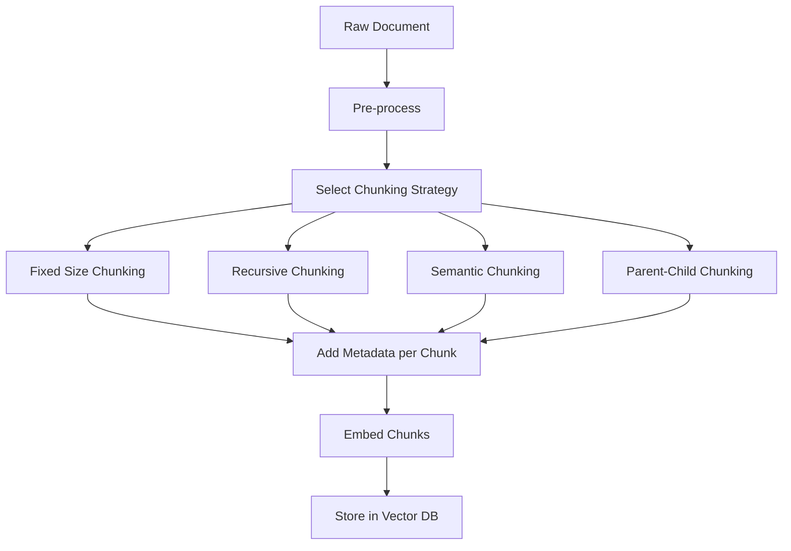

# 04. Chunking Strategies

## Overview

Chunking is the process of splitting large documents into smaller pieces before embedding and storing them in a vector database. Chunk design is arguably the most impactful decision in a RAG pipeline — it determines what information can be retrieved, at what granularity, and with what context. Bad chunking is one of the top root causes of poor RAG performance.

---

## Why This Exists

Embedding models have a maximum token limit (typically 512–8192 tokens). Even without that limit, embedding large documents produces coarse vectors that poorly represent any specific sub-topic. And sending full documents to the LLM wastes tokens.

Chunking solves three problems:
1. **Model constraints** — Documents exceed embedding model context windows
2. **Retrieval granularity** — Large chunks have many topics; similarity search returns semi-relevant results
3. **LLM context efficiency** — You want to inject the *relevant paragraph*, not the entire document

---

## Problem Being Solved

```
Document: 50-page technical specification (25,000 tokens)

Problem 1 - Embedding: Cannot embed 25K tokens (model limit: 512 tokens)

Problem 2 - Granularity:
  Query: "What is the timeout for connection retries?"
  If embedded as one chunk: The embedding represents ALL 50 pages
  → Similarity search returns the whole doc but nothing specific
  → LLM gets 25K tokens (expensive, exceeds context window)

Solution: Chunk into 200–500 token pieces
  → Each chunk covers one topic
  → Retrieve only the 3–5 most relevant chunks (~1000–2500 tokens)
  → LLM gets focused, relevant context
```

---

## Core Concepts

### Chunk Size vs. Context Quality Tradeoff

```
Small chunks (50–100 tokens):
  ✓ Precise retrieval — returned chunk directly answers query
  ✗ Missing context — chunk lacks surrounding information for LLM to reason
  ✗ Higher storage/compute — more chunks to index and search

Large chunks (500–1000 tokens):
  ✓ Rich context — LLM has enough surrounding information
  ✗ Noisy retrieval — chunk contains multiple topics, similarity is diluted
  ✗ Token waste — most of the chunk may be irrelevant to the query

Sweet spot: 200–400 tokens for most use cases
```

### Chunk Overlap

Adjacent chunks should share some text to prevent context from being split at the boundary:

```
Without overlap:
  Chunk 1: "...The connection timeout is 30 seconds. After timeout,"
  Chunk 2: "the system retries 3 times before..."

With overlap (50 tokens):
  Chunk 1: "...The connection timeout is 30 seconds. After timeout, the system"
  Chunk 2: "After timeout, the system retries 3 times before..."
```

Overlap of 10–20% of chunk size is typical.

---

## Chunking Strategies

### 1. Fixed-Size Chunking

Split documents into chunks of exactly N characters/tokens, with optional overlap.

```python
from typing import Generator

def fixed_size_chunk(
    text: str,
    chunk_size: int = 1000,
    overlap: int = 200,
) -> Generator[str, None, None]:
    """Split text into fixed-size chunks with overlap."""
    start = 0
    while start < len(text):
        end = start + chunk_size
        yield text[start:end]
        start = end - overlap  # Move back by overlap amount

# Usage
doc = "Long document text here..." * 100
chunks = list(fixed_size_chunk(doc, chunk_size=500, overlap=100))
```

**Pros:**
- Simple to implement
- Predictable chunk count and size
- No NLP dependencies

**Cons:**
- Splits mid-sentence, mid-paragraph — breaks semantic units
- No awareness of document structure
- Poor for structured content (tables, code, lists)

**When to use:** Quick prototyping, unstructured text where sentence boundaries don't matter much.

---

### 2. Recursive Character-Based Chunking

The most practical approach. Splits on a hierarchy of separators, trying each until chunks are small enough:

```python
class RecursiveChunker:
    """
    Splits on paragraph breaks, then sentence breaks, then word breaks.
    Tries to keep semantic units intact.
    """
    
    DEFAULT_SEPARATORS = ["\n\n", "\n", ". ", "! ", "? ", ", ", " ", ""]
    
    def __init__(
        self,
        chunk_size: int = 1000,
        chunk_overlap: int = 200,
        separators: list[str] | None = None,
    ):
        self.chunk_size = chunk_size
        self.chunk_overlap = chunk_overlap
        self.separators = separators or self.DEFAULT_SEPARATORS
    
    def split(self, text: str) -> list[str]:
        return self._split_text(text, self.separators)
    
    def _split_text(self, text: str, separators: list[str]) -> list[str]:
        chunks = []
        separator = ""
        new_separators = []
        
        # Find the best separator that creates chunks within size limit
        for i, sep in enumerate(separators):
            if sep == "" or sep in text:
                separator = sep
                new_separators = separators[i + 1:]
                break
        
        # Split on chosen separator
        splits = text.split(separator) if separator else [text]
        
        current_chunks = []
        current_length = 0
        
        for split in splits:
            split_len = len(split)
            
            if split_len > self.chunk_size:
                # This split is still too large, recurse
                if current_chunks:
                    chunks.append(separator.join(current_chunks))
                    current_chunks = []
                    current_length = 0
                
                if new_separators:
                    sub_chunks = self._split_text(split, new_separators)
                    chunks.extend(sub_chunks)
                else:
                    chunks.append(split)
            elif current_length + split_len + len(separator) > self.chunk_size:
                # Adding this split would exceed limit — emit current and start new
                if current_chunks:
                    chunks.append(separator.join(current_chunks))
                    # Keep overlap
                    overlap_chunks = []
                    overlap_len = 0
                    for c in reversed(current_chunks):
                        if overlap_len + len(c) > self.chunk_overlap:
                            break
                        overlap_chunks.insert(0, c)
                        overlap_len += len(c) + len(separator)
                    current_chunks = overlap_chunks
                    current_length = overlap_len
                
                current_chunks.append(split)
                current_length += split_len
            else:
                current_chunks.append(split)
                current_length += split_len + len(separator)
        
        if current_chunks:
            chunks.append(separator.join(current_chunks))
        
        return [c for c in chunks if c.strip()]

# Usage
chunker = RecursiveChunker(chunk_size=500, chunk_overlap=100)
chunks = chunker.split("""
# Introduction

This document describes the API specification.

## Authentication

All requests must include an Authorization header.

The token expires after 24 hours.

## Rate Limiting

Requests are limited to 100 per minute per API key.
""")
for i, chunk in enumerate(chunks):
    print(f"Chunk {i}: {len(chunk)} chars → {chunk[:80]}...")
```

**Pros:**
- Respects natural text boundaries (paragraphs, sentences)
- Consistent chunk sizes with minimal boundary cutting
- Works well for most prose documents

**Cons:**
- Still no semantic awareness
- May produce chunks that are thematically unrelated

**When to use:** Default choice for most RAG use cases with prose documents.

---

### 3. Semantic Chunking

Splits based on semantic coherence — chunks are formed where topic shifts occur in the embedding space.

```python
import numpy as np
from sentence_transformers import SentenceTransformer

class SemanticChunker:
    """
    Split text where embedding similarity between consecutive sentences drops.
    High drop = topic change = good split point.
    """
    
    def __init__(
        self,
        model_name: str = "BAAI/bge-small-en-v1.5",
        breakpoint_percentile: float = 95.0,
        min_chunk_size: int = 100,
    ):
        self.model = SentenceTransformer(model_name)
        self.breakpoint_percentile = breakpoint_percentile
        self.min_chunk_size = min_chunk_size
    
    def _split_sentences(self, text: str) -> list[str]:
        """Simple sentence splitter. Use spacy/nltk in production."""
        import re
        sentences = re.split(r'(?<=[.!?])\s+', text)
        return [s.strip() for s in sentences if s.strip()]
    
    def split(self, text: str) -> list[str]:
        sentences = self._split_sentences(text)
        if len(sentences) <= 1:
            return sentences
        
        # Embed all sentences
        embeddings = self.model.encode(
            sentences, normalize_embeddings=True, show_progress_bar=False
        )
        
        # Compute cosine distances between consecutive sentences
        distances = []
        for i in range(len(embeddings) - 1):
            # Distance = 1 - similarity
            sim = np.dot(embeddings[i], embeddings[i + 1])
            distances.append(1 - sim)
        
        # Find breakpoints where distance exceeds threshold
        threshold = np.percentile(distances, self.breakpoint_percentile)
        breakpoints = [i + 1 for i, d in enumerate(distances) if d > threshold]
        
        # Build chunks from breakpoints
        chunks = []
        start = 0
        for bp in breakpoints:
            chunk = " ".join(sentences[start:bp])
            if len(chunk) >= self.min_chunk_size:
                chunks.append(chunk)
                start = bp
            # else: merge short chunk with next
        
        # Remaining sentences
        remaining = " ".join(sentences[start:])
        if remaining:
            chunks.append(remaining)
        
        return chunks

# Usage
chunker = SemanticChunker(breakpoint_percentile=95)
text = """
The Eiffel Tower is a wrought-iron lattice tower in Paris. It was constructed from 1887 to 1889.
Named after the engineer Gustave Eiffel, it has become a global cultural icon of France.

Python is a high-level, general-purpose programming language. Its design philosophy emphasizes
code readability. Python was created by Guido van Rossum and first released in 1991.
"""
chunks = chunker.split(text)
# Should produce 2 chunks: one about Eiffel Tower, one about Python
```

**Pros:**
- Semantically coherent chunks (each chunk covers one topic)
- Better retrieval precision

**Cons:**
- Requires an embedding model during indexing (slower, more expensive)
- Variable chunk sizes (harder to predict storage and retrieval characteristics)
- Sensitive to the threshold parameter

**When to use:** High-accuracy RAG over well-structured prose. Worth the cost for critical use cases.

---

### 4. Sliding Window Chunking

Creates overlapping windows across the document to ensure every context can be retrieved:

```python
def sliding_window_chunk(
    sentences: list[str],
    window_size: int = 5,
    step_size: int = 2,
) -> list[str]:
    """
    Create overlapping windows of sentences.
    window_size=5, step_size=2 means 60% overlap.
    """
    chunks = []
    for start in range(0, len(sentences) - window_size + 1, step_size):
        window = sentences[start:start + window_size]
        chunks.append(" ".join(window))
    
    # Handle last window if needed
    if len(sentences) % step_size != 0:
        chunks.append(" ".join(sentences[-(window_size):]))
    
    return chunks
```

**Pros:**
- High recall — every passage appears in at least one chunk
- Good for documents where context spans multiple paragraphs

**Cons:**
- High redundancy — same content appears in multiple chunks
- Increased storage and search cost

**When to use:** When missing context is more costly than extra storage (e.g., legal, medical documents).

---

### 5. Parent-Child (Hierarchical) Chunking

Stores small child chunks for retrieval precision, but returns larger parent chunks for LLM context richness:

```python
from dataclasses import dataclass, field
import uuid

@dataclass
class Chunk:
    id: str = field(default_factory=lambda: str(uuid.uuid4()))
    text: str = ""
    parent_id: str | None = None
    level: str = "child"  # "parent" or "child"
    metadata: dict = field(default_factory=dict)

class HierarchicalChunker:
    """
    Two-level chunking:
    - Parent chunks: 1000 tokens → indexed but not embedded for retrieval
    - Child chunks: 200 tokens → embedded and used for retrieval
    
    Retrieval: search child chunks → return parent context to LLM
    """
    
    def __init__(
        self,
        parent_chunk_size: int = 1000,
        child_chunk_size: int = 200,
        overlap: int = 50,
    ):
        self.parent_chunker = RecursiveChunker(parent_chunk_size, overlap=0)
        self.child_chunker = RecursiveChunker(child_chunk_size, overlap)
    
    def chunk(self, text: str, doc_metadata: dict | None = None) -> list[Chunk]:
        parent_texts = self.parent_chunker.split(text)
        all_chunks = []
        
        for parent_text in parent_texts:
            parent = Chunk(
                text=parent_text,
                level="parent",
                metadata={**(doc_metadata or {}), "type": "parent"}
            )
            all_chunks.append(parent)
            
            # Create child chunks from this parent
            child_texts = self.child_chunker.split(parent_text)
            for child_text in child_texts:
                child = Chunk(
                    text=child_text,
                    parent_id=parent.id,
                    level="child",
                    metadata={**(doc_metadata or {}), "type": "child", "parent_id": parent.id}
                )
                all_chunks.append(child)
        
        return all_chunks
```

**Pros:**
- Best of both worlds: precise retrieval + rich context
- Commonly called "small-to-big" chunking

**Cons:**
- More complex storage and retrieval logic
- Requires linking child chunks back to parents

**When to use:** Production RAG where both retrieval precision and context quality matter. See [13. Parent Document Retrieval](13-parent-document-retrieval.md).

---

## Strategy Comparison

| Strategy | Precision | Recall | Context Quality | Complexity | Best For |
|----------|----------|--------|----------------|-----------|----------|
| Fixed Size | Medium | Medium | Low | Very Low | Prototyping |
| Recursive | Good | Good | Good | Low | General prose |
| Semantic | High | High | High | Medium | Topic-rich docs |
| Sliding Window | Medium | Very High | Medium | Low | Critical retrieval |
| Parent-Child | High | High | Very High | High | Production |

---

## Execution Flow



---

## Practical Example

```python
# Choosing chunk size empirically
from sentence_transformers import SentenceTransformer
import numpy as np

def evaluate_chunking_strategy(
    documents: list[str],
    queries: list[str],
    relevant_doc_map: dict[str, list[str]],  # query → list of relevant chunk ids
    chunk_sizes: list[int] = [200, 400, 600, 1000],
):
    """Measure retrieval quality at different chunk sizes."""
    model = SentenceTransformer("BAAI/bge-small-en-v1.5")
    results = []
    
    for chunk_size in chunk_sizes:
        chunker = RecursiveChunker(chunk_size=chunk_size, chunk_overlap=chunk_size // 5)
        
        # Build index
        chunks_with_ids = []
        for doc in documents:
            for chunk in chunker.split(doc):
                chunks_with_ids.append(chunk)
        
        chunk_embeddings = model.encode(chunks_with_ids, normalize_embeddings=True)
        
        # Evaluate retrieval
        precision_scores = []
        for query in queries:
            q_emb = model.encode([query], normalize_embeddings=True)[0]
            scores = chunk_embeddings @ q_emb
            top5 = np.argsort(scores)[::-1][:5]
            
            # For demo purposes — in real eval, use your ground truth
            precision_scores.append(float(scores[top5[0]]))
        
        results.append({
            "chunk_size": chunk_size,
            "num_chunks": len(chunks_with_ids),
            "avg_top1_score": np.mean(precision_scores),
        })
    
    return results
```

---

## Production Example

```python
# Production-ready chunker with document type detection
import mimetypes
from pathlib import Path

class DocumentAwareChunker:
    """Applies different chunking strategies based on document type."""
    
    def __init__(self):
        self.strategies = {
            "markdown": RecursiveChunker(
                chunk_size=800,
                chunk_overlap=100,
                separators=["## ", "### ", "\n\n", "\n", ". ", " ", ""]
            ),
            "code": RecursiveChunker(
                chunk_size=1500,
                chunk_overlap=200,
                separators=["\nclass ", "\ndef ", "\n\n", "\n", " ", ""]
            ),
            "prose": RecursiveChunker(
                chunk_size=600,
                chunk_overlap=120,
            ),
            "structured": SemanticChunker(
                breakpoint_percentile=90
            ),
        }
    
    def detect_type(self, text: str, filename: str | None = None) -> str:
        if filename:
            if filename.endswith(".md"):
                return "markdown"
            if filename.endswith((".py", ".js", ".ts", ".java", ".go")):
                return "code"
        
        # Heuristics
        if text.count("#") > 5 and "##" in text:
            return "markdown"
        if text.count("def ") > 3 or text.count("class ") > 2:
            return "code"
        if text.count("\n\n") > len(text) / 200:
            return "structured"
        return "prose"
    
    def chunk(self, text: str, filename: str | None = None) -> list[str]:
        doc_type = self.detect_type(text, filename)
        chunker = self.strategies[doc_type]
        chunks = chunker.split(text)
        return chunks
```

---

## Common Mistakes

1. **Using the default chunk size without testing** — Every domain has a different optimal size
2. **Zero overlap** — Context split at boundaries becomes irrecoverable
3. **100% overlap (sliding window)** — Extreme redundancy, cost explosion
4. **Chunking before cleaning** — HTML tags, headers, footers embedded in vectors
5. **Ignoring document structure** — Code should not be chunked like prose
6. **Not including metadata with chunks** — Cannot trace back which document a chunk came from
7. **Making chunks too small** — 50-token chunks lack enough context for the LLM to answer

---

## Best Practices

- **Start with recursive chunking** at 400–600 tokens with 10% overlap
- **Tune chunk size on a sample of your test queries** — measure retrieval quality empirically
- **Always include metadata**: source document, section, page number, timestamp
- **Clean documents before chunking** — strip HTML, normalize whitespace
- **Consider document type** — code, markdown, tables, prose need different strategies
- **Store original text** — Don't reconstruct documents from chunks; store originals separately
- **For production**: use parent-child chunking to balance retrieval precision with LLM context quality

---

## Performance Considerations

| Strategy | Index Time | Storage Multiplier | Query Time |
|----------|-----------|-------------------|------------|
| Fixed Size (500t) | 1x | 1x | 1x |
| Recursive (500t) | 1.1x | 1x | 1x |
| Semantic | 3-5x | 1x | 1x |
| Sliding Window (60% overlap) | 2.5x | 2.5x | 2.5x |
| Parent-Child | 1.5x | 1.8x | 1.3x (lookup overhead) |

---

## Evaluation Metrics

For chunking strategy selection:
- **Retrieval Precision@K** — Are top-K chunks relevant to the query?
- **Retrieval Recall@K** — Were all relevant chunks found?
- **Average chunk token count** — Is it within your target range?
- **Context coverage** — What % of the document content is in at least one chunk?
- **Answer completeness** — Does the LLM get enough context to answer correctly?

---

## Related Concepts

- [06. Indexing Pipelines](06-indexing-pipelines.md)
- [13. Parent Document Retrieval](13-parent-document-retrieval.md)
- [15. Context Compression](15-context-compression.md)

---

## Interview Questions

**Q: How do you choose chunk size?**  
A: Start with 400–600 tokens with 10% overlap. Then empirically evaluate retrieval quality (Precision@5, Recall@5) on a set of representative queries. Vary chunk size in steps of 100 tokens. The optimal size depends on average document length, query style (specific vs. broad), and embedding model context window.

**Q: What is "lost in the middle" and how does chunking help?**  
A: LLMs pay less attention to context in the middle of long prompts. Smaller chunks mean retrieved context fits in a shorter prompt, where the LLM attends to it better. This is a reason to prefer more, smaller chunks over fewer, larger chunks.

**Q: Should chunk overlap be based on characters or tokens?**  
A: Tokens, ideally. Character-based chunking can misalign with the tokenizer. For production, use a tokenizer-aware chunker (LangChain's `RecursiveCharacterTextSplitter` with `from_tiktoken_encoder` mode).

---

## References

- LangChain. [Text Splitters Documentation](https://python.langchain.com/docs/modules/data_connection/document_transformers/)
- Anthropic. [Long Context Prompting Guide](https://docs.anthropic.com/en/docs/build-with-claude/prompt-engineering/long-context-tips)
- Liu, N. et al. (2023). [Lost in the Middle: How Language Models Use Long Contexts](https://arxiv.org/abs/2307.03172)

---

## Summary

Chunking is a critical pipeline decision that directly impacts retrieval quality and LLM performance. Recursive character-based chunking is the practical default. Semantic chunking gives better coherence at higher cost. Parent-child chunking is the production gold standard. Always tune chunk size empirically on your domain, include metadata, and clean documents before chunking.
