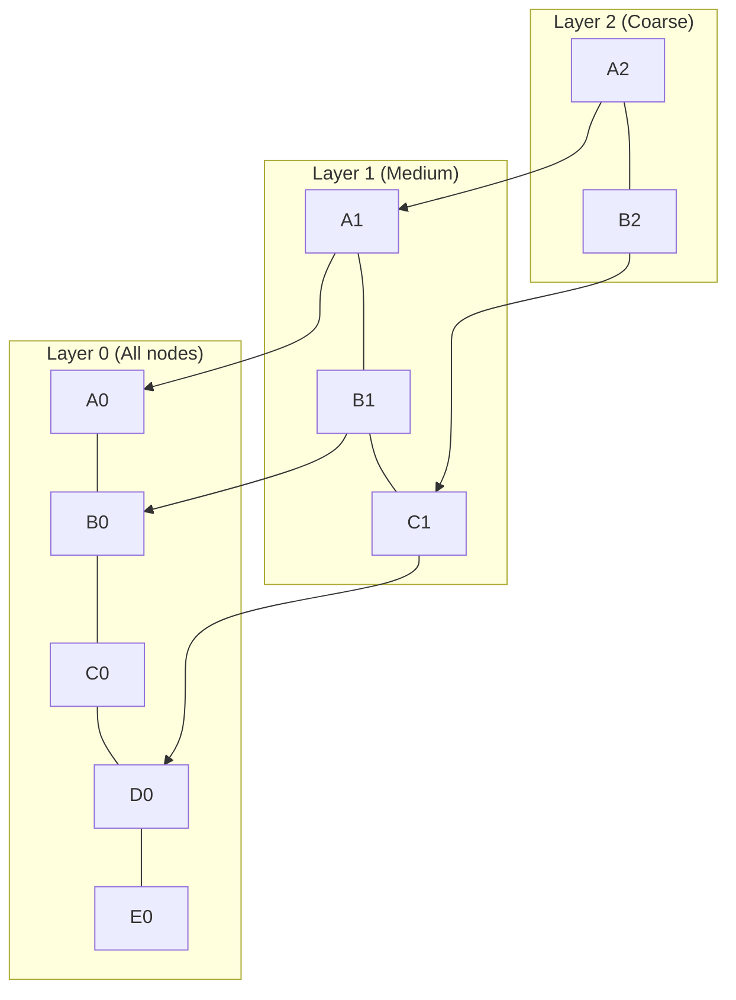
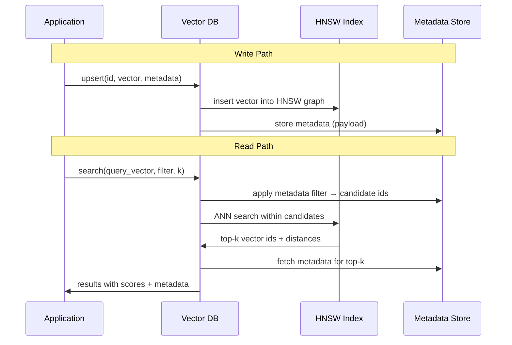

# 05. Vector Databases

## Overview

A vector database is a data store optimized for storing, indexing, and querying high-dimensional vectors (embeddings). It enables efficient approximate nearest neighbor (ANN) search — finding the most semantically similar documents to a query vector — at scale. Vector databases are the persistence layer of RAG systems.

---

## Why This Exists

After embedding documents, you need somewhere to store millions of vectors and query them in milliseconds. A traditional relational database (PostgreSQL, MySQL) can store vectors but must perform brute-force comparisons for every query — O(N) comparisons for N documents. At 1 million documents, this is too slow.

Vector databases use specialized index structures (HNSW, IVF, LSH) to achieve approximate nearest neighbor search in O(log N) or even O(1) time, trading a small accuracy loss for massive speed gains.

---

## Problem Being Solved

```
Problem: You have 10 million embedded document chunks.
For every query, find the 5 most similar chunks.

Brute force (numpy @ all vectors):
  10M × 1536 dims × 4 bytes = 60GB
  Scan time: 2–10 seconds per query
  → Unusable

Vector DB with HNSW index:
  Same data, ~90GB with overhead
  Query time: 5–50ms
  → Production-ready
```

---

## Core Concepts

### Approximate Nearest Neighbor (ANN)

Exact nearest neighbor search requires computing similarity against every vector. ANN algorithms trade a small probability of missing the true nearest neighbor for massive speed improvements.

**Key parameter:** `ef` (exploration factor) controls the precision-recall tradeoff:
- Higher `ef` → more accurate, slower
- Lower `ef` → faster, may miss some results

### HNSW (Hierarchical Navigable Small World)

The dominant ANN algorithm in modern vector DBs:

```
Multi-layer graph structure:
Layer 2 (coarse): few nodes, long-range connections
Layer 1 (medium): more nodes, medium-range connections
Layer 0 (fine):   all nodes, short-range connections

Search: Start at top layer, navigate to approximate nearest neighbor,
        descend to next layer, refine, repeat until Layer 0.
```



**Complexity:**
- Build: O(N log N)
- Query: O(log N) — much better than O(N)

### IVF (Inverted File Index)

Divides the vector space into clusters (Voronoi cells). At query time, only searches vectors in the nearest clusters:

```
1. Train: K-means to create C clusters
2. Index: Assign each vector to its nearest cluster center
3. Query: Find top-M nearest clusters, search only those vectors
```

Good for very large datasets (>10M vectors) where HNSW memory becomes limiting.

### HNSW vs. IVF

| Property | HNSW | IVF |
|----------|------|-----|
| Memory | High (graph structure) | Lower |
| Query Speed | Faster | Slightly slower |
| Build Time | Slower | Faster |
| Accuracy | Higher | Configurable |
| Best For | <50M vectors | >10M vectors |

---

## Vector Database Comparison

### Chroma

**Philosophy:** Simple, embedded-first, developer-friendly. Works in-process.

```python
import chromadb
from chromadb.utils import embedding_functions

# Embedded (no separate server)
client = chromadb.Client()

# Or persistent
client = chromadb.PersistentClient(path="/data/chroma")

# Or remote
client = chromadb.HttpClient(host="localhost", port=8000)

openai_ef = embedding_functions.OpenAIEmbeddingFunction(
    api_key="sk-...",
    model_name="text-embedding-3-small"
)

collection = client.create_collection(
    name="my_docs",
    embedding_function=openai_ef,
    metadata={"hnsw:space": "cosine"}
)

# Add documents
collection.add(
    documents=["First document text", "Second document text"],
    metadatas=[{"source": "doc1.pdf"}, {"source": "doc2.pdf"}],
    ids=["id1", "id2"]
)

# Query
results = collection.query(
    query_texts=["search query"],
    n_results=5,
    where={"source": "doc1.pdf"},  # Metadata filter
)
```

**Architecture:**
- Embedded: SQLite + in-memory HNSW
- Server: ClickHouse (production mode)
- Default: HNSW for ANN, SQLite for metadata

**Pros:** Zero setup, great for prototyping, automatic embedding support  
**Cons:** Limited scaling, no distributed mode, not battle-tested at 100M+ scale

**Scaling:** Vertical only. Good to ~10M vectors with a beefy server.

**Cost:** Open source + self-hosted. Chroma Cloud available.

---

### Qdrant

**Philosophy:** Production-grade, filter-first, built in Rust for performance.

```python
from qdrant_client import QdrantClient
from qdrant_client.models import (
    Distance, VectorParams, PointStruct,
    Filter, FieldCondition, MatchValue
)

client = QdrantClient(url="http://localhost:6333")

# Create collection
client.create_collection(
    collection_name="my_docs",
    vectors_config=VectorParams(size=1536, distance=Distance.COSINE),
)

# Upsert vectors
client.upsert(
    collection_name="my_docs",
    points=[
        PointStruct(
            id=1,
            vector=[0.1] * 1536,
            payload={"source": "doc1.pdf", "tenant": "acme_corp", "date": "2024-01"}
        ),
        PointStruct(
            id=2,
            vector=[0.2] * 1536,
            payload={"source": "doc2.pdf", "tenant": "beta_inc", "date": "2024-02"}
        )
    ]
)

# Search with metadata filter
results = client.search(
    collection_name="my_docs",
    query_vector=[0.15] * 1536,
    query_filter=Filter(
        must=[FieldCondition(key="tenant", match=MatchValue(value="acme_corp"))]
    ),
    limit=5,
    with_payload=True,
)

# Sparse + dense hybrid search
from qdrant_client.models import SparseVector, NamedSparseVector, NamedVector

client.search_batch(
    collection_name="hybrid_collection",
    requests=[
        # Query dense vectors
        # Query sparse vectors
    ]
)
```

**Architecture:**
- Written in Rust (memory-safe, high-performance)
- HNSW for dense vectors
- First-class sparse vector support (for hybrid search)
- Payload filtering pushed into the ANN search (not post-filter)
- Distributed sharding + replication

**Pros:** Best-in-class filtering, Rust performance, production-ready, great hybrid search support  
**Cons:** More complex setup than Chroma, newer ecosystem

**Scaling:** Distributed, sharded. Good to 1B+ vectors.

**Cost:** Open source + Qdrant Cloud.

---

### Pinecone

**Philosophy:** Fully managed, serverless, zero-ops vector database.

```python
from pinecone import Pinecone, ServerlessSpec

pc = Pinecone(api_key="your-api-key")

# Create index
pc.create_index(
    name="my-rag-index",
    dimension=1536,
    metric="cosine",
    spec=ServerlessSpec(cloud="aws", region="us-east-1")
)

index = pc.Index("my-rag-index")

# Upsert with metadata
index.upsert(
    vectors=[
        {
            "id": "chunk-001",
            "values": [0.1] * 1536,
            "metadata": {
                "source": "docs/api.md",
                "tenant": "acme_corp",
                "section": "authentication",
                "text": "The original chunk text stored in metadata"
            }
        }
    ],
    namespace="tenant_acme"  # Namespace = tenant isolation
)

# Query
results = index.query(
    vector=[0.15] * 1536,
    top_k=5,
    filter={"tenant": {"$eq": "acme_corp"}},
    include_metadata=True,
    namespace="tenant_acme"
)
```

**Architecture:**
- Fully managed SaaS
- Proprietary ANN index
- Namespaces for logical separation
- Serverless or pod-based deployment
- Built-in replication

**Pros:** Zero infrastructure management, auto-scaling, SLA-backed  
**Cons:** Vendor lock-in, expensive at scale, metadata stored in index (not separate DB), can't run locally

**Scaling:** Serverless: auto-scales. Pod-based: manual sizing.

**Cost:** $0.096/1M vectors/month (serverless), $0.096+/hr (pod). Expensive at large scale.

---

### Weaviate

**Philosophy:** Knowledge graph + vector search combined. Schema-driven.

```python
import weaviate
import weaviate.classes as wvc

client = weaviate.connect_to_local()

# Create collection with schema
documents = client.collections.create(
    name="Document",
    vectorizer_config=wvc.config.Configure.Vectorizer.text2vec_openai(),
    properties=[
        wvc.config.Property(name="content", data_type=wvc.config.DataType.TEXT),
        wvc.config.Property(name="source", data_type=wvc.config.DataType.TEXT),
        wvc.config.Property(name="tenant", data_type=wvc.config.DataType.TEXT),
    ]
)

# Insert
documents.data.insert({
    "content": "Document text here",
    "source": "doc1.pdf",
    "tenant": "acme_corp",
})

# Semantic search
results = documents.query.near_text(
    query="your search query",
    limit=5,
    filters=wvc.query.Filter.by_property("tenant").equal("acme_corp"),
)

# Hybrid search
results = documents.query.hybrid(
    query="your search query",
    alpha=0.5,  # 0 = BM25 only, 1 = vector only
    limit=5,
)
```

**Architecture:**
- Go + GraphQL API
- HNSW for vector search
- BM25 built-in for hybrid
- Graph-style object relationships
- Multi-tenancy with tenant isolation
- Module system (auto-embedding, auto-classification)

**Pros:** Built-in hybrid search, graph relationships, multi-tenancy support, AutoML modules  
**Cons:** Schema-required (less flexible), steeper learning curve, resource-heavy

**Scaling:** Kubernetes-native, horizontal scaling, replication.

---

### Milvus / Zilliz

**Philosophy:** Enterprise-scale, high-throughput, cloud-native vector database.

```python
from pymilvus import (
    connections, Collection, CollectionSchema, FieldSchema, DataType, utility
)
import numpy as np

connections.connect("default", host="localhost", port="19530")

# Define schema
fields = [
    FieldSchema(name="id", dtype=DataType.INT64, is_primary=True, auto_id=True),
    FieldSchema(name="embedding", dtype=DataType.FLOAT_VECTOR, dim=1536),
    FieldSchema(name="source", dtype=DataType.VARCHAR, max_length=200),
    FieldSchema(name="tenant", dtype=DataType.VARCHAR, max_length=100),
]
schema = CollectionSchema(fields, description="RAG documents")
collection = Collection("my_docs", schema)

# Create HNSW index
index_params = {
    "index_type": "HNSW",
    "metric_type": "COSINE",
    "params": {"M": 16, "efConstruction": 200}
}
collection.create_index("embedding", index_params)

# Insert
data = [
    [np.random.rand(1536).tolist() for _ in range(100)],
    ["doc1.pdf"] * 100,
    ["acme_corp"] * 100,
]
collection.insert(data)
collection.load()

# Search
search_params = {"metric_type": "COSINE", "params": {"ef": 100}}
results = collection.search(
    data=[np.random.rand(1536).tolist()],
    anns_field="embedding",
    param=search_params,
    limit=5,
    expr='tenant == "acme_corp"',
    output_fields=["source"]
)
```

**Architecture:**
- C++ core with Python/Go SDKs
- Supports HNSW, IVF, DiskANN
- Distributed: coordinator + data nodes + query nodes
- Tiered storage (hot/warm/cold)
- Cloud-native (Kubernetes)

**Pros:** Highest throughput, GPU support, enterprise features, Zilliz managed service  
**Cons:** Complex operations, heavyweight for small deployments

**Scaling:** Designed for 100M–10B+ vectors. The most scalable option.

---

## Full Comparison

| Feature | Chroma | Qdrant | Pinecone | Weaviate | Milvus |
|---------|--------|--------|----------|----------|--------|
| Setup complexity | Very Low | Low | Zero | Medium | High |
| Self-hostable | ✓ | ✓ | ✗ | ✓ | ✓ |
| Managed cloud | ✓ | ✓ | ✓ | ✓ | ✓ (Zilliz) |
| Filtering | Basic | Excellent | Good | Good | Good |
| Hybrid search | ✗ | ✓ | ✗* | ✓ | ✗* |
| Multi-tenancy | Basic | ✓ | ✓ (namespaces) | ✓ | ✓ |
| Max scale | ~10M | 1B+ | Auto-scale | 100M+ | 10B+ |
| Language | Python | Rust | Managed | Go | C++ |
| Cost | Free | Free/Paid | Expensive | Free/Paid | Free/Paid |
| Best for | Dev/Prototype | Production RAG | Zero-ops | GraphRAG | Ultra-scale |

*Can be implemented externally

---

## Execution Flow



---

## Production Example

```python
# Production Qdrant setup with async client and connection pooling
from qdrant_client import AsyncQdrantClient
from qdrant_client.models import (
    Distance, VectorParams, PointStruct, Filter, FieldCondition, MatchValue,
    HnswConfigDiff, OptimizersConfigDiff
)
import asyncio

class ProductionVectorStore:
    def __init__(self, url: str, collection_name: str, vector_size: int = 1536):
        self.client = AsyncQdrantClient(url=url, timeout=30)
        self.collection_name = collection_name
        self.vector_size = vector_size
    
    async def initialize(self):
        """Create collection if it doesn't exist."""
        collections = await self.client.get_collections()
        if self.collection_name not in [c.name for c in collections.collections]:
            await self.client.create_collection(
                collection_name=self.collection_name,
                vectors_config=VectorParams(
                    size=self.vector_size,
                    distance=Distance.COSINE,
                    on_disk=True,  # Store vectors on disk for large collections
                ),
                hnsw_config=HnswConfigDiff(
                    m=16,             # Graph connectivity
                    ef_construct=200,  # Build quality
                    on_disk=False,    # Keep HNSW graph in memory
                ),
                optimizers_config=OptimizersConfigDiff(
                    indexing_threshold=20000,  # Start indexing after N vectors
                ),
            )
    
    async def upsert(self, points: list[dict]) -> None:
        """Batch upsert with automatic chunking."""
        batch_size = 100
        for i in range(0, len(points), batch_size):
            batch = points[i:i + batch_size]
            await self.client.upsert(
                collection_name=self.collection_name,
                points=[
                    PointStruct(
                        id=p["id"],
                        vector=p["vector"],
                        payload=p.get("payload", {})
                    )
                    for p in batch
                ]
            )
    
    async def search(
        self,
        query_vector: list[float],
        tenant_id: str,
        k: int = 10,
        score_threshold: float = 0.5,
    ) -> list[dict]:
        results = await self.client.search(
            collection_name=self.collection_name,
            query_vector=query_vector,
            query_filter=Filter(
                must=[
                    FieldCondition(
                        key="tenant_id",
                        match=MatchValue(value=tenant_id)
                    )
                ]
            ),
            limit=k,
            score_threshold=score_threshold,
            with_payload=True,
        )
        
        return [
            {
                "id": r.id,
                "score": r.score,
                "text": r.payload.get("text", ""),
                "metadata": {k: v for k, v in r.payload.items() if k != "text"}
            }
            for r in results
        ]
```

---

## Common Mistakes

1. **Choosing a DB before knowing your scale** — Chroma is great at 100K vectors; useless at 100M
2. **Not setting score thresholds** — Returning vectors with 0.2 cosine similarity is noise
3. **Storing full text in vector DB payload** — Fine for small scale, expensive at large scale; use object storage
4. **Not indexing metadata fields** — Unindexed filters force full scans
5. **Single collection for all tenants without filtering** — Data leakage risk
6. **Not monitoring collection size** — Collections grow unboundedly without TTL policies

---

## Best Practices

- **Qdrant for production**, Chroma for development — This is the pragmatic recommendation in 2024
- **Always set score thresholds** — Reject results below 0.5–0.6 cosine similarity
- **Use payload filtering** — Pre-filter by tenant/category before ANN search
- **Batch upserts** — Individual inserts are 10–100x slower
- **Monitor index build lag** — New vectors aren't searchable until indexed
- **Keep vectors on disk** for cold data, in-memory for hot collections

---

## Performance Considerations

| Operation | HNSW Qdrant | Pinecone Serverless | Weaviate |
|-----------|-------------|--------------------|----|
| Insert (batch 1000) | ~100ms | ~200ms | ~150ms |
| Query (1M vectors, k=10) | 5–15ms | 20–50ms | 10–30ms |
| Query with filter | 10–30ms | 30–80ms | 15–50ms |
| Memory (1M × 1536 float32) | ~8GB + 4GB HNSW | Managed | ~12GB |

---

## Cost Optimization

| Strategy | Savings |
|----------|---------|
| Use smaller embedding dimensions (1536 → 512) | ~3x storage reduction |
| `on_disk=True` for vectors | 60–80% memory cost reduction |
| Cold-tier storage for old vectors | 10x cheaper than hot storage |
| Delete outdated vectors | Direct cost reduction |
| Batch writes (not one-at-a-time) | 10x throughput improvement |

---

## Security Considerations

- **Namespace / tenant isolation** — Enforce at the application level; vector DBs don't have row-level security
- **API key rotation** — For managed services (Pinecone, Qdrant Cloud)
- **Network isolation** — Vector DB should not be publicly accessible; use VPC/private endpoints
- **Data residency** — Know which region your vectors are stored in (compliance)

---

## Related Concepts

- [03. Embeddings](03-embeddings.md)
- [08. Metadata Filtering](08-metadata-filtering.md)
- [09. Hybrid Search](09-hybrid-search.md)
- [24. Security](./24-security.md)

---

## Interview Questions

**Q: What is the difference between exact KNN and approximate ANN?**  
A: Exact KNN computes similarity against every vector (100% accurate, O(N) time). ANN uses index structures (HNSW, IVF) to find approximate nearest neighbors in O(log N) time with ~95–99% recall. For RAG, ANN is always preferred — the accuracy loss is negligible.

**Q: Why does Qdrant filter before vector search rather than after?**  
A: Post-filtering: do ANN search → filter results → potentially get fewer than K results (wasteful). Pre-filtering (Qdrant's approach): apply payload filter to candidate set → search only within filtered set → always get exactly K results. This is why Qdrant's filtered search is particularly good.

**Q: How would you handle multi-tenancy in a vector database?**  
A: Three approaches: (1) Separate collections per tenant — best isolation, high overhead at 1000+ tenants. (2) Namespaces (Pinecone) — logical separation in same index. (3) Payload filtering — single collection, filter by tenant_id at query time — most common, requires trust in filter enforcement.

---

## References

- [Qdrant Documentation](https://qdrant.tech/documentation/)
- [Pinecone Documentation](https://docs.pinecone.io/)
- [Weaviate Documentation](https://weaviate.io/developers/weaviate)
- [Milvus Documentation](https://milvus.io/docs)
- Malkov, Y. & Yashunin, D. (2018). [Efficient and Robust Approximate Nearest Neighbor Search Using HNSW Graphs](https://arxiv.org/abs/1603.09320)

---

## Summary

Vector databases are the persistence layer of RAG. They enable ANN search over millions of embeddings in milliseconds using HNSW or IVF indexes. Choose Chroma for prototyping, Qdrant for production self-hosting, Pinecone for zero-ops, Weaviate for graph relationships and built-in hybrid search, and Milvus for ultra-scale. Always use metadata filtering, set score thresholds, and plan your tenant isolation strategy before building.
