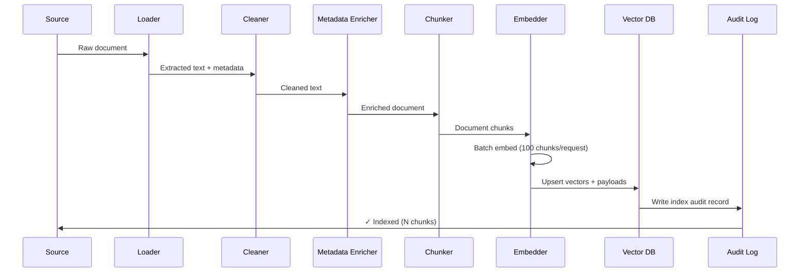

# 06. Indexing Pipelines

## Overview

An indexing pipeline is the offline data processing system that transforms raw documents into searchable vector representations. It is the "write path" of a RAG system — everything that happens before a user sends a query. The quality of your index directly determines the ceiling of your retrieval quality.

---

## Why This Exists

Documents in the real world are messy: PDFs with headers/footers, HTML with navigation menus, databases with inconsistent schemas, Word documents with embedded images. The indexing pipeline standardizes, cleans, enriches, chunks, embeds, and stores this heterogeneous data into a consistent, searchable format.

---

## Problem Being Solved

```
Input:
  - 500 PDFs from legal department
  - 10,000 markdown files from GitHub
  - 50,000 Confluence wiki pages
  - 100,000 support tickets (JSON)
  - New documents added daily

Output:
  - Clean, chunked, embedded, metadata-enriched vectors
  - Queryable in <50ms
  - Incrementally updatable (no full re-index needed)
  - Traceable back to source document
```

---

## Core Concepts

### The Indexing Pipeline Stages


### Idempotency

A production indexing pipeline must be **idempotent** — running it twice on the same document produces the same result, without duplicates. This is achieved by using document content hashes as IDs.

### Incremental Indexing

Re-embedding an entire corpus is expensive. Production pipelines detect changes (new, updated, deleted documents) and only process the delta:

```
Change detection:
  - Content hash: sha256(document_content) → has it changed?
  - Last-modified timestamp: file mtime or database updated_at
  - Document version: explicit version field
```

---

## Stage 1: Document Loading

```python
# Unified document loader supporting multiple formats
from abc import ABC, abstractmethod
from dataclasses import dataclass, field
from pathlib import Path
import hashlib

@dataclass
class RawDocument:
    content: str
    source: str
    doc_type: str
    metadata: dict = field(default_factory=dict)
    content_hash: str = field(default="")
    
    def __post_init__(self):
        if not self.content_hash:
            self.content_hash = hashlib.sha256(self.content.encode()).hexdigest()

class DocumentLoader(ABC):
    @abstractmethod
    def load(self, source: str) -> list[RawDocument]:
        ...

class PDFLoader(DocumentLoader):
    def load(self, path: str) -> list[RawDocument]:
        import pypdf
        reader = pypdf.PdfReader(path)
        docs = []
        for i, page in enumerate(reader.pages):
            text = page.extract_text() or ""
            docs.append(RawDocument(
                content=text,
                source=path,
                doc_type="pdf",
                metadata={"page": i + 1, "total_pages": len(reader.pages)}
            ))
        return docs

class MarkdownLoader(DocumentLoader):
    def load(self, path: str) -> list[RawDocument]:
        content = Path(path).read_text(encoding="utf-8")
        return [RawDocument(content=content, source=path, doc_type="markdown")]

class JSONLoader(DocumentLoader):
    def __init__(self, text_field: str = "content"):
        self.text_field = text_field
    
    def load(self, path: str) -> list[RawDocument]:
        import json
        data = json.loads(Path(path).read_text())
        if isinstance(data, list):
            return [
                RawDocument(
                    content=item.get(self.text_field, str(item)),
                    source=path,
                    doc_type="json",
                    metadata={k: v for k, v in item.items() if k != self.text_field}
                )
                for item in data
            ]
        return [RawDocument(content=data.get(self.text_field, ""), source=path, doc_type="json")]

class DocumentLoaderRegistry:
    def __init__(self):
        self._loaders = {
            ".pdf": PDFLoader(),
            ".md": MarkdownLoader(),
            ".txt": MarkdownLoader(),
            ".json": JSONLoader(),
        }
    
    def load(self, path: str) -> list[RawDocument]:
        ext = Path(path).suffix.lower()
        loader = self._loaders.get(ext)
        if not loader:
            raise ValueError(f"No loader for extension: {ext}")
        return loader.load(path)
```

---

## Stage 2: Data Cleaning

```python
import re
from typing import Callable

class TextCleaner:
    """Pipeline of text cleaning operations."""
    
    def __init__(self, operations: list[Callable[[str], str]] | None = None):
        self.operations = operations or [
            self.remove_html_tags,
            self.normalize_whitespace,
            self.remove_page_numbers,
            self.remove_headers_footers,
        ]
    
    def clean(self, text: str) -> str:
        for op in self.operations:
            text = op(text)
        return text.strip()
    
    @staticmethod
    def remove_html_tags(text: str) -> str:
        return re.sub(r'<[^>]+>', ' ', text)
    
    @staticmethod
    def normalize_whitespace(text: str) -> str:
        # Collapse multiple spaces/newlines
        text = re.sub(r'\n{3,}', '\n\n', text)
        text = re.sub(r' {2,}', ' ', text)
        return text
    
    @staticmethod
    def remove_page_numbers(text: str) -> str:
        # Remove patterns like "Page 5 of 20" or standalone numbers
        text = re.sub(r'\bPage \d+ of \d+\b', '', text, flags=re.IGNORECASE)
        return text
    
    @staticmethod
    def remove_headers_footers(text: str) -> str:
        # Remove lines that appear at top/bottom of each page (common in PDFs)
        # This is document-specific; customize per source
        lines = text.split('\n')
        # Remove lines that look like company headers/footers
        cleaned = [l for l in lines if not re.match(r'^\s*(Confidential|Internal Use Only|\d+)\s*$', l)]
        return '\n'.join(cleaned)
    
    @staticmethod
    def remove_boilerplate(patterns: list[str]) -> Callable[[str], str]:
        """Factory: creates a cleaner for document-specific boilerplate."""
        compiled = [re.compile(p, re.IGNORECASE) for p in patterns]
        def clean(text: str) -> str:
            for pattern in compiled:
                text = pattern.sub('', text)
            return text
        return clean
```

---

## Stage 3: Metadata Enrichment

```python
import hashlib
from datetime import datetime
from pathlib import Path

class MetadataEnricher:
    """Adds structured metadata to documents for filtering and tracing."""
    
    def enrich(self, doc: RawDocument) -> RawDocument:
        # Add standard fields
        doc.metadata.update({
            "content_hash": doc.content_hash,
            "char_count": len(doc.content),
            "word_count": len(doc.content.split()),
            "indexed_at": datetime.utcnow().isoformat(),
            "doc_type": doc.doc_type,
        })
        
        # Source-specific enrichment
        if doc.source.endswith(".md"):
            doc.metadata.update(self._enrich_markdown(doc.content))
        
        return doc
    
    def _enrich_markdown(self, content: str) -> dict:
        """Extract frontmatter and heading structure from markdown."""
        metadata = {}
        
        # Extract YAML frontmatter
        frontmatter_match = re.match(r'^---\n(.*?)\n---\n', content, re.DOTALL)
        if frontmatter_match:
            import yaml
            try:
                metadata.update(yaml.safe_load(frontmatter_match.group(1)) or {})
            except yaml.YAMLError:
                pass
        
        # Extract first H1 as title
        title_match = re.search(r'^# (.+)$', content, re.MULTILINE)
        if title_match:
            metadata["title"] = title_match.group(1)
        
        # Extract section headings
        headings = re.findall(r'^#{1,3} (.+)$', content, re.MULTILINE)
        metadata["sections"] = headings[:10]  # Top 10 headings
        
        return metadata
```

---

## Stage 4: Chunking

See [04. Chunking Strategies](04-chunking-strategies.md) for detailed coverage.

```python
@dataclass
class DocumentChunk:
    id: str
    text: str
    source_doc_id: str
    chunk_index: int
    metadata: dict
    embedding: list[float] | None = None
```

---

## Stage 5: Embedding Generation

```python
import asyncio
from openai import AsyncOpenAI

class BatchEmbeddingGenerator:
    """Generate embeddings with batching, retries, and rate limit handling."""
    
    def __init__(
        self,
        model: str = "text-embedding-3-small",
        batch_size: int = 100,
        max_retries: int = 3,
    ):
        self.client = AsyncOpenAI()
        self.model = model
        self.batch_size = batch_size
        self.max_retries = max_retries
    
    async def embed_chunks(self, chunks: list[DocumentChunk]) -> list[DocumentChunk]:
        """Embed all chunks in batches."""
        texts = [chunk.text for chunk in chunks]
        
        all_embeddings = []
        for i in range(0, len(texts), self.batch_size):
            batch = texts[i:i + self.batch_size]
            embeddings = await self._embed_batch_with_retry(batch)
            all_embeddings.extend(embeddings)
        
        for chunk, embedding in zip(chunks, all_embeddings):
            chunk.embedding = embedding
        
        return chunks
    
    async def _embed_batch_with_retry(self, texts: list[str]) -> list[list[float]]:
        for attempt in range(self.max_retries):
            try:
                response = await self.client.embeddings.create(
                    model=self.model,
                    input=texts
                )
                return [item.embedding for item in response.data]
            except Exception as e:
                if attempt == self.max_retries - 1:
                    raise
                wait = 2 ** attempt
                await asyncio.sleep(wait)
        return []
```

---

## Stage 6: Vector Storage + Deduplication

```python
from qdrant_client import AsyncQdrantClient
from qdrant_client.models import PointStruct

class IndexingPipeline:
    """Full indexing pipeline with deduplication."""
    
    def __init__(
        self,
        vector_store: AsyncQdrantClient,
        collection_name: str,
        cleaner: TextCleaner,
        enricher: MetadataEnricher,
        chunker,
        embedder: BatchEmbeddingGenerator,
    ):
        self.vector_store = vector_store
        self.collection_name = collection_name
        self.cleaner = cleaner
        self.enricher = enricher
        self.chunker = chunker
        self.embedder = embedder
        self._indexed_hashes: set[str] = set()
    
    async def index_document(self, raw_doc: RawDocument) -> dict:
        """Index a single document, skip if already indexed."""
        # Deduplication check
        if raw_doc.content_hash in self._indexed_hashes:
            return {"status": "skipped", "reason": "already indexed"}
        
        # Clean
        raw_doc.content = self.cleaner.clean(raw_doc.content)
        if not raw_doc.content.strip():
            return {"status": "skipped", "reason": "empty after cleaning"}
        
        # Enrich metadata
        raw_doc = self.enricher.enrich(raw_doc)
        
        # Chunk
        chunk_texts = self.chunker.chunk(raw_doc.content)
        chunks = [
            DocumentChunk(
                id=f"{raw_doc.content_hash}_{i}",
                text=text,
                source_doc_id=raw_doc.content_hash,
                chunk_index=i,
                metadata={**raw_doc.metadata, "chunk_index": i, "total_chunks": len(chunk_texts)}
            )
            for i, text in enumerate(chunk_texts)
        ]
        
        # Embed
        chunks = await self.embedder.embed_chunks(chunks)
        
        # Store
        points = [
            PointStruct(
                id=chunk.id[:36],  # UUID-compatible ID
                vector=chunk.embedding,
                payload={"text": chunk.text, **chunk.metadata}
            )
            for chunk in chunks
            if chunk.embedding is not None
        ]
        
        await self.vector_store.upsert(
            collection_name=self.collection_name,
            points=points
        )
        
        self._indexed_hashes.add(raw_doc.content_hash)
        
        return {
            "status": "indexed",
            "chunks": len(chunks),
            "source": raw_doc.source
        }
    
    async def index_batch(self, documents: list[RawDocument]) -> list[dict]:
        """Index multiple documents concurrently."""
        results = await asyncio.gather(
            *[self.index_document(doc) for doc in documents],
            return_exceptions=True
        )
        return [r if not isinstance(r, Exception) else {"status": "error", "error": str(r)} for r in results]
```

---

## Execution Flow



---

## Production Example

```python
# Production pipeline with change detection and observability
import asyncio
from datetime import datetime

class ProductionIndexingPipeline:
    """
    Production-grade pipeline with:
    - Incremental indexing (only process changed docs)
    - Dead-letter queue for failures
    - Metrics/observability
    - Graceful backpressure
    """
    
    def __init__(self, pipeline: IndexingPipeline, state_store: dict):
        self.pipeline = pipeline
        self.state_store = state_store  # Redis in production
        self.metrics = {"indexed": 0, "skipped": 0, "failed": 0}
    
    def _get_stored_hash(self, source: str) -> str | None:
        return self.state_store.get(f"doc_hash:{source}")
    
    def _store_hash(self, source: str, content_hash: str):
        self.state_store[f"doc_hash:{source}"] = content_hash
    
    async def process_document(self, raw_doc: RawDocument) -> dict:
        """Process with change detection."""
        stored_hash = self._get_stored_hash(raw_doc.source)
        
        if stored_hash == raw_doc.content_hash:
            self.metrics["skipped"] += 1
            return {"status": "unchanged", "source": raw_doc.source}
        
        try:
            result = await self.pipeline.index_document(raw_doc)
            if result["status"] == "indexed":
                self._store_hash(raw_doc.source, raw_doc.content_hash)
                self.metrics["indexed"] += 1
            return result
        except Exception as e:
            self.metrics["failed"] += 1
            # In production: push to dead-letter queue for retry
            return {"status": "failed", "error": str(e), "source": raw_doc.source}
    
    async def run_full_sync(self, documents: list[RawDocument]) -> dict:
        start = datetime.utcnow()
        results = await asyncio.gather(*[self.process_document(d) for d in documents])
        duration = (datetime.utcnow() - start).total_seconds()
        
        return {
            "duration_seconds": duration,
            "metrics": self.metrics,
            "details": results
        }
```

---

## Common Mistakes

1. **Not cleaning documents** — HTML tags and boilerplate pollute embeddings
2. **No deduplication** — Same document indexed multiple times, wastes storage
3. **No incremental updates** — Re-indexing entire corpus on every change is expensive
4. **Embedding before chunking** — Creates single vectors for huge documents
5. **Losing source information** — Cannot trace an answer back to the original document
6. **Synchronous pipeline for bulk indexing** — Takes hours instead of minutes
7. **No error handling** — One bad document fails the entire batch

---

## Best Practices

- **Design metadata schema before indexing** — It's painful to add fields later
- **Make pipeline idempotent** — Hash-based deduplication prevents duplicates
- **Process incrementally** — Change detection + partial re-index on updates
- **Store raw documents separately** — Object storage (S3/GCS) for originals, vector DB for embeddings
- **Track indexing lineage** — Record which pipeline version indexed which document
- **Implement retry with backoff** — Embedding API rate limits are real
- **Monitor pipeline health** — Documents/hour, error rate, embedding cost

---

## Performance Considerations

| Stage | Bottleneck | Optimization |
|-------|-----------|-------------|
| PDF loading | CPU (text extraction) | Async + process pool |
| Text cleaning | CPU | Vectorized regex |
| Embedding | API rate limits / GPU | Batch 100 texts/request |
| Vector upsert | DB write throughput | Batch 1000 points/upsert |

**Throughput target:** 1000 documents/hour on a single worker with OpenAI embeddings.

---

## Cost Optimization

| Operation | Cost Driver | Optimization |
|-----------|------------|-------------|
| Embedding generation | API tokens | Cache by content hash; skip unchanged docs |
| Vector storage | Storage size | Use smaller dimensions (matryoshka) |
| LLM for metadata extraction | API calls | Rule-based extraction where possible |

---

## Evaluation Metrics

- **Indexing throughput**: Documents indexed per hour
- **Error rate**: Failed documents / total documents
- **Deduplication rate**: Skipped (unchanged) / total processed
- **Average chunk count per document**: Indicator of pipeline health
- **Coverage**: % of source documents successfully indexed

---

## Related Concepts

- [04. Chunking Strategies](04-chunking-strategies.md)
- [03. Embeddings](03-embeddings.md)
- [05. Vector Databases](05-vector-databases.md)
- [08. Metadata Filtering](08-metadata-filtering.md)

---

## Interview Questions

**Q: How do you handle document updates in a RAG system?**  
A: Use content hashing (SHA-256 of document content) as the primary change detection mechanism. On update: delete old chunks (filtered by source document ID), re-chunk and re-embed the new version, insert new chunks. Store the hash in a state store (Redis) to detect unchanged documents and skip them.

**Q: What would cause all your RAG answers to suddenly get worse?**  
A: Common causes: (1) Embedding model changed without re-indexing (vectors now in a different space), (2) Document source corrupted or changed format, (3) Chunking parameters changed, (4) Vector DB index degraded, (5) New documents with contradictory information indexed without quality control.

---

## References

- [LangChain Document Loaders](https://python.langchain.com/docs/modules/data_connection/document_loaders/)
- [LlamaIndex Ingestion Pipeline](https://docs.llamaindex.ai/en/stable/module_guides/loading/ingestion_pipeline/)

---

## Summary

The indexing pipeline is the "write path" of RAG. It transforms raw, messy documents into clean, chunked, enriched, embedded vectors. The key properties of a production pipeline are: idempotency (hash-based dedup), incremental updates (change detection), error resilience (retry + dead-letter queue), and observability (metrics per stage). Bad indexing = bad retrieval = bad answers. Invest here.
