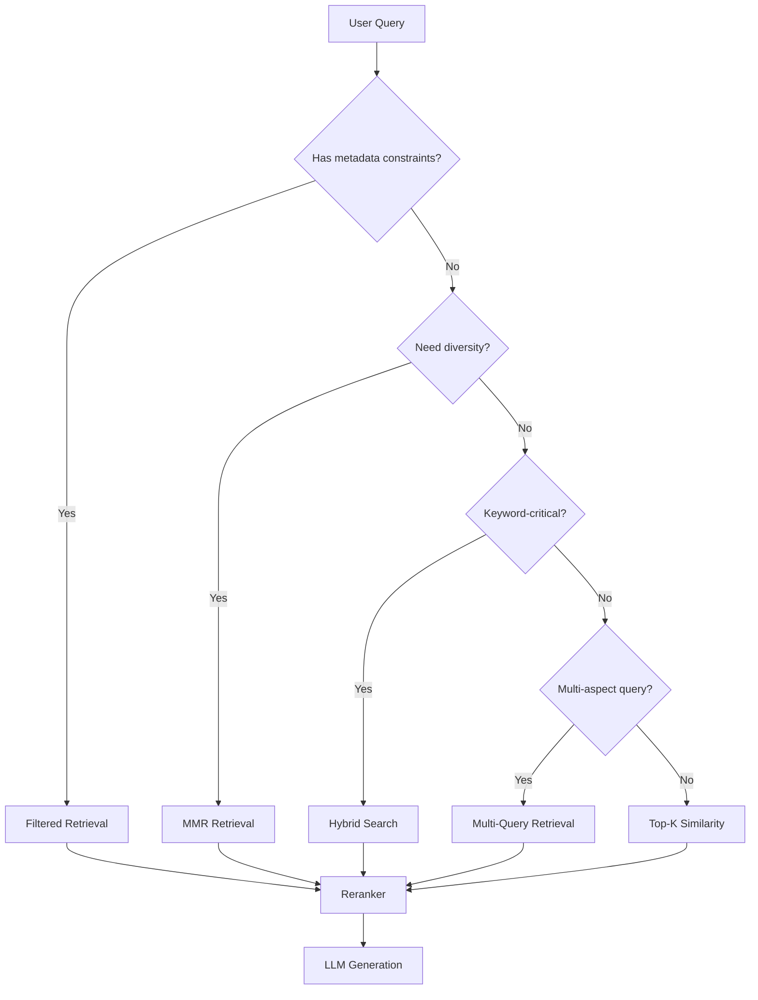

# 07. Retrieval Strategies

## Overview

Retrieval strategies define how a RAG system finds relevant document chunks given a user query. The choice of retrieval strategy is one of the highest-leverage decisions in RAG design — it directly determines the recall and precision of the context passed to the LLM. This topic covers the spectrum from simple top-K similarity search to sophisticated multi-strategy combinations.

---

## Why This Exists

Not every query is equal. A simple factual question ("What is the default timeout?") needs exact top-1 retrieval. A broad analytical question ("Summarize the security implications of feature X") needs wide recall. A query with specialized terminology needs keyword matching. A conceptual question needs semantic matching. Different retrieval strategies serve different information needs.

---

## Problem Being Solved

```
Query: "connection pool exhaustion during peak load"

Pure semantic search returns:
  - "Network performance during high traffic" (semantic match)
  - "System resource management" (semantic match)
  - Misses: "connection pool size exceeded max_connections" (exact keyword match)

Pure keyword search (BM25) returns:
  - "connection pool exhaustion" (exact match)
  - "pool exhausted error 502" (keyword match)
  - Misses: "unable to acquire database connections" (semantic paraphrase)

Hybrid retrieval returns: All of the above — best of both worlds.
```

---

## Core Concepts

### The Recall-Precision Tension in Retrieval

- **Higher K** (retrieve more chunks) → Higher recall, lower precision
- **Lower K** → Higher precision, lower recall
- **Goal**: Find the smallest K that still captures all relevant context

### Information Needs Taxonomy

| Need Type | Example | Best Strategy |
|-----------|---------|---------------|
| Factual lookup | "What is the rate limit?" | Top-K similarity |
| Conceptual | "Explain the architecture" | MMR or semantic |
| Keyword | "Find error code E4321" | BM25 or hybrid |
| Multi-aspect | "Compare A and B" | Multi-query |
| Exploratory | "Tell me everything about X" | Wide semantic + MMR |

---

## Strategy 1: Top-K Similarity Search

The baseline. Embed the query, find K most similar vectors.

```python
from qdrant_client import AsyncQdrantClient
from qdrant_client.models import ScoredPoint
import numpy as np

class TopKRetriever:
    def __init__(self, client: AsyncQdrantClient, collection: str, embedder):
        self.client = client
        self.collection = collection
        self.embedder = embedder
    
    async def retrieve(
        self,
        query: str,
        k: int = 5,
        score_threshold: float = 0.5,
    ) -> list[dict]:
        # Embed query
        query_vector = await self.embedder.embed_single(query)
        
        # Search
        results = await self.client.search(
            collection_name=self.collection,
            query_vector=query_vector,
            limit=k,
            score_threshold=score_threshold,
            with_payload=True,
        )
        
        return [
            {
                "text": r.payload.get("text", ""),
                "score": r.score,
                "metadata": {k: v for k, v in r.payload.items() if k != "text"},
            }
            for r in results
        ]
```

**When to use:** Conceptual questions, semantic paraphrase queries, default baseline.  
**When not to use:** When exact keyword matches are critical (product codes, error codes, names).

---

## Strategy 2: MMR (Maximal Marginal Relevance)

Selects chunks that are relevant to the query *and* diverse from each other, avoiding returning 5 chunks that all say the same thing.

```python
import numpy as np

def maximal_marginal_relevance(
    query_embedding: np.ndarray,
    candidate_embeddings: np.ndarray,
    candidate_texts: list[str],
    k: int = 5,
    lambda_mult: float = 0.5,  # 0 = max diversity, 1 = max relevance
) -> list[int]:
    """
    MMR selection:
    At each step, select the candidate that maximizes:
      lambda * sim(candidate, query) - (1-lambda) * max(sim(candidate, already_selected))
    """
    selected_indices = []
    remaining = list(range(len(candidate_embeddings)))
    
    # Normalize
    q = query_embedding / (np.linalg.norm(query_embedding) + 1e-8)
    cands = candidate_embeddings / (np.linalg.norm(candidate_embeddings, axis=1, keepdims=True) + 1e-8)
    
    # Relevance scores (similarity to query)
    relevance_scores = cands @ q
    
    for _ in range(min(k, len(remaining))):
        if not selected_indices:
            # First selection: pick most relevant
            best = remaining[np.argmax(relevance_scores[remaining])]
        else:
            # MMR: balance relevance and diversity
            selected_embs = cands[selected_indices]
            
            mmr_scores = []
            for i in remaining:
                rel = relevance_scores[i]
                # Maximum similarity to already selected
                redundancy = np.max(cands[i] @ selected_embs.T)
                mmr = lambda_mult * rel - (1 - lambda_mult) * redundancy
                mmr_scores.append((mmr, i))
            
            best = max(mmr_scores, key=lambda x: x[0])[1]
        
        selected_indices.append(best)
        remaining.remove(best)
    
    return selected_indices

class MMRRetriever:
    def __init__(self, base_retriever: TopKRetriever, fetch_k: int = 20):
        self.base_retriever = base_retriever
        self.fetch_k = fetch_k
    
    async def retrieve(self, query: str, k: int = 5, lambda_mult: float = 0.5) -> list[dict]:
        # Fetch more candidates than needed
        candidates = await self.base_retriever.retrieve(query, k=self.fetch_k)
        
        if len(candidates) <= k:
            return candidates
        
        # Get query embedding
        q_emb = np.array(await self.base_retriever.embedder.embed_single(query))
        cand_embs = np.array([c["embedding"] for c in candidates])  # Need to return embeddings
        
        # MMR selection
        selected_indices = maximal_marginal_relevance(q_emb, cand_embs, 
                                                        [c["text"] for c in candidates], 
                                                        k=k, lambda_mult=lambda_mult)
        return [candidates[i] for i in selected_indices]
```

**When to use:** When you want diverse coverage (summarization tasks, exploratory questions).  
**When not to use:** Specific factual queries where the top result is sufficient.

---

## Strategy 3: Threshold-Based Retrieval

Return all chunks above a similarity threshold, not a fixed K:

```python
async def threshold_retrieve(
    query: str,
    threshold: float = 0.7,
    max_k: int = 20,
) -> list[dict]:
    """
    Return all chunks above threshold.
    Useful when you don't know how many relevant chunks exist.
    """
    results = await client.search(
        collection_name=collection,
        query_vector=await embedder.embed_single(query),
        limit=max_k,
        score_threshold=threshold,
        with_payload=True,
    )
    return [{"text": r.payload["text"], "score": r.score} for r in results]
```

**When to use:** When result count should be data-driven (not artificially capped).  
**Trade-off:** Unpredictable number of results; can overflow context window.

---

## Strategy 4: Filtered Retrieval

Apply metadata filters before (or during) vector search:

```python
from qdrant_client.models import Filter, FieldCondition, MatchValue, Range, DatetimeRange
from datetime import datetime

async def filtered_retrieve(
    query: str,
    tenant_id: str,
    doc_type: str | None = None,
    date_after: datetime | None = None,
    k: int = 5,
) -> list[dict]:
    # Build filter conditions
    conditions = [
        FieldCondition(key="tenant_id", match=MatchValue(value=tenant_id))
    ]
    
    if doc_type:
        conditions.append(FieldCondition(key="doc_type", match=MatchValue(value=doc_type)))
    
    if date_after:
        conditions.append(FieldCondition(
            key="created_at",
            range=Range(gte=date_after.timestamp())
        ))
    
    results = await client.search(
        collection_name=collection,
        query_vector=await embedder.embed_single(query),
        query_filter=Filter(must=conditions),
        limit=k,
        with_payload=True,
    )
    
    return [{"text": r.payload["text"], "score": r.score, **r.payload} for r in results]
```

See [08. Metadata Filtering](08-metadata-filtering.md) for complete coverage.

---

## Strategy 5: Self-Query Retrieval

The LLM interprets the query and generates both a semantic search query and metadata filters:

```python
from openai import AsyncOpenAI
import json

class SelfQueryRetriever:
    """
    Two-stage retrieval:
    1. LLM interprets query → structured filter + search query
    2. Execute filtered vector search
    """
    
    EXTRACTION_PROMPT = """Extract a search query and metadata filters from the user question.
Return JSON with:
  - "search_query": cleaned search text
  - "filters": dict of metadata field → value pairs

Available metadata fields: source_type, date, author, department, document_type

User question: {question}

Return only valid JSON."""

    def __init__(self, vector_retriever, llm_client: AsyncOpenAI):
        self.retriever = vector_retriever
        self.llm = llm_client
    
    async def retrieve(self, question: str, k: int = 5) -> list[dict]:
        # Extract structured query
        response = await self.llm.chat.completions.create(
            model="gpt-4o-mini",
            messages=[{
                "role": "user",
                "content": self.EXTRACTION_PROMPT.format(question=question)
            }],
            response_format={"type": "json_object"}
        )
        
        try:
            parsed = json.loads(response.choices[0].message.content)
            search_query = parsed.get("search_query", question)
            filters = parsed.get("filters", {})
        except json.JSONDecodeError:
            search_query = question
            filters = {}
        
        # Execute filtered retrieval
        return await self.retriever.retrieve(search_query, filters=filters, k=k)
```

---

## Execution Flow: Choosing a Strategy



---

## Practical Example

```python
# Retrieval strategy router that selects strategy based on query analysis
from enum import Enum

class RetrievalStrategy(str, Enum):
    TOP_K = "top_k"
    MMR = "mmr"
    FILTERED = "filtered"
    HYBRID = "hybrid"

class RetrievalRouter:
    """Selects retrieval strategy based on query characteristics."""
    
    KEYWORD_PATTERNS = [
        r'\b[A-Z]{2,}-\d+\b',      # Error codes (ERR-404, E4321)
        r'\b\d{4,}\b',              # Long numbers (IDs)
        r'"[^"]+"',                  # Quoted strings (exact match)
        r'\b[A-Z][a-z]+(?:[A-Z][a-z]+)+\b',  # CamelCase (class names)
    ]
    
    def __init__(self, retrievers: dict[RetrievalStrategy, object]):
        self.retrievers = retrievers
    
    def select_strategy(self, query: str) -> RetrievalStrategy:
        import re
        
        # Check for keyword patterns
        for pattern in self.KEYWORD_PATTERNS:
            if re.search(pattern, query):
                return RetrievalStrategy.HYBRID
        
        # Check for list/comparison queries (need diversity)
        diversity_keywords = ["list", "compare", "differences", "all", "every", "overview"]
        if any(kw in query.lower() for kw in diversity_keywords):
            return RetrievalStrategy.MMR
        
        # Default: semantic top-K
        return RetrievalStrategy.TOP_K
    
    async def retrieve(self, query: str, k: int = 5, **kwargs) -> list[dict]:
        strategy = self.select_strategy(query)
        retriever = self.retrievers[strategy]
        return await retriever.retrieve(query, k=k, **kwargs)
```

---

## Production Example

```python
# Production retriever with fallback chain and observability
import time
from dataclasses import dataclass

@dataclass  
class RetrievalMetrics:
    strategy: str
    latency_ms: float
    result_count: int
    avg_score: float
    query: str

class ProductionRetriever:
    """
    Production retrieval with:
    - Primary strategy + fallback
    - Score-based quality check
    - Latency tracking
    - Empty result handling
    """
    
    def __init__(self, primary, fallback, min_results: int = 2, min_score: float = 0.45):
        self.primary = primary
        self.fallback = fallback
        self.min_results = min_results
        self.min_score = min_score
        self.metrics: list[RetrievalMetrics] = []
    
    async def retrieve(self, query: str, k: int = 5) -> tuple[list[dict], RetrievalMetrics]:
        # Try primary strategy
        start = time.perf_counter()
        try:
            results = await self.primary.retrieve(query, k=k)
        except Exception:
            results = []
        
        latency = (time.perf_counter() - start) * 1000
        
        # Quality check
        high_quality = [r for r in results if r.get("score", 0) >= self.min_score]
        
        if len(high_quality) >= self.min_results:
            metrics = RetrievalMetrics(
                strategy="primary",
                latency_ms=latency,
                result_count=len(high_quality),
                avg_score=sum(r["score"] for r in high_quality) / len(high_quality),
                query=query
            )
            self.metrics.append(metrics)
            return high_quality, metrics
        
        # Fallback
        start = time.perf_counter()
        fallback_results = await self.fallback.retrieve(query, k=k)
        fallback_latency = (time.perf_counter() - start) * 1000
        
        # Merge and deduplicate
        all_results = high_quality + fallback_results
        seen_texts = set()
        deduped = []
        for r in sorted(all_results, key=lambda x: x.get("score", 0), reverse=True):
            if r["text"] not in seen_texts:
                seen_texts.add(r["text"])
                deduped.append(r)
        
        metrics = RetrievalMetrics(
            strategy="fallback",
            latency_ms=latency + fallback_latency,
            result_count=len(deduped),
            avg_score=sum(r.get("score", 0) for r in deduped[:k]) / max(len(deduped[:k]), 1),
            query=query
        )
        self.metrics.append(metrics)
        return deduped[:k], metrics
```

---

## Common Mistakes

1. **Fixed K=4 everywhere** — K should depend on query complexity and corpus size
2. **No score threshold** — Returning chunks with 0.3 cosine score is noise
3. **Not deduplicating results** — Same chunk from different strategies returned twice
4. **Using only semantic search** — Misses exact keyword matches (hybrid is almost always better)
5. **Not handling empty results** — LLM hallucinates when given no context
6. **K too large for context window** — 20 chunks × 500 tokens = 10K tokens, may exceed limit

---

## Best Practices

- **Default to hybrid search** — Almost always outperforms pure semantic
- **Set a score threshold** (0.45–0.65) — Reject low-quality matches
- **Use MMR for broad queries** — Prevents redundant context
- **Implement fallback strategy** — If primary returns 0 results, try broader search
- **Tune K per query type** — Simple questions: K=3, complex: K=7–10
- **Always log retrieval quality** — Scores, result count, strategy used

---

## Performance Considerations

| Strategy | Latency | Recall | Precision |
|----------|---------|--------|-----------|
| Top-K | Lowest | High | Medium |
| MMR | +20% (extra computation) | High | High |
| Filtered | Similar to Top-K | Depends on filter | Higher |
| Self-Query | +200–500ms (LLM call) | High | High |
| Hybrid | +BM25 time | Highest | High |

---

## Evaluation Metrics

- **Recall@K**: Are all relevant chunks in the top K?
- **Precision@K**: Are the top K chunks all relevant?
- **MRR**: Is the best chunk ranked #1?
- **Diversity@K**: How semantically diverse are the top K results? (MMR-specific)

---

## Related Concepts

- [08. Metadata Filtering](08-metadata-filtering.md)
- [09. Hybrid Search](09-hybrid-search.md)
- [10. Reranking](10-reranking.md)
- [14. Multi-Query Retrieval](14-multi-query-retrieval.md)

---

## Interview Questions

**Q: How do you handle queries that return no results?**  
A: Implement a fallback chain: (1) Loosen score threshold, (2) Remove metadata filters, (3) Expand query with LLM (query expansion), (4) Try keyword-only BM25 search, (5) Return "I don't have information about that" with suggestion to rephrase.

**Q: Why is MMR better than top-K for summarization tasks?**  
A: Top-K can return K copies of essentially the same chunk (if multiple chunks cover the same topic). MMR trades some relevance for diversity, ensuring each selected chunk adds new information. This is critical when you want broad coverage.

---

## References

- Carbonell, J. & Goldstein, J. (1998). The Use of MMR, Diversity-Based Reranking for Reordering Documents.
- [LangChain Retrievers](https://python.langchain.com/docs/modules/data_connection/retrievers/)

---

## Summary

Retrieval strategy selection is a first-class architectural decision. Top-K is the baseline but rarely optimal. MMR improves diversity. Metadata filtering focuses retrieval. Self-query lets the LLM parse the query for you. Hybrid search (covered next) combines semantic and keyword retrieval for the best overall recall. Implement a fallback chain and always set score thresholds. Never return zero-context to an LLM without a graceful response.
