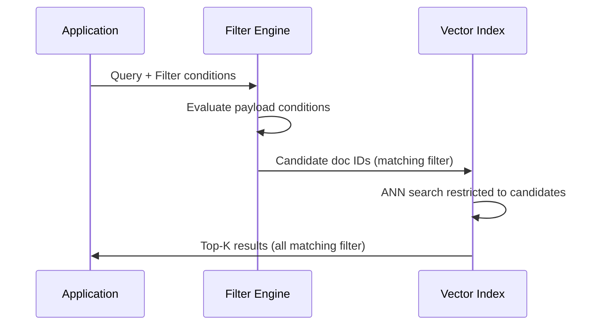

# 08. Metadata Filtering

## Overview

Metadata filtering restricts vector search to documents matching specific attributes — tenant ID, date range, document type, author, category, etc. It is the primary mechanism for implementing security isolation, multi-tenancy, relevance scoping, and access control in RAG systems.

---

## Why This Exists

Vector search finds semantically similar documents, but "similar" doesn't mean "authorized" or "applicable." A user at Company A should not retrieve Company B's documents even if their query is semantically similar to Company B's content. A user asking about Q1 policies shouldn't get Q4 results. Metadata filtering enforces these constraints.

---

## Problem Being Solved

```
Multi-tenant scenario:
  User from acme_corp asks: "What is our refund policy?"
  
  Without filtering:
    Vector search returns the 5 most semantically similar chunks
    → Could return beta_inc's refund policy (high semantic similarity)
    → Data leakage between tenants
  
  With tenant filter:
    Filter: tenant_id == "acme_corp"
    Vector search restricted to acme_corp documents only
    → Returns acme_corp's actual refund policy
    → Zero risk of cross-tenant leakage
```

---

## Core Concepts

### Metadata Schema Design

Before indexing, design your metadata schema. You cannot easily add new metadata fields to existing vectors without re-indexing.

**Core fields to always include:**

```python
@dataclass
class ChunkMetadata:
    # Identity
    chunk_id: str          # Unique chunk identifier
    doc_id: str            # Parent document ID
    
    # Tenant/security
    tenant_id: str         # Multi-tenant isolation (CRITICAL)
    access_level: str      # "public", "internal", "confidential", "restricted"
    owner_id: str          # Who owns this document
    
    # Content classification
    doc_type: str          # "policy", "technical", "faq", "legal", etc.
    category: str          # Business category
    language: str          # ISO 639-1 code
    
    # Temporal
    created_at: float      # Unix timestamp
    updated_at: float      # Unix timestamp
    valid_from: float      # When this content becomes valid
    valid_until: float     # When this content expires
    
    # Source
    source: str            # File path or URL
    source_system: str     # "confluence", "github", "s3", "database"
    
    # Content
    chunk_index: int       # Position in document
    total_chunks: int      # Total chunks in document
    char_count: int        # Chunk character count
```

### Filter Types

| Filter Type | Example | Use Case |
|-------------|---------|----------|
| Exact match | `tenant_id == "acme"` | Tenant isolation |
| Range | `created_at >= 2024-01-01` | Date filtering |
| In/Any | `doc_type in ["policy", "faq"]` | Category filtering |
| Exists | `has_field("expiry_date")` | Optional field presence |
| Nested | `author.department == "legal"` | Nested objects |
| Combined (AND) | `tenant_id == X AND doc_type == Y` | Multi-condition |
| Combined (OR) | `access == "public" OR owner == user` | Permission union |

---

## Internal Architecture

### Pre-filter vs. Post-filter

**Post-filter (avoid):**
```
1. Vector search → top 1000 results
2. Apply metadata filter → keep 20 matching results
3. Problem: Many wasted vector comparisons; inconsistent result count
```

**Pre-filter (preferred in Qdrant/Weaviate):**
```
1. Apply metadata filter → candidate set (e.g., 10,000 docs for this tenant)
2. Vector search within candidate set → top 5 results
3. Always returns K results; no wasted comparisons
```



---

## Implementation

### Qdrant Filtering

```python
from qdrant_client.models import (
    Filter, FieldCondition, MatchValue, MatchAny,
    Range, HasId, IsEmpty, IsNull, NestedCondition,
    FilterSelector
)
from datetime import datetime

class MetadataFilterBuilder:
    """Fluent builder for Qdrant filters."""
    
    def __init__(self):
        self._must: list = []
        self._should: list = []
        self._must_not: list = []
    
    def tenant(self, tenant_id: str) -> "MetadataFilterBuilder":
        self._must.append(FieldCondition(key="tenant_id", match=MatchValue(value=tenant_id)))
        return self
    
    def doc_types(self, *types: str) -> "MetadataFilterBuilder":
        self._must.append(FieldCondition(key="doc_type", match=MatchAny(any=list(types))))
        return self
    
    def after_date(self, dt: datetime) -> "MetadataFilterBuilder":
        self._must.append(FieldCondition(key="created_at", range=Range(gte=dt.timestamp())))
        return self
    
    def before_date(self, dt: datetime) -> "MetadataFilterBuilder":
        self._must.append(FieldCondition(key="created_at", range=Range(lte=dt.timestamp())))
        return self
    
    def access_levels(self, *levels: str) -> "MetadataFilterBuilder":
        """Filter by access level (security control)."""
        self._must.append(FieldCondition(key="access_level", match=MatchAny(any=list(levels))))
        return self
    
    def language(self, lang: str) -> "MetadataFilterBuilder":
        self._must.append(FieldCondition(key="language", match=MatchValue(value=lang)))
        return self
    
    def not_expired(self) -> "MetadataFilterBuilder":
        """Exclude documents past their valid_until date."""
        self._must.append(FieldCondition(
            key="valid_until",
            range=Range(gte=datetime.utcnow().timestamp())
        ))
        return self
    
    def build(self) -> Filter | None:
        if not self._must and not self._should and not self._must_not:
            return None
        return Filter(
            must=self._must or None,
            should=self._should or None,
            must_not=self._must_not or None,
        )

# Usage
filter_builder = (
    MetadataFilterBuilder()
    .tenant("acme_corp")
    .doc_types("policy", "faq")
    .after_date(datetime(2024, 1, 1))
    .not_expired()
)
qdrant_filter = filter_builder.build()
```

### Multi-Tenant Retrieval

```python
from dataclasses import dataclass
from enum import Enum

class AccessLevel(str, Enum):
    PUBLIC = "public"
    INTERNAL = "internal"
    CONFIDENTIAL = "confidential"
    RESTRICTED = "restricted"

@dataclass
class UserContext:
    user_id: str
    tenant_id: str
    access_levels: list[AccessLevel]
    department: str | None = None

class MultiTenantRetriever:
    """
    Enforces tenant isolation and access control at retrieval time.
    NEVER allow user-controlled filter injection.
    """
    
    def __init__(self, vector_store, embedder):
        self.store = vector_store
        self.embedder = embedder
    
    def _build_security_filter(self, user_context: UserContext) -> Filter:
        """
        Build a filter that enforces:
        1. Tenant isolation (must match tenant_id)
        2. Access level (must match user's allowed levels)
        """
        return Filter(
            must=[
                # Tenant isolation — non-negotiable
                FieldCondition(
                    key="tenant_id",
                    match=MatchValue(value=user_context.tenant_id)
                ),
                # Access level — only docs user is authorized to see
                FieldCondition(
                    key="access_level",
                    match=MatchAny(any=[lvl.value for lvl in user_context.access_levels])
                )
            ]
        )
    
    async def retrieve(
        self,
        query: str,
        user_context: UserContext,
        k: int = 5,
        additional_filters: Filter | None = None,
    ) -> list[dict]:
        # Security filter — always applied, never bypassed
        security_filter = self._build_security_filter(user_context)
        
        # Merge with additional filters
        if additional_filters:
            final_filter = Filter(must=[security_filter, additional_filters])
        else:
            final_filter = security_filter
        
        query_vector = await self.embedder.embed_single(query)
        
        results = await self.store.search(
            collection_name="documents",
            query_vector=query_vector,
            query_filter=final_filter,
            limit=k,
            with_payload=True,
        )
        
        return [
            {"text": r.payload.get("text", ""), "score": r.score, **r.payload}
            for r in results
        ]
```

---

## Practical Example

```python
# Temporal filtering for knowledge freshness
import asyncio
from datetime import datetime, timedelta

class TemporallyAwareRetriever:
    """
    Retrieves recent documents with a freshness bias.
    Useful for domains where knowledge ages quickly (security, finance).
    """
    
    def __init__(self, store, embedder, freshness_window_days: int = 90):
        self.store = store
        self.embedder = embedder
        self.freshness_window = timedelta(days=freshness_window_days)
    
    async def retrieve(self, query: str, k: int = 5) -> list[dict]:
        # Try recent documents first
        recent_cutoff = datetime.utcnow() - self.freshness_window
        recent_filter = Filter(must=[
            FieldCondition(key="created_at", range=Range(gte=recent_cutoff.timestamp()))
        ])
        
        query_vector = await self.embedder.embed_single(query)
        recent_results = await self.store.search(
            query_vector=query_vector,
            query_filter=recent_filter,
            limit=k,
        )
        
        if len(recent_results) >= 3:  # Enough recent results
            return [{"text": r.payload["text"], "score": r.score} for r in recent_results]
        
        # Fall back to all-time search if not enough recent results
        all_results = await self.store.search(
            query_vector=query_vector,
            limit=k,
        )
        return [{"text": r.payload["text"], "score": r.score} for r in all_results]
```

---

## Production Example

```python
# Enterprise RAG with role-based access control
from functools import lru_cache

class RBACRetriever:
    """
    Role-Based Access Control for document retrieval.
    Maps user roles to allowed access levels and document categories.
    """
    
    ROLE_PERMISSIONS = {
        "admin": {
            "access_levels": ["public", "internal", "confidential", "restricted"],
            "categories": None,  # No category restriction
        },
        "employee": {
            "access_levels": ["public", "internal"],
            "categories": None,
        },
        "contractor": {
            "access_levels": ["public"],
            "categories": ["technical", "onboarding"],
        },
        "customer": {
            "access_levels": ["public"],
            "categories": ["product", "support", "faq"],
        }
    }
    
    def build_filter_for_role(self, role: str, tenant_id: str) -> Filter:
        permissions = self.ROLE_PERMISSIONS.get(role, self.ROLE_PERMISSIONS["customer"])
        
        conditions = [
            FieldCondition(key="tenant_id", match=MatchValue(value=tenant_id)),
            FieldCondition(
                key="access_level",
                match=MatchAny(any=permissions["access_levels"])
            )
        ]
        
        if permissions["categories"]:
            conditions.append(FieldCondition(
                key="category",
                match=MatchAny(any=permissions["categories"])
            ))
        
        return Filter(must=conditions)
```

---

## Common Mistakes

1. **Allowing user-controlled filters** — Users can manipulate filters to access unauthorized content
2. **No tenant_id field** — Can't isolate data between tenants retroactively
3. **Filtering after retrieval** — Wastes compute; use pre-filter in Qdrant/Weaviate
4. **Over-filtering** — Too restrictive filters return 0 results
5. **Not indexing metadata fields** — Unindexed fields require full scan

---

## Best Practices

- **Tenant isolation is non-negotiable** — Always filter by tenant_id first
- **Build security filter server-side** — Never trust client-provided filters
- **Design metadata schema upfront** — Changing it later requires re-indexing
- **Index all filterable fields** — Qdrant automatically indexes payload fields used in filters
- **Use `valid_until` for expiring content** — TTL for time-sensitive documents
- **Audit filter usage** — Log which filters were applied for security forensics

---

## Security Considerations

- **Filter bypass via injection**: Never interpolate user input into filter expressions
- **Missing field = no match**: If `tenant_id` is absent from a document, it won't match any tenant filter — safe by default
- **Test isolation**: Explicitly test that Tenant A cannot retrieve Tenant B's documents
- **Admin bypass**: Admin roles should still be scoped to their organization, not all tenants

---

## Related Concepts

- [05. Vector Databases](05-vector-databases.md)
- [07. Retrieval Strategies](07-retrieval-strategies.md)
- [24. Security](./24-security.md)
- [26. Production Architecture](./26-production-architecture.md)

---

## Interview Questions

**Q: How do you implement multi-tenancy in a RAG system?**  
A: Store `tenant_id` as a metadata payload field on every chunk. At query time, always apply a server-side filter for the authenticated user's tenant_id. This filter is applied before ANN search (pre-filtering in Qdrant), ensuring strict isolation. Test explicitly that cross-tenant retrieval is impossible.

**Q: What's the risk of post-filtering vs. pre-filtering?**  
A: Post-filtering: Do vector search → get 1000 results → filter to 20. Problems: (1) wastes compute comparing irrelevant vectors, (2) may return fewer than K results if most fail the filter, (3) inconsistent latency. Pre-filtering restricts the search space before ANN — more efficient, consistent result count.

---

## Summary

Metadata filtering is the security and relevance scoping layer of RAG. Design your metadata schema before indexing, always apply tenant isolation filters server-side, use pre-filtering for performance, and never allow user-controlled filter injection. Combined with proper access level tracking, metadata filtering enables secure, multi-tenant RAG at enterprise scale.
