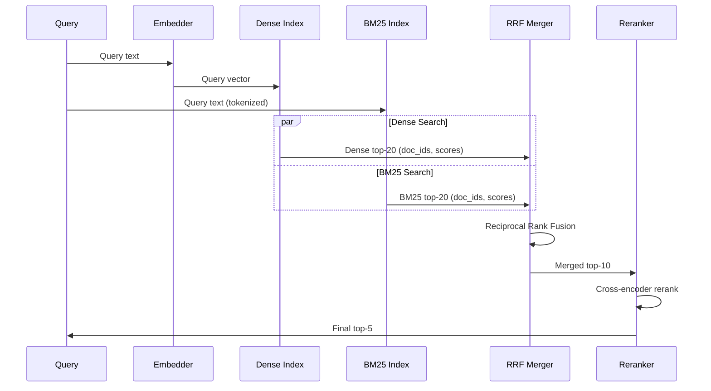

# 09. Hybrid Search

## Overview

Hybrid search combines dense (semantic/vector) retrieval with sparse (keyword/BM25) retrieval to achieve higher recall than either method alone. It is the recommended baseline retrieval strategy for production RAG systems in 2024, consistently outperforming pure semantic search on most benchmarks.

---

## Why This Exists

No single retrieval method is dominant for all query types:

| Query Type | Best Retrieval | Fails On |
|-----------|---------------|---------|
| Conceptual | Dense (semantic) | Exact terms |
| Keyword | Sparse (BM25) | Paraphrase |
| Mixed | Hybrid | Nothing |

Hybrid search hedges the bet — it ensures you capture both semantic matches and exact keyword matches, merged into a single ranked list.

---

## Problem Being Solved

```
Query: "CVE-2024-1234 vulnerability impact"

Dense search returns:
  - "Critical security vulnerability discovered in OpenSSL" (semantic, score: 0.82)
  - "Remote code execution risk in network components" (semantic, score: 0.79)
  - Misses: The document literally titled "CVE-2024-1234" (different embedding space)

BM25 returns:
  - "CVE-2024-1234: Buffer overflow in libssl..." (exact: score: 8.3)
  - "Advisory: CVE-2024-1234 affects versions..." (exact: score: 7.1)
  - Misses: "New OpenSSL flaw enables RCE" (semantic paraphrase)

Hybrid returns: All of the above, merged and re-ranked by RRF
→ Complete, precise, semantically rich results
```

---

## Core Concepts

### Dense Retrieval (Vector Search)

Embeds query and documents into a shared vector space. Finds semantically similar documents regardless of exact wording.

**Strengths:** Handles paraphrase, synonyms, cross-lingual  
**Weaknesses:** Misses exact keyword matches, new/rare terms, named entities

### Sparse Retrieval (BM25/TF-IDF)

Represents documents as sparse term-frequency vectors. Finds documents containing the query terms.

**Strengths:** Exact matches, named entities, codes, product IDs  
**Weaknesses:** Vocabulary mismatch, no semantic understanding

### Learned Sparse Retrieval (SPLADE)

A neural sparse model that predicts importance weights for vocabulary terms, combining the interpretability of sparse vectors with neural scoring:

```python
# SPLADE produces sparse vectors like BM25 but learned from data
# "machine learning" → {"machine": 2.1, "learning": 1.8, "ml": 1.3, "artificial": 0.9}
```

SPLADE outperforms BM25 but requires more compute during indexing.

---

## Reciprocal Rank Fusion (RRF)

The standard algorithm for merging results from multiple retrieval systems without needing calibrated scores:

$$RRF(d) = \sum_{r \in \text{rankers}} \frac{1}{k + \text{rank}_r(d)}$$

Where $k = 60$ is a constant that dampens the impact of high ranks.

```python
def reciprocal_rank_fusion(
    result_lists: list[list[str]],
    k: int = 60
) -> list[tuple[str, float]]:
    """
    Merge multiple ranked lists using RRF.
    
    Args:
        result_lists: Each list is a ranked list of document IDs
        k: RRF smoothing constant (default: 60)
    
    Returns:
        List of (doc_id, rrf_score) sorted by score descending
    """
    scores: dict[str, float] = {}
    
    for ranked_list in result_lists:
        for rank, doc_id in enumerate(ranked_list, 1):
            if doc_id not in scores:
                scores[doc_id] = 0.0
            scores[doc_id] += 1.0 / (k + rank)
    
    return sorted(scores.items(), key=lambda x: x[1], reverse=True)

# Example:
dense_results = ["doc_A", "doc_B", "doc_C", "doc_D"]
bm25_results  = ["doc_C", "doc_E", "doc_A", "doc_F"]

merged = reciprocal_rank_fusion([dense_results, bm25_results])
# doc_A: 1/(60+1) + 1/(60+3) = 0.0164 + 0.0156 = 0.0320  ← both ranked it
# doc_C: 1/(60+3) + 1/(60+1) = 0.0156 + 0.0164 = 0.0320  ← both ranked it
# doc_B: 1/(60+2) = 0.0161
# doc_E: 1/(60+2) = 0.0161
print(merged)
```

### Score Normalization + Weighted Combination

Alternative to RRF: normalize scores to [0,1] and combine with weights:

```python
def weighted_combine(
    dense_results: list[tuple[str, float]],
    sparse_results: list[tuple[str, float]],
    dense_weight: float = 0.7,
    sparse_weight: float = 0.3,
) -> list[tuple[str, float]]:
    """Min-max normalize scores, then weighted combine."""
    
    def normalize(results: list[tuple[str, float]]) -> dict[str, float]:
        if not results:
            return {}
        scores = [s for _, s in results]
        min_s, max_s = min(scores), max(scores)
        rng = max_s - min_s or 1.0
        return {doc_id: (s - min_s) / rng for doc_id, s in results}
    
    dense_norm = normalize(dense_results)
    sparse_norm = normalize(sparse_results)
    
    all_docs = set(dense_norm) | set(sparse_norm)
    combined = {
        doc: dense_weight * dense_norm.get(doc, 0) + sparse_weight * sparse_norm.get(doc, 0)
        for doc in all_docs
    }
    
    return sorted(combined.items(), key=lambda x: x[1], reverse=True)
```

**RRF vs. weighted combination:**
- RRF is rank-based (robust, no calibration needed) — preferred in practice
- Weighted combination requires calibrated scores from both systems

---

## Implementation

### Approach 1: Application-Level Hybrid (DIY)

Run BM25 and dense search separately, merge with RRF:

```python
from rank_bm25 import BM25Okapi
import numpy as np
from sentence_transformers import SentenceTransformer
from dataclasses import dataclass

@dataclass
class HybridResult:
    doc_id: str
    text: str
    rrf_score: float
    dense_score: float
    bm25_score: float

class ApplicationLevelHybridSearch:
    """
    Hybrid search implemented at the application level.
    Use when your vector DB doesn't support native hybrid search.
    """
    
    def __init__(self, model_name: str = "BAAI/bge-small-en-v1.5"):
        self.model = SentenceTransformer(model_name)
        self.documents: list[str] = []
        self.doc_ids: list[str] = []
        self.bm25: BM25Okapi | None = None
        self.embeddings: np.ndarray | None = None
    
    def index(self, documents: list[str], doc_ids: list[str]) -> None:
        self.documents = documents
        self.doc_ids = doc_ids
        
        # BM25 index
        tokenized = [doc.lower().split() for doc in documents]
        self.bm25 = BM25Okapi(tokenized)
        
        # Dense index
        self.embeddings = self.model.encode(
            documents, normalize_embeddings=True, show_progress_bar=True
        )
    
    def search(self, query: str, k: int = 10, rrf_k: int = 60) -> list[HybridResult]:
        # BM25 retrieval
        bm25_scores = self.bm25.get_scores(query.lower().split())
        bm25_top_k = np.argsort(bm25_scores)[::-1][:k * 2]
        
        # Dense retrieval
        q_emb = self.model.encode([query], normalize_embeddings=True)[0]
        dense_scores = self.embeddings @ q_emb
        dense_top_k = np.argsort(dense_scores)[::-1][:k * 2]
        
        # Build ranked lists
        bm25_list = [self.doc_ids[i] for i in bm25_top_k]
        dense_list = [self.doc_ids[i] for i in dense_top_k]
        
        # RRF merge
        merged = dict(reciprocal_rank_fusion([dense_list, bm25_list], k=rrf_k))
        
        # Build results
        doc_id_to_idx = {did: i for i, did in enumerate(self.doc_ids)}
        results = []
        for doc_id, rrf_score in sorted(merged.items(), key=lambda x: x[1], reverse=True)[:k]:
            idx = doc_id_to_idx.get(doc_id)
            if idx is not None:
                results.append(HybridResult(
                    doc_id=doc_id,
                    text=self.documents[idx],
                    rrf_score=rrf_score,
                    dense_score=float(dense_scores[idx]),
                    bm25_score=float(bm25_scores[idx]),
                ))
        
        return results
```

### Approach 2: Qdrant Native Hybrid Search

Qdrant supports both dense and sparse vectors natively:

```python
from qdrant_client import QdrantClient
from qdrant_client.models import (
    VectorParams, SparseVectorParams, Distance,
    SparseIndexParams, PointStruct,
    SparseVector, NamedSparseVector, NamedVector
)

# Collection with both dense and sparse vectors
client.create_collection(
    collection_name="hybrid_docs",
    vectors_config={
        "dense": VectorParams(size=1536, distance=Distance.COSINE)
    },
    sparse_vectors_config={
        "sparse": SparseVectorParams(
            index=SparseIndexParams(on_disk=False)
        )
    }
)

# Insert with both vector types
def text_to_sparse_vector(text: str, vocab_size: int = 30000) -> SparseVector:
    """Convert text to sparse TF-IDF vector (or use SPLADE model)."""
    from sklearn.feature_extraction.text import TfidfVectorizer
    # Simplified — use a pre-fitted vectorizer in production
    terms = text.lower().split()
    from collections import Counter
    term_counts = Counter(terms)
    
    # Simple hash-based sparse encoding
    indices = [hash(t) % vocab_size for t in term_counts]
    values = [float(c) for c in term_counts.values()]
    return SparseVector(indices=indices, values=values)

# Search with hybrid query
from qdrant_client.models import (
    SearchRequest, RecommendStrategy,
    FusionQuery, Prefetch
)

# Using Qdrant's Query API with hybrid fusion
results = client.query_points(
    collection_name="hybrid_docs",
    prefetch=[
        # Dense search
        Prefetch(query=[0.1] * 1536, using="dense", limit=20),
        # Sparse search  
        Prefetch(query=SparseVector(indices=[1,5,23], values=[0.8,0.4,0.3]), 
                 using="sparse", limit=20),
    ],
    query=FusionQuery(fusion="rrf"),  # Merge with RRF
    limit=5,
)
```

### Approach 3: Weaviate Native Hybrid

```python
import weaviate.classes as wvc

# Weaviate has native BM25 + vector hybrid
results = collection.query.hybrid(
    query="your search query",
    alpha=0.5,          # 0.0 = BM25 only, 1.0 = vector only, 0.5 = balanced
    limit=5,
    return_metadata=wvc.query.MetadataQuery(score=True, explain_score=True),
)

for result in results.objects:
    print(result.properties["content"])
    print(f"Score: {result.metadata.score}")
    print(f"Explanation: {result.metadata.explain_score}")
```

---

## Execution Flow



---

## Alpha Tuning

The weight between dense and sparse retrieval depends on query characteristics:

```python
def compute_alpha(query: str) -> float:
    """
    Heuristic to determine alpha (0=BM25, 1=dense) based on query type.
    """
    import re
    
    # Indicators of keyword queries → lower alpha (more BM25)
    keyword_indicators = [
        r'\b[A-Z]{2,}-\d+\b',  # Error codes
        r'\b[0-9a-f]{8,}\b',   # Hashes/IDs
        r'"[^"]+"',             # Quoted exact phrases
        r'\b\w+\(\)',           # Function calls
    ]
    for pattern in keyword_indicators:
        if re.search(pattern, query):
            return 0.3  # Mostly BM25
    
    # Natural language → more semantic
    if len(query.split()) > 8:
        return 0.7  # More semantic
    
    return 0.5  # Balanced default
```

---

## Production Example

```python
# Complete production hybrid search pipeline
import asyncio
from dataclasses import dataclass

@dataclass
class HybridSearchConfig:
    dense_k: int = 20        # Retrieve top-20 from dense
    sparse_k: int = 20       # Retrieve top-20 from BM25
    final_k: int = 5         # Return top-5 after merging
    rrf_k: int = 60          # RRF constant
    alpha: float = 0.5       # Dense weight (0=BM25, 1=dense)
    score_threshold: float = 0.4

class ProductionHybridRetriever:
    def __init__(
        self,
        dense_retriever,
        sparse_retriever,
        config: HybridSearchConfig | None = None,
    ):
        self.dense = dense_retriever
        self.sparse = sparse_retriever
        self.config = config or HybridSearchConfig()
    
    async def retrieve(
        self, query: str, tenant_id: str, k: int | None = None
    ) -> list[dict]:
        final_k = k or self.config.final_k
        
        # Parallel retrieval
        dense_task = self.dense.retrieve(query, tenant_id=tenant_id, k=self.config.dense_k)
        sparse_task = self.sparse.retrieve(query, tenant_id=tenant_id, k=self.config.sparse_k)
        
        dense_results, sparse_results = await asyncio.gather(dense_task, sparse_task)
        
        # Extract doc IDs for RRF
        dense_ids = [r["id"] for r in dense_results]
        sparse_ids = [r["id"] for r in sparse_results]
        
        # Build ID → result mapping
        all_results = {r["id"]: r for r in dense_results + sparse_results}
        
        # RRF merge
        merged = reciprocal_rank_fusion([dense_ids, sparse_ids], k=self.config.rrf_k)
        
        # Build final results
        final_results = []
        for doc_id, rrf_score in merged[:final_k]:
            if doc_id in all_results:
                result = all_results[doc_id].copy()
                result["rrf_score"] = rrf_score
                final_results.append(result)
        
        return final_results
```

---

## Common Mistakes

1. **Not normalizing BM25 and dense scores before combining** — Different scales make weighted combination unreliable (use RRF instead)
2. **Duplicate results** — Same document returned by both retrievers, counted twice
3. **Equal weight regardless of query type** — Tune alpha based on query characteristics
4. **Not testing hybrid against dense-only** — Sometimes hybrid doesn't improve; measure it
5. **Running searches serially** — Dense and sparse can run in parallel

---

## Best Practices

- **Use RRF over weighted combination** — More robust, no calibration needed
- **Run dense and BM25 in parallel** — They're independent, saves latency
- **Retrieve 2-4x more candidates** than final K before merging
- **Deduplicate after merging** — Same doc ID from both retrievers
- **Tune alpha on your domain** — Default 0.5; tune based on query type distribution
- **Always measure improvement** — Run benchmarks; hybrid doesn't always win

---

## Performance Considerations

| Operation | Latency |
|-----------|---------|
| Dense search only | 10–30ms |
| BM25 search only | 1–5ms |
| Hybrid (parallel) | 10–35ms (dense bottleneck) |
| Hybrid (serial) | 15–40ms |
| RRF computation | <1ms |

Hybrid adds minimal latency over dense-only when searches run in parallel.

---

## Evaluation Metrics

Test on a labeled dataset with:
- Dense-only recall@5
- BM25-only recall@5
- Hybrid recall@5

**Typical improvement:** Hybrid improves recall@5 by 5–15% over dense-only, 10–30% over BM25-only.

---

## Related Concepts

- [02. Information Retrieval Fundamentals](02-information-retrieval.md)
- [07. Retrieval Strategies](07-retrieval-strategies.md)
- [10. Reranking](10-reranking.md)
- [05. Vector Databases](05-vector-databases.md)

---

## Interview Questions

**Q: Why use RRF instead of score-based combination?**  
A: BM25 scores and cosine similarity scores are on different scales and distributions. Min-max normalization helps but is sensitive to outliers. RRF uses only rank positions, which are comparable across systems. It's more robust and requires zero calibration.

**Q: When does hybrid search NOT help?**  
A: When your corpus is small and well-covered by semantic embeddings. When all queries are natural language with no exact keyword requirements. When your BM25 implementation adds more noise than signal. Always measure on your specific dataset.

---

## References

- Cormack, G. et al. (2009). [Reciprocal Rank Fusion Outperforms Condorcet and Individual Rank Learning Methods](https://plg.uwaterloo.ca/~gvcormac/cormacksigir09-rrf.pdf)
- [Weaviate Hybrid Search Documentation](https://weaviate.io/developers/weaviate/search/hybrid)
- [Qdrant Hybrid Search](https://qdrant.tech/documentation/concepts/hybrid-queries/)

---

## Summary

Hybrid search combines the semantic understanding of dense retrieval with the exact-match precision of BM25, merged via Reciprocal Rank Fusion. It consistently outperforms either method alone and should be your default retrieval strategy in production. Use Qdrant or Weaviate for native hybrid support, or implement it at the application level with parallel retrieval and RRF. Tune alpha based on query type distribution in your domain.
