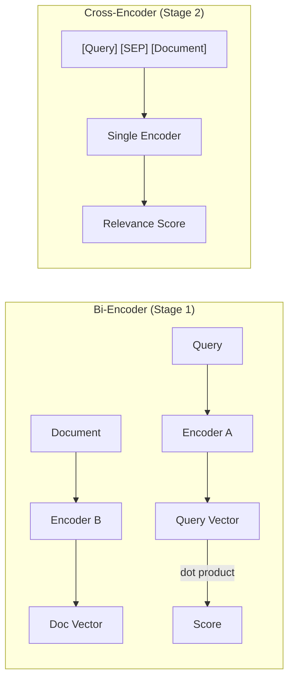
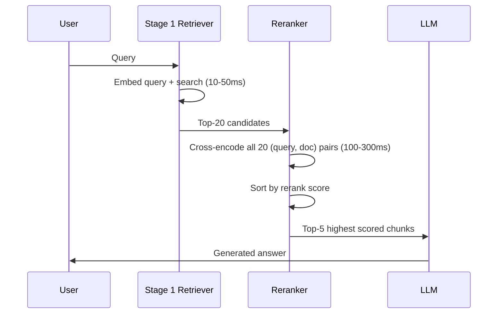

# 10. Reranking

## Overview

Reranking is a second-stage retrieval step that takes an initial set of candidate documents (from vector search or hybrid search) and re-orders them using a more powerful, computationally expensive model. It is one of the most impactful improvements you can make to a RAG pipeline with minimal architectural complexity.

---

## Why This Exists

First-stage retrieval (bi-encoder / vector search) is fast but uses independent query and document encodings. The model doesn't see the query and document together — it computes their similarity by comparing pre-computed vectors.

A cross-encoder (reranker) sees the query and document concatenated as input. It can model fine-grained interactions between query terms and document terms. This produces much more accurate relevance scores — at the cost of latency.

**The two-stage retrieval paradigm:**
```
Stage 1 (Fast, Approximate): Retrieve top-100 candidates in 10–50ms
Stage 2 (Slow, Accurate):    Rerank top-100 to find best top-5 in 100–300ms
```

---

## Problem Being Solved

```
Query: "How to fix SSL certificate verification failure in Python requests?"

Stage 1 retrieval (bi-encoder) returns (in this order):
  1. "Python SSL module documentation" (score: 0.82)
  2. "SSL certificate errors explained" (score: 0.80)
  3. "Python requests library: verify=False" (score: 0.78)
  4. "Common Python exceptions" (score: 0.76)
  5. "Fix for requests.exceptions.SSLError" (score: 0.74)

Problem: #5 is actually the most relevant, but scored lowest.
The bi-encoder missed the interaction between "fix" and "SSLError"

After reranking (cross-encoder):
  1. "Fix for requests.exceptions.SSLError" → rerank: 0.95
  2. "Python requests library: verify=False" → rerank: 0.92
  3. "SSL certificate errors explained" → rerank: 0.78
  4. "Python SSL module documentation" → rerank: 0.65
  5. "Common Python exceptions" → rerank: 0.23

Result: The most relevant document is now #1
```

---

## Core Concepts

### Bi-Encoder vs. Cross-Encoder



| Property | Bi-Encoder | Cross-Encoder |
|----------|-----------|---------------|
| Computation | O(N) query embeddings | O(K) inference calls |
| Can pre-compute? | Yes (documents) | No (query-doc specific) |
| Accuracy | Moderate | High |
| Latency | 10–50ms | 100–500ms |
| Scalable to 1M docs? | Yes | No (too slow) |
| Interaction modeling | None | Full attention |

### Why Cross-Encoders Are More Accurate

A cross-encoder uses full attention between every query token and every document token:

```
Query: "python SSL fix"
Document: "To fix SSL errors in requests, set verify to the certificate path"

Cross-encoder attention:
  "fix" ←→ "fix" (high attention)
  "SSL" ←→ "SSL errors" (high attention)
  "python" ←→ "requests" (indirect — requests is a Python library)
  
This attention pattern produces a much richer relevance signal.
```

---

## Reranking Models

### Open-Source Models

| Model | Parameters | Latency | Quality | Notes |
|-------|-----------|---------|---------|-------|
| `BAAI/bge-reranker-base` | 278M | ~30ms | Good | Fast baseline |
| `BAAI/bge-reranker-large` | 560M | ~60ms | Very good | Best open-source |
| `BAAI/bge-reranker-v2-m3` | 568M | ~70ms | Excellent | Multilingual |
| `cross-encoder/ms-marco-MiniLM-L-6-v2` | 22M | ~10ms | Decent | Ultra-fast |
| `cross-encoder/ms-marco-MiniLM-L-12-v2` | 33M | ~15ms | Good | Good price/perf |

### Commercial APIs

| Provider | API | Latency | Cost |
|----------|-----|---------|------|
| Cohere | `rerank-english-v3.0` | 100–200ms | $1/1K searches |
| Voyage AI | `rerank-1` | 100–200ms | Commercial |
| JinaAI | `jina-reranker-v2-base-multilingual` | 100–200ms | API-based |

---

## Implementation

### Basic Reranker

```python
from sentence_transformers import CrossEncoder
from dataclasses import dataclass

@dataclass
class RankedResult:
    text: str
    original_rank: int
    rerank_score: float
    metadata: dict

class CrossEncoderReranker:
    def __init__(self, model_name: str = "BAAI/bge-reranker-large"):
        self.model = CrossEncoder(model_name)
    
    def rerank(
        self,
        query: str,
        candidates: list[dict],
        top_k: int | None = None,
        score_threshold: float | None = None,
    ) -> list[RankedResult]:
        if not candidates:
            return []
        
        # Prepare query-document pairs
        pairs = [(query, c["text"]) for c in candidates]
        
        # Score all pairs
        scores = self.model.predict(pairs, show_progress_bar=False)
        
        # Build ranked results
        results = [
            RankedResult(
                text=candidates[i]["text"],
                original_rank=i,
                rerank_score=float(scores[i]),
                metadata=candidates[i].get("metadata", {})
            )
            for i in range(len(candidates))
        ]
        
        # Sort by rerank score
        results.sort(key=lambda r: r.rerank_score, reverse=True)
        
        # Apply threshold
        if score_threshold is not None:
            results = [r for r in results if r.rerank_score >= score_threshold]
        
        return results[:top_k] if top_k else results
```

### Cohere Reranker (API)

```python
import cohere
import asyncio

class CohereReranker:
    def __init__(self, api_key: str, model: str = "rerank-english-v3.0"):
        self.client = cohere.AsyncClient(api_key=api_key)
        self.model = model
    
    async def rerank(
        self,
        query: str,
        candidates: list[dict],
        top_k: int = 5,
    ) -> list[dict]:
        if not candidates:
            return []
        
        documents = [c["text"] for c in candidates]
        
        response = await self.client.rerank(
            model=self.model,
            query=query,
            documents=documents,
            top_n=top_k,
            return_documents=False,
        )
        
        return [
            {
                **candidates[result.index],
                "rerank_score": result.relevance_score,
                "original_rank": result.index,
            }
            for result in response.results
        ]
```

### Async Batch Reranker

```python
import asyncio
from concurrent.futures import ThreadPoolExecutor

class AsyncBatchReranker:
    """Run CPU-bound cross-encoder in thread pool to avoid blocking async loop."""
    
    def __init__(self, model_name: str = "BAAI/bge-reranker-large"):
        self.model = CrossEncoder(model_name)
        self.executor = ThreadPoolExecutor(max_workers=2)
    
    async def rerank(self, query: str, candidates: list[dict], top_k: int = 5) -> list[dict]:
        loop = asyncio.get_event_loop()
        
        pairs = [(query, c["text"]) for c in candidates]
        
        # Run in thread pool (cross-encoder is CPU-bound)
        scores = await loop.run_in_executor(
            self.executor,
            lambda: self.model.predict(pairs, show_progress_bar=False)
        )
        
        ranked = sorted(
            zip(candidates, scores),
            key=lambda x: x[1],
            reverse=True
        )
        
        return [
            {**cand, "rerank_score": float(score)}
            for cand, score in ranked[:top_k]
        ]
```

---

## Two-Stage Retrieval Pipeline

```python
class TwoStageRetriever:
    """
    Stage 1: Hybrid retrieval (fast, high recall)
    Stage 2: Cross-encoder reranking (slow, high precision)
    """
    
    def __init__(
        self,
        stage1_retriever,
        stage2_reranker,
        stage1_k: int = 20,
        stage2_k: int = 5,
    ):
        self.stage1 = stage1_retriever
        self.stage2 = stage2_reranker
        self.stage1_k = stage1_k
        self.stage2_k = stage2_k
    
    async def retrieve(self, query: str, **kwargs) -> list[dict]:
        # Stage 1: Get candidates (fast, high recall)
        candidates = await self.stage1.retrieve(query, k=self.stage1_k, **kwargs)
        
        if not candidates:
            return []
        
        # Stage 2: Rerank (slow, high precision)
        reranked = await self.stage2.rerank(query, candidates, top_k=self.stage2_k)
        
        return reranked
```

---

## Execution Flow



---

## Cost vs. Accuracy Tradeoffs

```
Scenario: 1M documents, 1000 queries/day

Option A: Dense retrieval only
  Cost: ~$0 (local model) or $20/day (API)
  Latency: 20ms
  Quality: Baseline

Option B: Dense + reranking (local model)
  Cost: ~$0 extra (CPU/GPU compute)
  Latency: 150ms
  Quality: +10-20% over baseline

Option C: Dense + Cohere reranking
  Cost: $1/1K queries × 1K/day = $1/day
  Latency: 250ms  
  Quality: +15-25% over baseline

Option D: Hybrid + reranking
  Cost: $1/day + BM25 infrastructure
  Latency: 200ms
  Quality: +20-35% over baseline ← Best overall
```

---

## Production Example

```python
# Production reranker with caching, metrics, and fallback
import hashlib
import time

class ProductionReranker:
    def __init__(self, model_name: str = "BAAI/bge-reranker-large"):
        self.reranker = AsyncBatchReranker(model_name)
        self._cache: dict[str, list[dict]] = {}  # Redis in production
        self.latencies: list[float] = []
    
    def _cache_key(self, query: str, candidate_texts: list[str]) -> str:
        content = query + "|".join(sorted(candidate_texts))
        return hashlib.sha256(content.encode()).hexdigest()
    
    async def rerank(
        self, query: str, candidates: list[dict], top_k: int = 5
    ) -> list[dict]:
        if not candidates:
            return []
        
        # Check cache
        key = self._cache_key(query, [c["text"] for c in candidates])
        if key in self._cache:
            return self._cache[key]
        
        # Rerank
        start = time.perf_counter()
        try:
            results = await self.reranker.rerank(query, candidates, top_k=top_k)
        except Exception:
            # Fallback: return original order
            results = candidates[:top_k]
        
        latency = (time.perf_counter() - start) * 1000
        self.latencies.append(latency)
        
        # Cache (short TTL for queries)
        self._cache[key] = results
        
        return results
    
    def get_p95_latency(self) -> float:
        if not self.latencies:
            return 0.0
        sorted_lat = sorted(self.latencies)
        p95_idx = int(len(sorted_lat) * 0.95)
        return sorted_lat[p95_idx]
```

---

## Common Mistakes

1. **Reranking the wrong set** — Running reranker on only top-5 from Stage 1 (too few candidates; reranker can't fix poor recall)
2. **Not batching cross-encoder calls** — Single inference per doc is ~100x slower than batch
3. **No fallback** — Reranker API failure crashes the pipeline
4. **Using reranker for Stage 1** — Cross-encoders can't scale to millions of documents
5. **Ignoring rerank score threshold** — Documents with 0.1 rerank score should be filtered

---

## Best Practices

- **Retrieve 4–10x more than you'll use** before reranking (e.g., top-20 → rerank → top-5)
- **Batch all pairs** in one cross-encoder inference call
- **Use local reranker for cost control**, Cohere/Voyage for best quality
- **Cache reranking results** — same query+docs pair will appear in similar queries
- **Implement fallback** — If reranker fails, return Stage 1 results (graceful degradation)
- **Monitor reranker latency separately** — It's usually the second-largest latency source

---

## Performance Considerations

| Model | 20 docs @ batch | Memory |
|-------|----------------|--------|
| ms-marco-MiniLM-L-6-v2 | ~10ms | 100MB |
| bge-reranker-base | ~30ms | 550MB |
| bge-reranker-large | ~60ms | 1.1GB |
| Cohere API | ~150ms | 0 (cloud) |

---

## Related Concepts

- [07. Retrieval Strategies](07-retrieval-strategies.md)
- [09. Hybrid Search](09-hybrid-search.md)
- [12. Advanced RAG](12-advanced-rag.md)

---

## Interview Questions

**Q: Why can't we just use a cross-encoder for all retrieval?**  
A: Cross-encoders require (query, document) concatenation at inference time — they cannot pre-compute document representations. For 1M documents, you'd need 1M cross-encoder inference calls per query. At 30ms each, that's 8 hours per query. Bi-encoders pre-compute document vectors; the query vector comparison is just a matrix multiply — milliseconds.

**Q: What K should you use for Stage 1 retrieval before reranking?**  
A: Typical recommendation is 4–10x the final K. If you want top-5 final results, retrieve top-20 to top-50 in Stage 1. Higher K means better reranker recall (it can find the needle) but higher latency (more pairs to score). Tune empirically on your domain using Recall@20 as the Stage 1 metric.

---

## References

- Nogueira, R. et al. (2020). [Passage Re-ranking with BERT](https://arxiv.org/abs/1901.04085)
- [BAAI BGE Reranker Models](https://huggingface.co/BAAI/bge-reranker-large)
- [Cohere Rerank Documentation](https://docs.cohere.com/reference/rerank)

---

## Summary

Reranking is a second-stage retrieval step that applies a cross-encoder to re-score candidates retrieved by a fast first-stage retriever. It significantly improves precision by modeling fine-grained query-document interactions. The two-stage retrieval pattern (retrieve top-20 → rerank to top-5) is the production standard. Use local models (BGE reranker) for low latency/cost, Cohere for best quality. Always implement a fallback and cache results for repeated queries.
