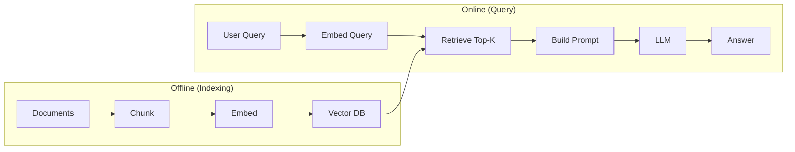
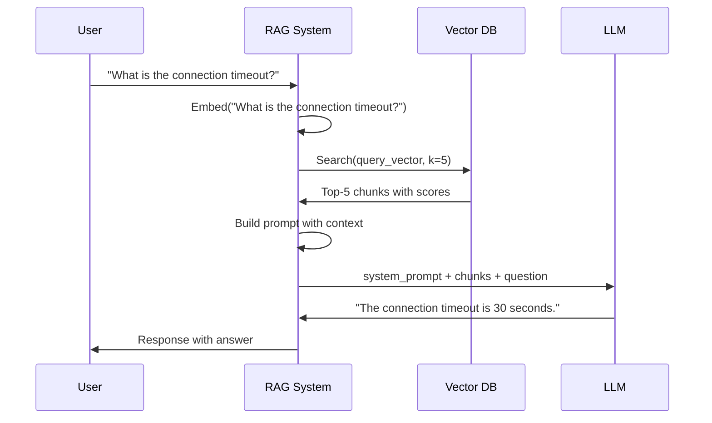

# 11. Naive RAG

## Overview

Naive RAG (also called Basic RAG or Standard RAG) is the simplest complete RAG architecture: embed documents → store in vector DB → embed query → retrieve top-K → generate answer. It is the starting point for all RAG systems and the baseline against which advanced variants are measured.

---

## Why This Exists

Naive RAG is the direct implementation of the original RAG paper (Lewis et al., 2020). It solves the fundamental problem — grounding LLM responses in external knowledge — with minimum complexity. For many use cases, it's "good enough."

---

## Core Architecture



---

## The Naive RAG Formula

```
Answer = LLM(system_prompt + retrieved_chunks + user_query)
```

That's the complete description. No query rewriting, no reranking, no compression — just retrieve and generate.

---

## Basic Example

```python
"""Naive RAG implementation — minimal, complete, educational."""

from openai import OpenAI
import numpy as np
from dataclasses import dataclass, field

client = OpenAI()

@dataclass
class NaiveRAG:
    model: str = "gpt-4o-mini"
    embed_model: str = "text-embedding-3-small"
    k: int = 3
    
    documents: list[str] = field(default_factory=list)
    embeddings: list[list[float]] = field(default_factory=list)
    
    SYSTEM_PROMPT = """You are a helpful assistant. Answer questions ONLY using the provided context.
If the answer is not in the context, say "I don't have that information."
Always be accurate and concise."""
    
    def _embed(self, text: str) -> list[float]:
        return client.embeddings.create(
            model=self.embed_model, input=text
        ).data[0].embedding
    
    def add_documents(self, docs: list[str]) -> None:
        """Index stage: chunk, embed, store."""
        for doc in docs:
            self.documents.append(doc)
            self.embeddings.append(self._embed(doc))
    
    def retrieve(self, query: str) -> list[str]:
        """Retrieval stage: embed query, find top-K."""
        q_emb = np.array(self._embed(query))
        doc_embs = np.array(self.embeddings)
        
        # Cosine similarity
        scores = doc_embs @ q_emb / (
            np.linalg.norm(doc_embs, axis=1) * np.linalg.norm(q_emb) + 1e-8
        )
        top_k = np.argsort(scores)[::-1][:self.k]
        return [self.documents[i] for i in top_k]
    
    def ask(self, question: str) -> str:
        """Full RAG pipeline: retrieve → augment → generate."""
        # 1. Retrieve
        chunks = self.retrieve(question)
        
        # 2. Augment
        context = "\n\n---\n\n".join(chunks)
        user_message = f"Context:\n{context}\n\nQuestion: {question}"
        
        # 3. Generate
        response = client.chat.completions.create(
            model=self.model,
            messages=[
                {"role": "system", "content": self.SYSTEM_PROMPT},
                {"role": "user", "content": user_message}
            ],
            temperature=0,
        )
        return response.choices[0].message.content

# Usage
rag = NaiveRAG(k=3)
rag.add_documents([
    "Python was created by Guido van Rossum and first released in 1991.",
    "Python 3.0 was released in 2008 and is not backward compatible with Python 2.",
    "Python is widely used in data science, web development, and automation.",
    "FastAPI is a modern, fast web framework for building APIs with Python 3.7+.",
    "Django is a full-featured web framework for Python that follows the MTV pattern.",
])

answer = rag.ask("When was Python 3 released?")
print(answer)
# → "Python 3.0 was released in 2008."
```

---

## Execution Flow



---

## Where Naive RAG Fails

### Problem 1: Poor Retrieval Quality

The query as phrased may not semantically match the right documents:

```
Query: "How do I make my API faster?"
Most relevant doc: "Optimizing response latency using async handlers and connection pooling"

The semantic gap between "make API faster" and "optimizing response latency"
may cause the retrieval to miss this document.
```

**Solution:** Query rewriting / expansion (→ Advanced RAG)

### Problem 2: Redundant Retrieved Context

Multiple retrieved chunks say the same thing:
```
Retrieved chunks 1-3 all say: "Use HTTPS for all API calls."
The LLM gets 3 copies of the same information, wasting tokens.
```

**Solution:** MMR, deduplication, context compression

### Problem 3: Lost in the Middle

The LLM performs worst on context in the middle of long prompts:
```
Context: [chunk1][chunk2][chunk3][chunk4][chunk5]
The relevant information is in chunk3 (middle)
LLM pays less attention to it than chunk1 or chunk5
```

**Solution:** Reranking to put best chunks first, context compression

### Problem 4: Multi-Hop Questions

Questions that require combining information from multiple documents:
```
Query: "Which products are affected by the vulnerability fixed in version 2.3.4?"

This requires:
  1. Find: "What vulnerability was fixed in v2.3.4?"
  2. Find: "Which products use the affected component?"
  
Single-pass retrieval can't handle this.
```

**Solution:** Multi-hop retrieval, Agentic RAG

### Problem 5: Outdated Chunks

```
Query: "What are the current rate limits?"

Retrieved chunk (from 6 months ago): "Rate limit: 100 requests/minute"
Actual current limit: 1000 requests/minute (changed 3 months ago)
```

**Solution:** Temporal metadata filtering, TTL on chunks, freshness-aware retrieval

### Problem 6: Hallucination When Context is Insufficient

```
Context retrieved: Partially relevant but doesn't fully answer the question
LLM: "Fills in the gaps" with plausible-but-wrong information
```

**Solution:** Confidence scoring, "I don't know" enforcement, Corrective RAG

---

## Limitations Summary

| Limitation | Root Cause | Advanced Solution |
|-----------|-----------|------------------|
| Query-document vocabulary mismatch | Single-pass semantic search | Query rewriting, hybrid search |
| Redundant context | No diversity in retrieval | MMR, deduplication |
| Poor ranking | No reranking step | Cross-encoder reranking |
| Multi-hop questions | Single retrieval round | Multi-hop retrieval |
| Context insufficiency → hallucination | No retrieval validation | Corrective RAG, Self-RAG |
| Outdated information | No temporal awareness | Metadata filtering by date |
| Token waste | No context compression | Context compression |

---

## When Naive RAG Is Good Enough

Despite its limitations, Naive RAG works well for:

- **Simple factual Q&A** over a focused, well-indexed knowledge base
- **Internal search** for SME-maintained document collections
- **Prototypes and demos** where speed of iteration matters
- **Small corpora** (<10,000 chunks) with high-quality documents
- **Single-domain questions** where queries naturally map to documents

**Rule of thumb:** If your naive RAG answers 80%+ of your test questions correctly, optimize it gradually rather than jumping to complex architectures.

---

## Production Checklist for Naive RAG

Even in its simplest form, production Naive RAG should have:

- [ ] Persistent vector store (not in-memory)
- [ ] Score threshold (reject irrelevant results)
- [ ] Graceful empty-result handling
- [ ] Source citations in responses
- [ ] Basic metadata (source, date)
- [ ] Query + response logging
- [ ] Rate limiting on the API endpoint
- [ ] Content hash deduplication in index

---

## Practical Naive RAG with FastAPI

```python
"""Production-deployable Naive RAG with FastAPI."""
from fastapi import FastAPI, HTTPException
from pydantic import BaseModel
from openai import AsyncOpenAI
import numpy as np
from typing import AsyncIterator

app = FastAPI(title="Naive RAG API")
client = AsyncOpenAI()

# In production: replace with Chroma/Qdrant
INDEX: list[dict] = []

class QueryRequest(BaseModel):
    question: str
    k: int = 3

class QueryResponse(BaseModel):
    answer: str
    sources: list[str]
    chunk_count: int

async def embed(text: str) -> list[float]:
    r = await client.embeddings.create(model="text-embedding-3-small", input=text)
    return r.data[0].embedding

@app.post("/query", response_model=QueryResponse)
async def query(req: QueryRequest):
    if not INDEX:
        raise HTTPException(status_code=503, detail="Index is empty")
    
    q_emb = np.array(await embed(req.question))
    embeddings = np.array([item["embedding"] for item in INDEX])
    scores = embeddings @ q_emb / (np.linalg.norm(embeddings, axis=1) * np.linalg.norm(q_emb) + 1e-8)
    
    top_k_idx = np.argsort(scores)[::-1][:req.k]
    top_k_scores = scores[top_k_idx]
    
    # Filter low-quality results
    good_idx = [i for i, idx in zip(top_k_idx, range(len(top_k_idx))) if top_k_scores[idx] > 0.5]
    
    if not good_idx:
        return QueryResponse(answer="I don't have information about that topic.", sources=[], chunk_count=0)
    
    chunks = [INDEX[i] for i in good_idx]
    context = "\n\n---\n\n".join(c["text"] for c in chunks)
    sources = list({c["metadata"].get("source", "unknown") for c in chunks})
    
    response = await client.chat.completions.create(
        model="gpt-4o-mini",
        messages=[
            {"role": "system", "content": "Answer ONLY from context. Cite [sources]. If not in context, say you don't know."},
            {"role": "user", "content": f"Context:\n{context}\n\nQuestion: {req.question}"}
        ],
        temperature=0,
    )
    
    return QueryResponse(
        answer=response.choices[0].message.content,
        sources=sources,
        chunk_count=len(chunks)
    )
```

---

## Common Mistakes

1. **K=4 hardcoded everywhere** — No score threshold, no quality check
2. **No system prompt constraints** — LLM ignores context and answers from training data
3. **Synchronous OpenAI calls in FastAPI** — Blocks the event loop
4. **No source attribution** — Cannot audit or verify answers
5. **In-memory only index** — Lost on restart
6. **Not logging queries** — Cannot analyze failure modes

---

## Related Concepts

- [12. Advanced RAG](12-advanced-rag.md)
- [07. Retrieval Strategies](07-retrieval-strategies.md)
- [10. Reranking](10-reranking.md)

---

## Interview Questions

**Q: What are the three components of Naive RAG?**  
A: Retrieval (embed query → find similar chunks), Augmentation (inject chunks into prompt), Generation (LLM produces grounded answer).

**Q: What is the first improvement you'd make to a Naive RAG system?**  
A: Add hybrid search (BM25 + dense) and a reranker. These two changes typically improve answer quality by 20–40% with modest complexity increase.

---

## References

- Lewis, P. et al. (2020). [Retrieval-Augmented Generation for Knowledge-Intensive NLP Tasks](https://arxiv.org/abs/2005.11401)

---

## Summary

Naive RAG is the baseline: chunk → embed → retrieve top-K → generate. It works well for simple, single-domain Q&A. Its limitations — vocabulary mismatch, redundant context, poor ranking, inability to handle multi-hop questions — motivate the advanced RAG variants covered in topics 12–20. Start with Naive RAG, measure quality, and add complexity only where needed.
