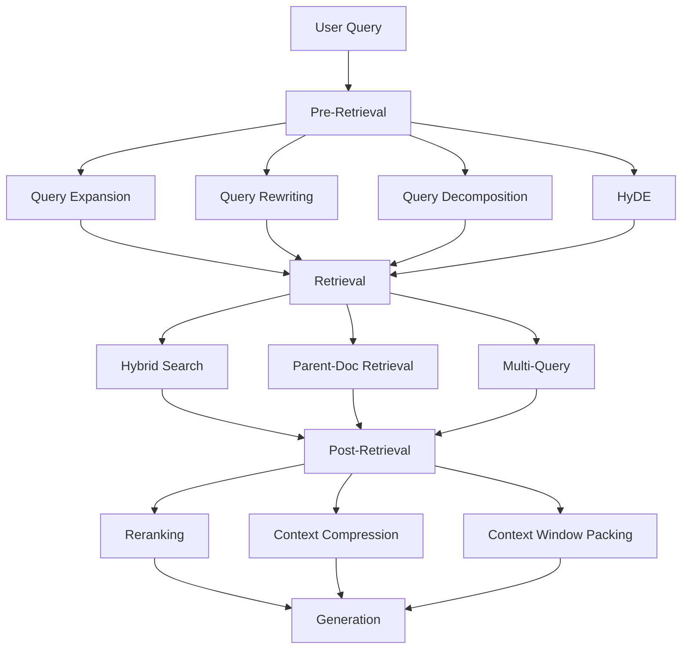
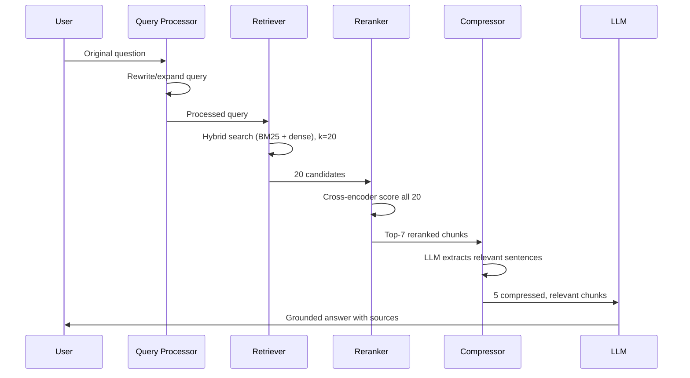

# 12. Advanced RAG

## Overview

Advanced RAG encompasses a family of techniques that improve upon Naive RAG by addressing its core failure modes: poor retrieval quality, insufficient context, and inability to handle complex queries. These techniques operate at the pre-retrieval (query transformation), retrieval (strategy enhancement), and post-retrieval (context optimization) stages.

---

## Why This Exists

Naive RAG fails when:
1. The user's query doesn't semantically match the indexed documents
2. A single retrieval pass doesn't capture all needed information
3. The retrieved context contains too much noise or redundancy
4. The LLM receives more context than it can effectively use

Advanced RAG techniques address each of these failures systematically.

---

## The Advanced RAG Landscape



---

## Pre-Retrieval Techniques

### 1. Query Rewriting

Use an LLM to rewrite the user's query to better match how documents are written:

```python
from openai import AsyncOpenAI
from dataclasses import dataclass

@dataclass
class QueryRewriter:
    client: AsyncOpenAI
    model: str = "gpt-4o-mini"
    
    REWRITE_PROMPT = """Rewrite the following user question to be more effective for document retrieval.
Make it more specific, use domain terminology, and remove conversational fillers.

Original: {query}
Rewritten:"""
    
    async def rewrite(self, query: str) -> str:
        response = await self.client.chat.completions.create(
            model=self.model,
            messages=[{
                "role": "user",
                "content": self.REWRITE_PROMPT.format(query=query)
            }],
            temperature=0,
            max_tokens=200,
        )
        return response.choices[0].message.content.strip()

# Example:
# Input: "how do i make this faster"
# Output: "performance optimization techniques for reducing API response latency"
```

---

### 2. Query Expansion

Generate alternative phrasings or related terms to improve recall:

```python
import asyncio
from typing import AsyncIterator

class QueryExpander:
    """Generate multiple query variants for broader retrieval coverage."""
    
    EXPANSION_PROMPT = """Generate 3 alternative search queries for the following question.
Each query should approach the topic from a different angle or use different terminology.

Question: {query}

Return exactly 3 queries, one per line:"""
    
    def __init__(self, client: AsyncOpenAI, model: str = "gpt-4o-mini"):
        self.client = client
        self.model = model
    
    async def expand(self, query: str) -> list[str]:
        response = await self.client.chat.completions.create(
            model=self.model,
            messages=[{
                "role": "user",
                "content": self.EXPANSION_PROMPT.format(query=query)
            }],
            temperature=0.3,
            max_tokens=300,
        )
        
        expanded = response.choices[0].message.content.strip().split('\n')
        # Clean and include original
        queries = [query] + [q.strip().lstrip('123.-) ') for q in expanded if q.strip()]
        return queries[:4]  # Original + 3 variants

# Example:
# Input: "Python async performance"
# Output: [
#   "Python async performance",
#   "asyncio performance optimization Python",
#   "improving throughput with async await Python",
#   "event loop bottlenecks Python concurrent requests"
# ]
```

---

### 3. HyDE (Hypothetical Document Embeddings)

Generate a hypothetical document that would answer the query, then embed it for retrieval. The hypothesis often matches real documents better than the raw query:

```python
class HyDE:
    """
    HyDE: Generate a hypothetical answer document, embed it,
    and use that embedding for retrieval instead of the query embedding.
    
    Intuition: A hypothetical answer is in the same linguistic space as
    real answer documents, creating a better retrieval signal.
    """
    
    HYPOTHESIS_PROMPT = """Write a short, factual passage that would answer this question.
Write it as if it were a paragraph from a technical document or documentation.
Be specific and use domain terminology.

Question: {query}

Passage:"""
    
    def __init__(self, client: AsyncOpenAI, embedder, model: str = "gpt-4o-mini"):
        self.client = client
        self.embedder = embedder
        self.model = model
    
    async def generate_hypothesis(self, query: str) -> str:
        response = await self.client.chat.completions.create(
            model=self.model,
            messages=[{
                "role": "user",
                "content": self.HYPOTHESIS_PROMPT.format(query=query)
            }],
            temperature=0.2,
        )
        return response.choices[0].message.content.strip()
    
    async def retrieve_with_hyde(self, query: str, retriever, k: int = 5) -> list[dict]:
        # Generate hypothetical document
        hypothesis = await self.generate_hypothesis(query)
        
        # Embed hypothesis (not original query)
        hyp_embedding = await self.embedder.embed_single(hypothesis)
        
        # Retrieve using hypothesis embedding
        results = await retriever.search_by_vector(hyp_embedding, k=k)
        return results

# Example:
# Query: "What causes connection pool exhaustion?"
# Hypothesis: "Connection pool exhaustion occurs when all available connections 
#              in the pool are in use and new requests cannot obtain a connection. 
#              This happens under high concurrency when the pool size is too small
#              relative to request volume..."
# → This hypothesis embeds much closer to the real documentation than the raw query
```

---

### 4. Query Decomposition (Step-Back Prompting)

Break complex queries into simpler sub-queries:

```python
class QueryDecomposer:
    """
    Decompose complex questions into simpler sub-questions.
    Each sub-question can be answered independently.
    """
    
    DECOMPOSE_PROMPT = """Break down the following complex question into 2-4 simpler sub-questions.
Each sub-question should be independently answerable.

Question: {query}

Sub-questions (one per line):"""
    
    def __init__(self, client: AsyncOpenAI):
        self.client = client
    
    async def decompose(self, query: str) -> list[str]:
        response = await self.client.chat.completions.create(
            model="gpt-4o-mini",
            messages=[{"role": "user", "content": self.DECOMPOSE_PROMPT.format(query=query)}],
            temperature=0,
        )
        lines = response.choices[0].message.content.strip().split('\n')
        return [l.strip().lstrip('1234567890.-) ') for l in lines if l.strip()]

# Example:
# Input: "Compare the performance and scaling characteristics of Qdrant and Pinecone for a 100M vector corpus"
# Output:
#   1. "What are Qdrant's performance characteristics for large vector collections?"
#   2. "How does Pinecone handle scaling to 100M vectors?"
#   3. "What are the cost differences between Qdrant and Pinecone at scale?"
#   4. "Which vector database has better query latency for 100M vectors?"
```

---

## Post-Retrieval Techniques

### 5. Context Compression (Selective Extraction)

Remove irrelevant parts of retrieved chunks before sending to the LLM:

```python
class ContextCompressor:
    """
    Extract only the relevant portions of retrieved documents.
    Reduces token count while preserving relevant information.
    """
    
    COMPRESS_PROMPT = """Given this context and question, extract ONLY the sentences or paragraphs 
that are directly relevant to answering the question. 
If nothing is relevant, return "IRRELEVANT".

Question: {question}

Context:
{context}

Relevant extract:"""
    
    def __init__(self, client: AsyncOpenAI):
        self.client = client
    
    async def compress(self, question: str, context: str) -> str | None:
        response = await self.client.chat.completions.create(
            model="gpt-4o-mini",
            messages=[{
                "role": "user",
                "content": self.COMPRESS_PROMPT.format(question=question, context=context)
            }],
            temperature=0,
            max_tokens=500,
        )
        
        result = response.choices[0].message.content.strip()
        return None if result == "IRRELEVANT" else result
    
    async def compress_chunks(self, question: str, chunks: list[str]) -> list[str]:
        """Compress all chunks in parallel, dropping irrelevant ones."""
        tasks = [self.compress(question, chunk) for chunk in chunks]
        compressed = await asyncio.gather(*tasks)
        return [c for c in compressed if c is not None]
```

### 6. Context Window Packing

Intelligently order retrieved chunks in the prompt to counteract "lost in the middle":

```python
def pack_context(chunks: list[dict], strategy: str = "lost_in_middle") -> list[dict]:
    """
    Order chunks in the prompt for optimal LLM attention.
    
    Strategies:
    - "descending": Best first (natural, works well for most cases)
    - "lost_in_middle": Best at start and end, lower quality in middle
    - "ascending": Worst first, best last (some evidence this helps)
    """
    if strategy == "descending":
        return sorted(chunks, key=lambda c: c.get("score", 0), reverse=True)
    
    elif strategy == "lost_in_middle":
        # Put best at position 0, second best at last position
        sorted_chunks = sorted(chunks, key=lambda c: c.get("score", 0), reverse=True)
        if len(sorted_chunks) <= 2:
            return sorted_chunks
        
        result = [None] * len(sorted_chunks)
        # Best → first, second best → last
        result[0] = sorted_chunks[0]
        result[-1] = sorted_chunks[1]
        # Fill middle with remaining in descending order
        for i, chunk in enumerate(sorted_chunks[2:], 1):
            result[i] = chunk
        return result
    
    elif strategy == "ascending":
        return sorted(chunks, key=lambda c: c.get("score", 0))
    
    return chunks
```

---

## Complete Advanced RAG Pipeline

```python
import asyncio
from openai import AsyncOpenAI

class AdvancedRAGPipeline:
    """
    Complete advanced RAG pipeline combining:
    - Query rewriting
    - Hybrid retrieval
    - Reranking
    - Context compression
    - Grounded generation
    """
    
    def __init__(
        self,
        retriever,
        reranker,
        compressor: ContextCompressor | None = None,
        enable_rewrite: bool = True,
        enable_compression: bool = True,
    ):
        self.client = AsyncOpenAI()
        self.retriever = retriever
        self.reranker = reranker
        self.compressor = compressor
        self.enable_rewrite = enable_rewrite
        self.enable_compression = enable_compression
        self.rewriter = QueryRewriter(self.client)
    
    async def run(self, question: str, tenant_id: str = "default") -> dict:
        # Stage 0: Query rewriting (optional)
        search_query = question
        if self.enable_rewrite:
            search_query = await self.rewriter.rewrite(question)
        
        # Stage 1: Retrieval (hybrid: BM25 + dense)
        candidates = await self.retriever.retrieve(search_query, tenant_id=tenant_id, k=20)
        
        if not candidates:
            return {"answer": "I don't have information about that topic.", "sources": []}
        
        # Stage 2: Reranking
        reranked = await self.reranker.rerank(search_query, candidates, top_k=7)
        
        # Stage 3: Context compression (optional)
        if self.enable_compression and self.compressor:
            chunks = await self.compressor.compress_chunks(
                question, [r["text"] for r in reranked]
            )
        else:
            chunks = [r["text"] for r in reranked]
        
        if not chunks:
            return {"answer": "I found some documents but couldn't extract relevant information.", "sources": []}
        
        # Stage 4: Context ordering (lost-in-middle prevention)
        context = "\n\n---\n\n".join(chunks[:5])
        
        # Stage 5: Generation
        response = await self.client.chat.completions.create(
            model="gpt-4o-mini",
            messages=[
                {
                    "role": "system",
                    "content": (
                        "Answer ONLY from the provided context. "
                        "Be accurate and cite relevant information. "
                        "If the answer is not in the context, say 'I don't have that information.'"
                    )
                },
                {
                    "role": "user",
                    "content": f"Context:\n{context}\n\nQuestion: {question}"
                }
            ],
            temperature=0,
        )
        
        sources = list({
            r.get("metadata", {}).get("source", "unknown")
            for r in reranked[:5]
        })
        
        return {
            "answer": response.choices[0].message.content,
            "sources": sources,
            "rewritten_query": search_query if self.enable_rewrite else None,
            "retrieved_count": len(candidates),
            "reranked_count": len(reranked),
            "compressed_count": len(chunks),
        }
```

---

## Execution Flow



---

## Technique Selection Guide

| Problem | Technique | Complexity Added |
|---------|-----------|-----------------|
| Query vocabulary mismatch | Query rewriting | Low (one LLM call) |
| Low recall | Query expansion + hybrid | Medium |
| Short query, sparse signal | HyDE | Low (one LLM call) |
| Complex multi-part question | Query decomposition | Medium |
| Redundant/noisy context | Context compression | Medium (N LLM calls) |
| LLM ignores middle context | Context window packing | Very low |
| Poor initial ranking | Cross-encoder reranking | Medium |

---

## Common Mistakes

1. **Applying all techniques at once** — More pipeline stages = more latency + failure points
2. **Not measuring each technique's contribution** — Add techniques incrementally, measure each
3. **Using a large LLM for query rewriting** — GPT-4o-mini is sufficient and much cheaper
4. **Compressing every chunk** — Only compress long, noisy chunks (>500 tokens)
5. **No fallback when rewriting makes query worse** — Sometimes the original query is better

---

## Best Practices

- **Start with Naive RAG** — Add advanced techniques based on measured failure modes
- **Add hybrid search first** — Biggest bang for buck, minimal complexity
- **Add reranking second** — Consistent precision improvement
- **Add query rewriting for user-facing chatbots** — Handles colloquial queries
- **Add HyDE for technical documentation** — Strong improvement on precise technical queries
- **Measure each addition** — Use Precision@5 and answer correctness

---

## Performance Considerations

| Technique | Added Latency | Added Cost |
|-----------|-------------|-----------|
| Query rewriting | +100–300ms | ~$0.001 |
| Query expansion | +100–300ms | ~$0.001 |
| HyDE | +100–300ms | ~$0.003 |
| Hybrid search | +5–20ms | ~$0 |
| Reranking (local) | +50–150ms | ~$0 |
| Reranking (Cohere) | +150–300ms | ~$0.001 |
| Context compression | +200–500ms (N calls) | ~$0.01 |

---

## Related Concepts

- [11. Naive RAG](11-naive-rag.md)
- [13. Parent Document Retrieval](13-parent-document-retrieval.md)
- [14. Multi-Query Retrieval](14-multi-query-retrieval.md)
- [15. Context Compression](15-context-compression.md)
- [10. Reranking](10-reranking.md)

---

## Interview Questions

**Q: What is HyDE and when does it outperform standard query embedding?**  
A: HyDE (Hypothetical Document Embeddings) generates a synthetic answer to the query and embeds that instead of the raw query. It outperforms standard embedding when queries are short, ambiguous, or use different vocabulary than the documents. A hypothetical answer is linguistically similar to the real answer documents, creating a better retrieval signal.

**Q: When would you NOT use context compression?**  
A: (1) When chunks are already concise (≤200 tokens) — compression overhead exceeds value. (2) When you need exact quotes or full context. (3) When latency SLA is strict — compression adds N LLM calls per retrieved chunk. (4) When the LLM doing compression might itself hallucinate.

---

## References

- Gao, Y. et al. (2023). [Retrieval-Augmented Generation for Large Language Models: A Survey](https://arxiv.org/abs/2312.10997)
- Gao, L. et al. (2022). [Precise Zero-Shot Dense Retrieval without Relevance Labels (HyDE)](https://arxiv.org/abs/2212.10496)
- Liu, N. et al. (2023). [Lost in the Middle: How Language Models Use Long Contexts](https://arxiv.org/abs/2307.03172)

---

## Summary

Advanced RAG is not a single technique but a collection of improvements targeting specific failure modes of Naive RAG. The high-ROI techniques are: hybrid search (covers vocab mismatch), reranking (improves precision), query rewriting (handles casual queries), and HyDE (improves technical retrieval). Add techniques incrementally, measure each addition, and avoid over-engineering for simple use cases.
