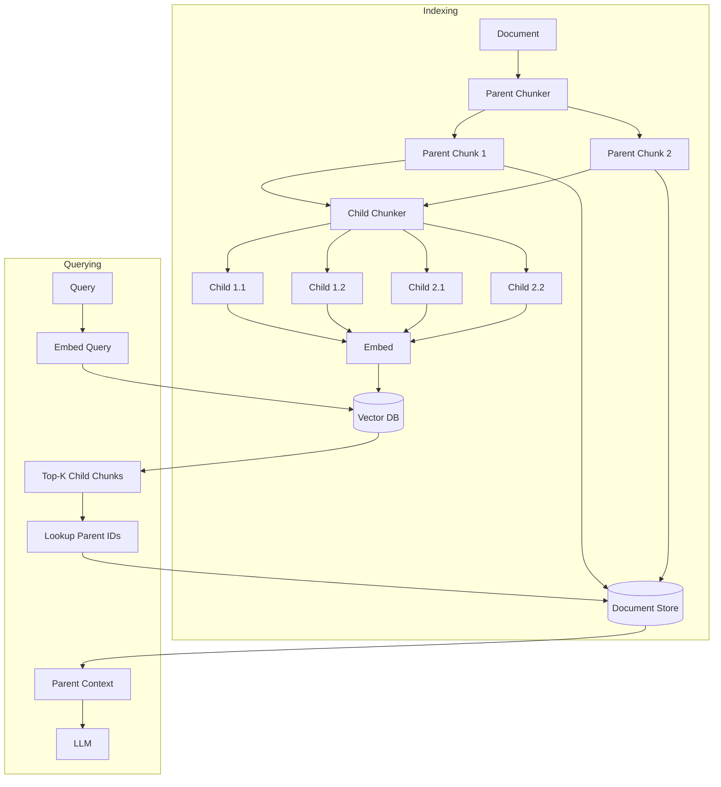
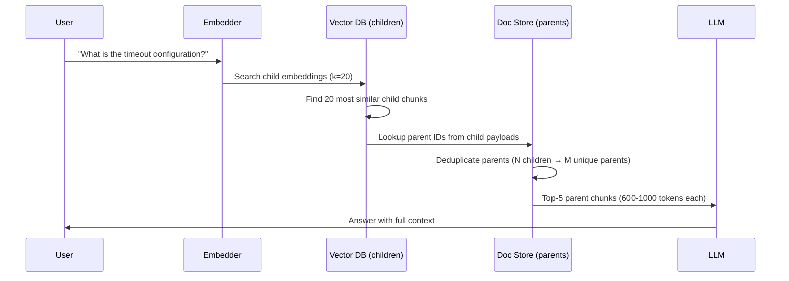

# 13. Parent Document Retrieval

## Overview

Parent Document Retrieval (also called "small-to-big" or hierarchical retrieval) is an architecture where small child chunks are used for semantic retrieval precision, but larger parent chunks are returned to the LLM for context richness. It solves the fundamental tension between chunk size for retrieval and chunk size for generation.

---

## Why This Exists

**The chunking dilemma:**
- **Small chunks** (100–200 tokens): High retrieval precision (focused, single-topic), but insufficient context for LLM to reason
- **Large chunks** (800–1200 tokens): Rich LLM context, but noisy retrieval (many topics, diluted embedding)

Parent Document Retrieval breaks this dilemma: retrieve small, generate from large.

---

## Problem Being Solved

```
Document: "Database Connection Guide"
  Section 1: "Installation (200 tokens)"
  Section 2: "Configuration (600 tokens)" ← Contains timeout settings
    Subsection 2.1: "Connection pool settings (150 tokens)"
    Subsection 2.2: "Timeout configuration (150 tokens)" ← MOST RELEVANT
    Subsection 2.3: "SSL settings (150 tokens)"
  Section 3: "Troubleshooting (400 tokens)"

Query: "What is the default connection timeout?"

With standard chunking (500-token chunks):
  Chunk A: "Section 1 + partial Section 2" → embedded together, weaker signal
  Chunk B: "Section 2 + partial Section 3" → embedded together, topic mixed

With parent-child chunking:
  Child: "Subsection 2.2: Timeout configuration (150 tokens)" ← retrieved exactly
  Parent: "Section 2: Configuration (600 tokens)" ← sent to LLM with full context
```

---

## Internal Architecture



**Key insight:** Vector DB stores child embeddings. Document store stores parent text. They're linked by parent_id.

---

## Implementation

### Storage Layer

```python
from dataclasses import dataclass, field
import uuid

@dataclass
class ParentChunk:
    """Stored in document store (not vector DB)."""
    id: str = field(default_factory=lambda: str(uuid.uuid4()))
    text: str = ""
    metadata: dict = field(default_factory=dict)

@dataclass
class ChildChunk:
    """Stored in vector DB with embedding."""
    id: str = field(default_factory=lambda: str(uuid.uuid4()))
    text: str = ""
    parent_id: str = ""  # Link to parent
    chunk_index: int = 0
    embedding: list[float] | None = None
    metadata: dict = field(default_factory=dict)

class InMemoryDocumentStore:
    """In production: Redis, PostgreSQL, or S3."""
    
    def __init__(self):
        self._store: dict[str, ParentChunk] = {}
    
    def put(self, chunk: ParentChunk) -> None:
        self._store[chunk.id] = chunk
    
    def get(self, parent_id: str) -> ParentChunk | None:
        return self._store.get(parent_id)
    
    def get_many(self, parent_ids: list[str]) -> list[ParentChunk]:
        return [self._store[pid] for pid in parent_ids if pid in self._store]
```

### Hierarchical Chunker

```python
class ParentChildChunker:
    """
    Creates two-level chunk hierarchy.
    Parent chunks: larger, stored in document store
    Child chunks: smaller, stored in vector DB
    """
    
    def __init__(
        self,
        parent_chunk_size: int = 1000,
        parent_overlap: int = 0,
        child_chunk_size: int = 200,
        child_overlap: int = 50,
    ):
        self.parent_chunker = RecursiveChunker(parent_chunk_size, parent_overlap)
        self.child_chunker = RecursiveChunker(child_chunk_size, child_overlap)
    
    def chunk(
        self,
        text: str,
        doc_metadata: dict | None = None,
    ) -> tuple[list[ParentChunk], list[ChildChunk]]:
        """
        Returns (parent_chunks, child_chunks).
        Child chunks are linked to parent chunks via parent_id.
        """
        parent_texts = self.parent_chunker.split(text)
        
        all_parents: list[ParentChunk] = []
        all_children: list[ChildChunk] = []
        
        for p_idx, parent_text in enumerate(parent_texts):
            parent = ParentChunk(
                text=parent_text,
                metadata={
                    **(doc_metadata or {}),
                    "parent_index": p_idx,
                    "total_parents": len(parent_texts),
                }
            )
            all_parents.append(parent)
            
            # Create children for this parent
            child_texts = self.child_chunker.split(parent_text)
            for c_idx, child_text in enumerate(child_texts):
                child = ChildChunk(
                    text=child_text,
                    parent_id=parent.id,
                    chunk_index=c_idx,
                    metadata={
                        **(doc_metadata or {}),
                        "parent_id": parent.id,
                        "child_index": c_idx,
                        "total_children": len(child_texts),
                    }
                )
                all_children.append(child)
        
        return all_parents, all_children
```

### Parent Document Retriever

```python
from qdrant_client import AsyncQdrantClient
from qdrant_client.models import PointStruct

class ParentDocumentRetriever:
    """
    Retrieval pipeline that:
    1. Searches child chunks (small, precise embeddings)
    2. Looks up corresponding parent chunks (large, context-rich)
    3. Deduplicates parents (multiple children may share a parent)
    """
    
    def __init__(
        self,
        vector_store: AsyncQdrantClient,
        doc_store: InMemoryDocumentStore,
        embedder,
        collection_name: str,
        child_k: int = 20,
        parent_k: int = 5,
    ):
        self.vector_store = vector_store
        self.doc_store = doc_store
        self.embedder = embedder
        self.collection_name = collection_name
        self.child_k = child_k
        self.parent_k = parent_k
    
    async def index_document(self, text: str, doc_metadata: dict | None = None) -> dict:
        """Index a document: store parents in doc store, children in vector DB."""
        chunker = ParentChildChunker()
        parents, children = chunker.chunk(text, doc_metadata)
        
        # Store parents in document store
        for parent in parents:
            self.doc_store.put(parent)
        
        # Embed and store children in vector DB
        child_texts = [c.text for c in children]
        embeddings = await self.embedder.embed_batch(child_texts)
        
        points = []
        for child, embedding in zip(children, embeddings):
            child.embedding = embedding
            points.append(PointStruct(
                id=child.id[:36],
                vector=embedding,
                payload={
                    "text": child.text,
                    "parent_id": child.parent_id,
                    **child.metadata
                }
            ))
        
        await self.vector_store.upsert(
            collection_name=self.collection_name,
            points=points
        )
        
        return {
            "parents_indexed": len(parents),
            "children_indexed": len(children),
        }
    
    async def retrieve(
        self,
        query: str,
        k: int | None = None,
    ) -> list[ParentChunk]:
        """
        Retrieve using child precision, return parent context.
        """
        final_k = k or self.parent_k
        query_vector = await self.embedder.embed_single(query)
        
        # Search children (use more candidates to get enough unique parents)
        child_results = await self.vector_store.search(
            collection_name=self.collection_name,
            query_vector=query_vector,
            limit=self.child_k,
            with_payload=True,
        )
        
        # Collect unique parent IDs, ordered by best child score
        seen_parents: dict[str, float] = {}  # parent_id → best child score
        for result in child_results:
            parent_id = result.payload.get("parent_id", "")
            if parent_id and parent_id not in seen_parents:
                seen_parents[parent_id] = result.score
            elif parent_id in seen_parents:
                seen_parents[parent_id] = max(seen_parents[parent_id], result.score)
        
        # Sort parents by best child score
        sorted_parent_ids = sorted(
            seen_parents.keys(),
            key=lambda pid: seen_parents[pid],
            reverse=True
        )[:final_k]
        
        # Fetch parent chunks
        parents = self.doc_store.get_many(sorted_parent_ids)
        
        # Add score to metadata
        for parent in parents:
            parent.metadata["retrieval_score"] = seen_parents.get(parent.id, 0.0)
        
        return parents
```

---

## Execution Flow



---

## Variant: Sentence-Window Retrieval

A simpler variant: retrieve individual sentences, but return them with surrounding sentences for context:

```python
class SentenceWindowRetriever:
    """
    Retrieve individual sentences, expand to surrounding window for context.
    Lighter-weight alternative to full parent-child chunking.
    """
    
    def __init__(self, sentences: list[str], embedder, window_size: int = 2):
        self.sentences = sentences
        self.embedder = embedder
        self.window_size = window_size
        self.embeddings = None
    
    async def build_index(self):
        import numpy as np
        embs = await self.embedder.embed_batch(self.sentences)
        self.embeddings = np.array(embs)
    
    async def retrieve(self, query: str, k: int = 3) -> list[str]:
        import numpy as np
        q_emb = np.array(await self.embedder.embed_single(query))
        scores = self.embeddings @ q_emb
        top_k = np.argsort(scores)[::-1][:k]
        
        results = []
        seen_indices = set()
        
        for idx in top_k:
            # Expand to window
            start = max(0, idx - self.window_size)
            end = min(len(self.sentences), idx + self.window_size + 1)
            window_indices = range(start, end)
            
            # Skip if already covered
            if any(i in seen_indices for i in window_indices):
                continue
            
            seen_indices.update(window_indices)
            window_text = " ".join(self.sentences[i] for i in window_indices)
            results.append(window_text)
        
        return results
```

---

## Practical Example

```python
# Comparing standard vs. parent-child retrieval quality
import asyncio

async def compare_retrieval_strategies():
    """Demonstrate that parent-child retrieval provides better context."""
    
    document = """
    # Database Configuration Guide
    
    ## Connection Settings
    
    The connection pool manages database connections efficiently. The default pool 
    size is 10 connections. Under high load, you may need to increase this to 50.
    
    ## Timeout Configuration
    
    Connection timeouts prevent hung requests. The default connection timeout is 
    30 seconds. If your database is on a different network, consider 45-60 seconds.
    The query timeout controls maximum query execution time, defaulting to 120 seconds.
    Long-running reports should use a separate connection pool with a 300-second timeout.
    
    ## SSL Configuration
    
    All production connections must use SSL. Configure ssl_mode to "require" in 
    production environments. The certificate path defaults to /etc/ssl/certs/ca.pem.
    """
    
    query = "What is the default connection timeout?"
    
    # With standard chunking (500 tokens), you might get:
    standard_chunk = """
    Connection timeouts prevent hung requests. The default connection timeout is 
    30 seconds. If your database is on a different network, consider 45-60 seconds.
    """
    # → Correct but limited context (150 tokens only)
    
    # With parent-child chunking:
    # Child retrieved: "The default connection timeout is 30 seconds." (30 tokens, precise match)
    # Parent returned: Full "Timeout Configuration" section (250 tokens, rich context)
    parent_context = """
    ## Timeout Configuration
    
    Connection timeouts prevent hung requests. The default connection timeout is 
    30 seconds. If your database is on a different network, consider 45-60 seconds.
    The query timeout controls maximum query execution time, defaulting to 120 seconds.
    Long-running reports should use a separate connection pool with a 300-second timeout.
    """
    # → Both correct answer AND context about query timeouts and long-running queries
    
    print("Standard chunk tokens:", len(standard_chunk.split()))
    print("Parent context tokens:", len(parent_context.split()))
    # Parent provides 3x more context while child retrieval ensures precision
```

---

## Common Mistakes

1. **Storing both child text and parent text in the vector DB** — Vector DB is for embeddings; parent text belongs in document store
2. **Same collection for children and parents** — Confuses the retrieval logic
3. **Not deduplicating parents** — Multiple children from same parent → parent context duplicated to LLM
4. **Parent too large** — 2000+ token parents can overflow context window
5. **Child too small** — 50-token children lack enough content for accurate embedding

---

## Best Practices

- **Parent size**: 800–1200 tokens (rich context for LLM)
- **Child size**: 150–300 tokens (precise retrieval signal)
- **Overlap on children**: 50–100 tokens (prevent split-context issues)
- **No overlap on parents**: Parents should have clean boundaries
- **Use a fast document store** for parent lookup (Redis, PostgreSQL)
- **Always return parent metadata** (source, section) for citations

---

## Performance Considerations

| Stage | Latency |
|-------|---------|
| Child vector search | 10–30ms |
| Parent ID deduplication | <1ms |
| Document store lookup | 1–5ms (memory/Redis) or 5–20ms (DB) |
| Total overhead vs. standard | +10ms |

---

## Related Concepts

- [04. Chunking Strategies](04-chunking-strategies.md)
- [07. Retrieval Strategies](07-retrieval-strategies.md)
- [15. Context Compression](15-context-compression.md)

---

## Interview Questions

**Q: Why not just use large chunks for everything?**  
A: Large chunks produce embeddings that represent many topics simultaneously, making cosine similarity less discriminative. A 1000-token chunk embedding averages the signal from many sentences, making it harder to match precisely against a specific query. Smaller chunks produce sharper, more specific embeddings.

**Q: How do you handle a query whose answer spans multiple parent chunks?**  
A: Retrieve multiple parents (top-3 to top-5). If the answer genuinely spans multiple sections, the parent-child approach will retrieve multiple relevant parents. For questions requiring synthesis across many sections, consider multi-hop retrieval or a broader context strategy.

---

## References

- [LangChain Parent Document Retriever](https://python.langchain.com/docs/modules/data_connection/retrievers/parent_document_retriever)
- Llamaindex. [Sentence Window Retrieval](https://docs.llamaindex.ai/en/stable/examples/node_postprocessor/MetadataReplacementDemo/)

---

## Summary

Parent Document Retrieval breaks the chunk-size dilemma by maintaining two granularities: small child chunks for precise vector retrieval, and large parent chunks for rich LLM context. Children are indexed in the vector DB; parents are stored in a document store; they're linked by parent_id. Retrieve via children, return via parents. This pattern consistently improves answer quality when answers require more context than a small chunk provides.
