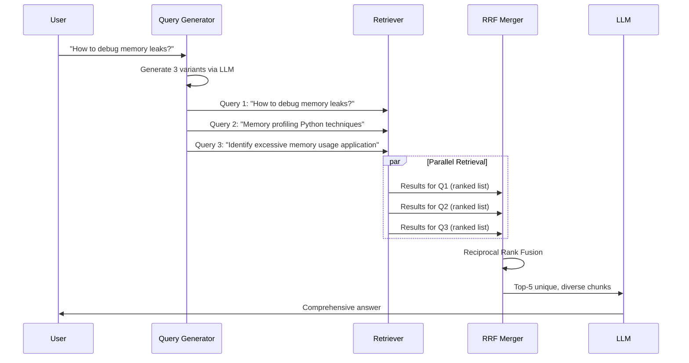

# 14. Multi-Query Retrieval

## Overview

Multi-Query Retrieval generates multiple alternative phrasings of the user's query, runs retrieval for each, and merges the results. It improves recall by ensuring that relevant documents are found even when the user's original phrasing doesn't semantically match how the answer is written.

---

## Why This Exists

A single query embedding captures one "direction" in the embedding space. If the relevant documents use different terminology, the query misses them. Multi-query retrieval hedges by exploring multiple directions simultaneously, dramatically improving recall.

---

## Problem Being Solved

```
Query: "How do I speed up database queries?"

Single retrieval catches:
  ✓ "Optimize database query performance"
  ✗ "Index strategies for faster data access"
  ✗ "Reducing query execution time"
  ✗ "Database query plan optimization"

Multi-query retrieval generates variants:
  1. "How do I speed up database queries?"
  2. "Database query performance optimization techniques"
  3. "Reducing database query execution time"
  4. "SQL index strategies for faster queries"

Runs 4 retrievals → merges with RRF → catches ALL relevant documents
```

---

## Core Concepts

### Query Diversification Strategies

1. **Vocabulary variation** — Same meaning, different words
2. **Perspective variation** — Same question from different angles
3. **Granularity variation** — High-level → low-level formulations
4. **Step-back prompting** — More general question for background context

### Retrieval Fusion

After running N retrievals, merge results:
- **Union**: Take all unique results from all retrievals
- **RRF (Reciprocal Rank Fusion)**: Rank by how consistently a document appears across retrievals
- **Intersection**: Only return documents that appear in all retrievals (high precision, low recall)

---

## Implementation

### Multi-Query Generator

```python
from openai import AsyncOpenAI
import asyncio

class MultiQueryGenerator:
    """
    Generate N alternative query formulations using an LLM.
    """
    
    PROMPT = """Generate {n} different search queries that would retrieve documents 
relevant to answering the following question. Each query should:
- Use different wording or terminology
- Approach the topic from a slightly different angle
- Be independently useful for retrieval

Question: {question}

Return exactly {n} queries, one per line, without numbering:"""
    
    def __init__(
        self,
        client: AsyncOpenAI,
        model: str = "gpt-4o-mini",
        n_queries: int = 3,
    ):
        self.client = client
        self.model = model
        self.n_queries = n_queries
    
    async def generate(self, question: str) -> list[str]:
        """Returns [original_query] + [generated variants]."""
        response = await self.client.chat.completions.create(
            model=self.model,
            messages=[{
                "role": "user",
                "content": self.PROMPT.format(n=self.n_queries, question=question)
            }],
            temperature=0.5,  # Some creativity for diverse phrasings
            max_tokens=400,
        )
        
        generated = response.choices[0].message.content.strip().split('\n')
        variants = [q.strip() for q in generated if q.strip()][:self.n_queries]
        
        # Always include original query
        all_queries = [question] + variants
        return list(dict.fromkeys(all_queries))  # Deduplicate while preserving order
```

### Multi-Query Retriever with RRF

```python
from dataclasses import dataclass

@dataclass
class MultiQueryResult:
    text: str
    metadata: dict
    rrf_score: float
    appeared_in_queries: list[str]
    query_scores: dict[str, float]

class MultiQueryRetriever:
    """
    Runs parallel retrievals for multiple query variants,
    merges with Reciprocal Rank Fusion.
    """
    
    def __init__(
        self,
        retriever,
        query_generator: MultiQueryGenerator,
        per_query_k: int = 10,
        final_k: int = 5,
        rrf_k: int = 60,
    ):
        self.retriever = retriever
        self.generator = query_generator
        self.per_query_k = per_query_k
        self.final_k = final_k
        self.rrf_k = rrf_k
    
    async def retrieve(
        self,
        question: str,
        tenant_id: str = "default",
    ) -> list[MultiQueryResult]:
        # Generate query variants
        queries = await self.generator.generate(question)
        
        # Run all retrievals in parallel
        retrieval_tasks = [
            self.retriever.retrieve(q, tenant_id=tenant_id, k=self.per_query_k)
            for q in queries
        ]
        all_results = await asyncio.gather(*retrieval_tasks, return_exceptions=True)
        
        # Build doc_id → results mapping
        doc_registry: dict[str, dict] = {}  # doc_id → {text, metadata}
        query_rankings: dict[str, list[str]] = {}  # query → [doc_ids in rank order]
        
        for query, results in zip(queries, all_results):
            if isinstance(results, Exception):
                continue
            
            ranked_ids = []
            for result in results:
                doc_id = result.get("id") or result["text"][:100]  # Fallback ID
                
                if doc_id not in doc_registry:
                    doc_registry[doc_id] = result
                
                ranked_ids.append(doc_id)
            
            query_rankings[query] = ranked_ids
        
        # RRF merge
        rrf_scores: dict[str, float] = {}
        appeared_in: dict[str, list[str]] = {}
        query_score_map: dict[str, dict[str, float]] = {}
        
        for query, ranked_ids in query_rankings.items():
            for rank, doc_id in enumerate(ranked_ids, 1):
                rrf_score = 1.0 / (self.rrf_k + rank)
                rrf_scores[doc_id] = rrf_scores.get(doc_id, 0) + rrf_score
                appeared_in.setdefault(doc_id, []).append(query)
                
                # Store per-query scores
                if doc_id not in query_score_map:
                    query_score_map[doc_id] = {}
                query_score_map[doc_id][query] = doc_registry.get(doc_id, {}).get("score", 0)
        
        # Build final results
        sorted_ids = sorted(rrf_scores.keys(), key=lambda x: rrf_scores[x], reverse=True)
        
        results = []
        for doc_id in sorted_ids[:self.final_k]:
            doc = doc_registry.get(doc_id, {})
            results.append(MultiQueryResult(
                text=doc.get("text", ""),
                metadata=doc.get("metadata", {}),
                rrf_score=rrf_scores[doc_id],
                appeared_in_queries=appeared_in.get(doc_id, []),
                query_scores=query_score_map.get(doc_id, {}),
            ))
        
        return results
```

---

## Execution Flow



---

## Practical Example

```python
# Multi-query with step-back prompting
class StepBackMultiQueryRetriever:
    """
    Combines multi-query with "step-back" prompting:
    - Original query for specific answer
    - Step-back query for background/principles
    """
    
    STEP_BACK_PROMPT = """Given the following specific question, generate a more general 
"step-back" question that would provide useful background knowledge for answering it.

Specific question: {question}

General step-back question:"""
    
    def __init__(self, retriever, client: AsyncOpenAI):
        self.retriever = retriever
        self.client = client
        self.multi_query = MultiQueryRetriever(
            retriever=retriever,
            query_generator=MultiQueryGenerator(client, n_queries=2),
            per_query_k=8,
        )
    
    async def generate_step_back(self, question: str) -> str:
        resp = await self.client.chat.completions.create(
            model="gpt-4o-mini",
            messages=[{"role": "user", "content": self.STEP_BACK_PROMPT.format(question=question)}],
            temperature=0,
        )
        return resp.choices[0].message.content.strip()
    
    async def retrieve(self, question: str) -> list[dict]:
        # Specific query variants
        specific_task = self.multi_query.retrieve(question)
        
        # Step-back query for background
        step_back_query = await self.generate_step_back(question)
        background_task = self.retriever.retrieve(step_back_query, k=3)
        
        specific_results, background_results = await asyncio.gather(
            specific_task, background_task
        )
        
        # Combine: specific results first, then background
        specific_texts = {r.text for r in specific_results}
        background_unique = [r for r in background_results if r["text"] not in specific_texts]
        
        return [
            {"text": r.text, "metadata": r.metadata, "type": "specific"}
            for r in specific_results
        ] + [
            {**r, "type": "background"}
            for r in background_unique[:2]  # Add up to 2 background chunks
        ]

# Example:
# Question: "Why does my FastAPI endpoint fail under load?"
# Step-back: "How does Python async I/O handle concurrent requests?"
# → Specific results: FastAPI-specific error handling, connection pool settings
# → Background results: Python asyncio concurrency model (useful for reasoning)
```

---

## Production Example

```python
# Cached multi-query retrieval for cost control
import hashlib
import json
from datetime import datetime, timedelta

class CachedMultiQueryRetriever:
    """
    Multi-query with caching to avoid redundant LLM calls for query generation.
    Query variants for similar questions can often be reused.
    """
    
    def __init__(self, retriever: MultiQueryRetriever, ttl_seconds: int = 3600):
        self.retriever = retriever
        self.ttl = timedelta(seconds=ttl_seconds)
        self._cache: dict[str, tuple[list, datetime]] = {}
    
    def _cache_key(self, question: str) -> str:
        return hashlib.sha256(question.lower().strip().encode()).hexdigest()
    
    async def retrieve(self, question: str, **kwargs) -> list[MultiQueryResult]:
        key = self._cache_key(question)
        
        if key in self._cache:
            results, cached_at = self._cache[key]
            if datetime.utcnow() - cached_at < self.ttl:
                return results
        
        results = await self.retriever.retrieve(question, **kwargs)
        self._cache[key] = (results, datetime.utcnow())
        return results
```

---

## Common Mistakes

1. **Generating identical or near-identical queries** — Wastes retrieval calls; use temperature=0.5+ for diversity
2. **Too many queries (>5)** — Diminishing returns; latency scales linearly
3. **Not deduplicating results** — Same document returned multiple times
4. **Using large LLM for query generation** — gpt-4o-mini is sufficient, much cheaper
5. **Forgetting original query** — Generated variants aren't always better

---

## Best Practices

- **3–4 query variants** is the sweet spot (more gives diminishing returns)
- **Always include the original query** as the first variant
- **Run retrievals in parallel** — N serial retrievals = N× latency
- **Use RRF** for merging, not score averaging
- **Documents appearing in multiple retrievals are more likely to be relevant** — use this as a quality signal
- **Cache generated query variants** — Same question asked repeatedly

---

## Performance Considerations

| N queries | Retrieval latency | LLM query gen cost | Expected recall improvement |
|-----------|------------------|-------------------|-----------------------------|
| 1 (baseline) | 20ms | $0 | 100% (baseline) |
| 2 | 25ms (parallel) | ~$0.001 | +8–15% |
| 3 | 30ms (parallel) | ~$0.002 | +12–20% |
| 4 | 35ms (parallel) | ~$0.003 | +15–25% |
| 5+ | 40ms+ | ~$0.004+ | Diminishing returns |

---

## Evaluation Metrics

- **Recall@K improvement** — Compare single-query vs. multi-query recall
- **Query diversity score** — Average cosine distance between generated queries (should be > 0.2)
- **Documents appearing in N queries** — More appearances = higher confidence in relevance

---

## Related Concepts

- [07. Retrieval Strategies](07-retrieval-strategies.md)
- [09. Hybrid Search](09-hybrid-search.md)
- [12. Advanced RAG](12-advanced-rag.md)
- [20. Multi-Hop Retrieval](20-multi-hop-retrieval.md)

---

## Interview Questions

**Q: What's the difference between multi-query retrieval and query expansion?**  
A: Query expansion adds related terms to a single query (e.g., "timeout" → "timeout, latency, connection delay"). Multi-query retrieval generates completely separate query formulations and runs independent retrievals for each. Multi-query is more powerful (covers more semantic directions) but more expensive (N retrieval calls vs. 1).

**Q: When does multi-query retrieval hurt performance?**  
A: When the query generator produces irrelevant or misleading variants that retrieve irrelevant documents. This can happen with ambiguous queries. Mitigation: always include the original query, use temperature carefully, and inspect generated variants.

---

## References

- [LangChain Multi-Query Retriever](https://python.langchain.com/docs/modules/data_connection/retrievers/multi_vector)
- Zheng, H. et al. (2023). [Step-Back Prompting for Complex Reasoning](https://arxiv.org/abs/2310.06117)

---

## Summary

Multi-Query Retrieval generates multiple phrasings of the user's query to cover more of the semantic space. N queries run in parallel, results merge via RRF. Documents appearing in multiple retrievals are high-confidence relevant. Use 3–4 variants with a small LLM (gpt-4o-mini). The recall improvement (12–25%) typically justifies the latency and cost overhead for complex queries.
