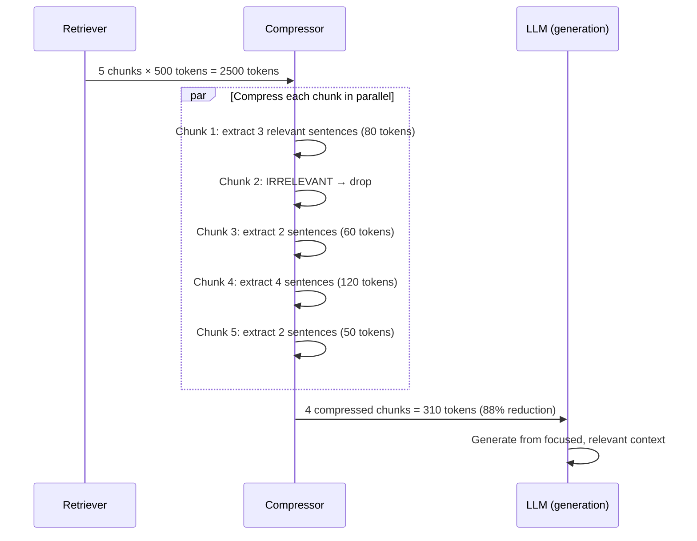

# 15. Context Compression

## Overview

Context compression reduces the amount of text sent to the LLM by extracting only the portions of retrieved documents that are relevant to the query. It solves the problem of noisy, redundant, or partially relevant context that wastes tokens and degrades LLM performance.

---

## Why This Exists

After retrieval and reranking, you have K chunks — but not all of each chunk is relevant to the question. A 500-token chunk might contain 50 tokens of highly relevant information and 450 tokens of tangentially related or irrelevant content. Sending all 500 tokens:
1. Wastes LLM input tokens (cost)
2. Dilutes the relevant signal (quality)
3. May cause "lost in the middle" effects (accuracy)

Context compression surgically extracts the relevant portions.

---

## Problem Being Solved

```
Query: "What is the retry interval for failed API calls?"

Retrieved chunk (500 tokens):
  "The API client manages connections using a connection pool. The pool 
  size defaults to 10. Authentication uses OAuth 2.0 with JWT tokens.
  Failed requests are automatically retried with exponential backoff.
  The retry interval starts at 1 second and doubles with each attempt,
  up to a maximum of 60 seconds. Up to 3 retries are attempted before
  the request fails. Rate limits apply to all authenticated endpoints.
  The rate limit is 1000 requests per hour per API key..."

After compression:
  "Failed requests are automatically retried with exponential backoff.
  The retry interval starts at 1 second and doubles with each attempt,
  up to a maximum of 60 seconds."
  
Token reduction: 500 → 60 tokens (88% reduction)
Quality: Only relevant information sent to LLM
```

---

## Core Concepts

### Compression Strategies

1. **LLM-based extraction** — Ask an LLM to extract relevant sentences
2. **Sentence scoring** — Score each sentence for relevance, keep top N
3. **Cross-encoder compression** — Score sentence-query relevance with a cross-encoder
4. **Embeddings-based filtering** — Keep only sentences above a similarity threshold

### Compression vs. Summarization

| Approach | Process | Output | Faithfulness |
|----------|---------|--------|-------------|
| Extraction | Copy relevant sentences | Subset of original text | 100% faithful |
| Summarization | Paraphrase and compress | New text | May introduce errors |
| Abstraction | Generate new summary | New text | May hallucinate |

**For RAG: prefer extraction over summarization** — summaries can introduce errors or lose precision.

---

## Implementation

### Strategy 1: LLM-Based Extraction

```python
from openai import AsyncOpenAI
import asyncio

class LLMContextCompressor:
    """
    Use a small LLM to extract relevant sentences from each retrieved chunk.
    Fast and cheap with GPT-4o-mini.
    """
    
    EXTRACT_PROMPT = """Extract ONLY the sentences from the context that directly answer or 
are relevant to the question. Copy them verbatim. Do not paraphrase.

If no sentences are relevant, respond with exactly: IRRELEVANT

Question: {question}

Context:
{context}

Relevant sentences (verbatim):"""
    
    def __init__(
        self,
        client: AsyncOpenAI,
        model: str = "gpt-4o-mini",
        min_tokens: int = 50,
    ):
        self.client = client
        self.model = model
        self.min_tokens = min_tokens
    
    async def compress(self, question: str, context: str) -> str | None:
        """Returns compressed context or None if irrelevant."""
        if len(context.split()) < self.min_tokens:
            return context  # Don't compress very short chunks
        
        response = await self.client.chat.completions.create(
            model=self.model,
            messages=[{
                "role": "user",
                "content": self.EXTRACT_PROMPT.format(
                    question=question, context=context
                )
            }],
            temperature=0,
            max_tokens=len(context.split()),  # Can't expand beyond original
        )
        
        result = response.choices[0].message.content.strip()
        
        if result == "IRRELEVANT" or not result:
            return None
        
        return result
    
    async def compress_batch(
        self,
        question: str,
        chunks: list[str],
        max_concurrent: int = 5,
    ) -> list[str]:
        """Compress multiple chunks in parallel, dropping irrelevant ones."""
        semaphore = asyncio.Semaphore(max_concurrent)
        
        async def compress_with_semaphore(chunk: str) -> str | None:
            async with semaphore:
                return await self.compress(question, chunk)
        
        results = await asyncio.gather(*[compress_with_semaphore(c) for c in chunks])
        return [r for r in results if r is not None]
```

### Strategy 2: Sentence Relevance Scoring

```python
from sentence_transformers import SentenceTransformer
import numpy as np
import re

class EmbeddingCompressor:
    """
    Fast, no-LLM compression using sentence embeddings.
    Score each sentence by similarity to query, keep top sentences.
    """
    
    def __init__(
        self,
        model_name: str = "BAAI/bge-small-en-v1.5",
        threshold: float = 0.5,
        max_sentences: int = 5,
    ):
        self.model = SentenceTransformer(model_name)
        self.threshold = threshold
        self.max_sentences = max_sentences
    
    def _split_sentences(self, text: str) -> list[str]:
        sentences = re.split(r'(?<=[.!?])\s+', text)
        return [s.strip() for s in sentences if len(s.strip()) > 20]
    
    def compress(self, query: str, context: str) -> str:
        """Compress context by keeping only relevant sentences."""
        sentences = self._split_sentences(context)
        if len(sentences) <= 2:
            return context
        
        # Embed query and sentences
        query_emb = self.model.encode([query], normalize_embeddings=True)[0]
        sent_embs = self.model.encode(sentences, normalize_embeddings=True)
        
        # Score each sentence
        scores = sent_embs @ query_emb
        
        # Keep sentences above threshold and top-N
        scored_sentences = list(zip(sentences, scores))
        relevant = [(s, sc) for s, sc in scored_sentences if sc >= self.threshold]
        
        # Sort by position (preserve order) then by score for top-N
        top_sentences = sorted(
            relevant, key=lambda x: x[1], reverse=True
        )[:self.max_sentences]
        
        # Restore original order
        original_order = {s: i for i, s in enumerate(sentences)}
        top_sentences.sort(key=lambda x: original_order.get(x[0], 0))
        
        return " ".join(s for s, _ in top_sentences)
    
    def compress_batch(self, query: str, chunks: list[str]) -> list[str]:
        """Compress all chunks using embedding similarity."""
        return [self.compress(query, chunk) for chunk in chunks]
```

### Strategy 3: Cross-Encoder Compression

```python
from sentence_transformers import CrossEncoder

class CrossEncoderCompressor:
    """
    Use a cross-encoder to score sentence-query relevance.
    Higher accuracy than embedding similarity, higher latency.
    """
    
    def __init__(
        self,
        model_name: str = "cross-encoder/ms-marco-MiniLM-L-6-v2",
        threshold: float = 0.0,  # Cross-encoder scores are not [0,1]
        max_sentences: int = 5,
    ):
        self.model = CrossEncoder(model_name)
        self.threshold = threshold
        self.max_sentences = max_sentences
    
    def compress(self, query: str, context: str) -> str:
        sentences = re.split(r'(?<=[.!?])\s+', context)
        sentences = [s.strip() for s in sentences if len(s.strip()) > 20]
        
        if len(sentences) <= 2:
            return context
        
        # Score all (query, sentence) pairs
        pairs = [(query, s) for s in sentences]
        scores = self.model.predict(pairs, show_progress_bar=False)
        
        # Select top sentences preserving original order
        scored = sorted(enumerate(zip(sentences, scores)), key=lambda x: x[1][1], reverse=True)
        top_indices = sorted([idx for idx, (_, _) in scored[:self.max_sentences]])
        
        return " ".join(sentences[i] for i in top_indices)
```

---

## Adaptive Compression

```python
class AdaptiveContextCompressor:
    """
    Choose compression strategy based on chunk length and available budget.
    """
    
    def __init__(
        self,
        llm_compressor: LLMContextCompressor,
        embedding_compressor: EmbeddingCompressor,
        max_context_tokens: int = 4000,
        llm_threshold_tokens: int = 300,  # Use LLM compression for chunks > 300 tokens
    ):
        self.llm = llm_compressor
        self.emb = embedding_compressor
        self.max_tokens = max_context_tokens
        self.llm_threshold = llm_threshold_tokens
    
    async def compress_to_budget(
        self,
        question: str,
        chunks: list[str],
    ) -> list[str]:
        """Compress until total tokens fit within budget."""
        # First pass: compress long chunks
        compressed = []
        for chunk in chunks:
            token_count = len(chunk.split())
            
            if token_count > self.llm_threshold:
                # Use LLM for long, rich chunks
                result = await self.llm.compress(question, chunk)
                if result:
                    compressed.append(result)
            elif token_count > 50:
                # Use fast embedding compression for medium chunks
                result = self.emb.compress(question, chunk)
                if result.strip():
                    compressed.append(result)
            else:
                # Keep short chunks as-is
                compressed.append(chunk)
        
        # Second pass: trim to token budget
        total_tokens = 0
        final_chunks = []
        for chunk in compressed:
            chunk_tokens = len(chunk.split())
            if total_tokens + chunk_tokens <= self.max_tokens:
                final_chunks.append(chunk)
                total_tokens += chunk_tokens
            else:
                # Partial include
                remaining = self.max_tokens - total_tokens
                words = chunk.split()[:remaining]
                if words:
                    final_chunks.append(" ".join(words) + "...")
                break
        
        return final_chunks
```

---

## Execution Flow



---

## Production Example

```python
# Full pipeline with compression metrics
import time
from dataclasses import dataclass

@dataclass
class CompressionMetrics:
    original_token_count: int
    compressed_token_count: int
    chunks_dropped: int
    compression_ratio: float
    latency_ms: float

class InstrumentedCompressor:
    def __init__(self, compressor: LLMContextCompressor | AdaptiveContextCompressor):
        self.compressor = compressor
    
    async def compress(
        self, question: str, chunks: list[str]
    ) -> tuple[list[str], CompressionMetrics]:
        original_tokens = sum(len(c.split()) for c in chunks)
        start = time.perf_counter()
        
        if isinstance(self.compressor, AdaptiveContextCompressor):
            compressed = await self.compressor.compress_to_budget(question, chunks)
        else:
            compressed = await self.compressor.compress_batch(question, chunks)
        
        latency = (time.perf_counter() - start) * 1000
        compressed_tokens = sum(len(c.split()) for c in compressed)
        
        metrics = CompressionMetrics(
            original_token_count=original_tokens,
            compressed_token_count=compressed_tokens,
            chunks_dropped=len(chunks) - len(compressed),
            compression_ratio=compressed_tokens / max(original_tokens, 1),
            latency_ms=latency
        )
        
        return compressed, metrics
```

---

## Common Mistakes

1. **Compressing short chunks** — Overhead cost exceeds benefit for <100 token chunks
2. **Using large LLM for compression** — GPT-4o-mini is fine and much cheaper
3. **Summarizing instead of extracting** — Summaries can introduce errors or lose precision
4. **No fallback if compression fails** — Return original chunk on error
5. **Compressing all chunks serially** — Parallelize for multiple chunks

---

## Best Practices

- **Use extraction, not summarization** — Verbatim sentences are trustworthy
- **Only compress long chunks** (>300 tokens)
- **Parallelize all compression calls**
- **Drop irrelevant chunks** — Better to have fewer, relevant chunks than many noisy ones
- **Set a maximum context budget** — Even after compression, ensure total fits in context window
- **Monitor compression ratio** — Very low ratio (>90% kept) suggests your retrieval needs improvement

---

## Cost Optimization

| Strategy | Cost per chunk | Speed | Quality |
|----------|---------------|-------|---------|
| LLM extraction (gpt-4o-mini) | ~$0.0003 | 100–200ms | Excellent |
| Embedding similarity | ~$0 | 5–20ms | Good |
| Cross-encoder | ~$0 | 10–50ms | Very good |
| No compression | $0 | 0ms | Baseline |

For cost-optimized production: Use embedding compressor as primary, LLM compressor only for chunks > 500 tokens.

---

## Related Concepts

- [12. Advanced RAG](12-advanced-rag.md)
- [10. Reranking](10-reranking.md)
- [25. Cost Optimization](./25-cost-optimization.md)

---

## Interview Questions

**Q: Why prefer extraction over summarization for context compression?**  
A: Extraction copies verbatim text from source documents — it cannot hallucinate. Summarization generates new text that might paraphrase incorrectly, lose precision, or introduce errors. For factual RAG applications, faithfulness to source text is critical.

**Q: What is the "lost in the middle" problem and how does context compression help?**  
A: LLMs pay less attention to context in the middle of long prompts than at the start/end. Context compression reduces total prompt length, which reduces the amount of "middle" context and ensures the LLM can attend to all relevant information.

---

## References

- Xu, Z. et al. (2023). [RECOMP: Improving Retrieval-Augmented LMs with Context Compression and Selective Augmentation](https://arxiv.org/abs/2310.04408)
- [LangChain Contextual Compression Retriever](https://python.langchain.com/docs/modules/data_connection/retrievers/contextual_compression)

---

## Summary

Context compression surgically removes irrelevant text from retrieved chunks before sending to the LLM, reducing token cost and improving answer quality. The three approaches — LLM extraction, embedding similarity filtering, and cross-encoder scoring — trade cost, speed, and quality. Use extraction (not summarization) to preserve faithfulness. Apply only to long chunks (>300 tokens), parallelize across chunks, and monitor compression ratios to ensure retrieval quality is improving over time.
