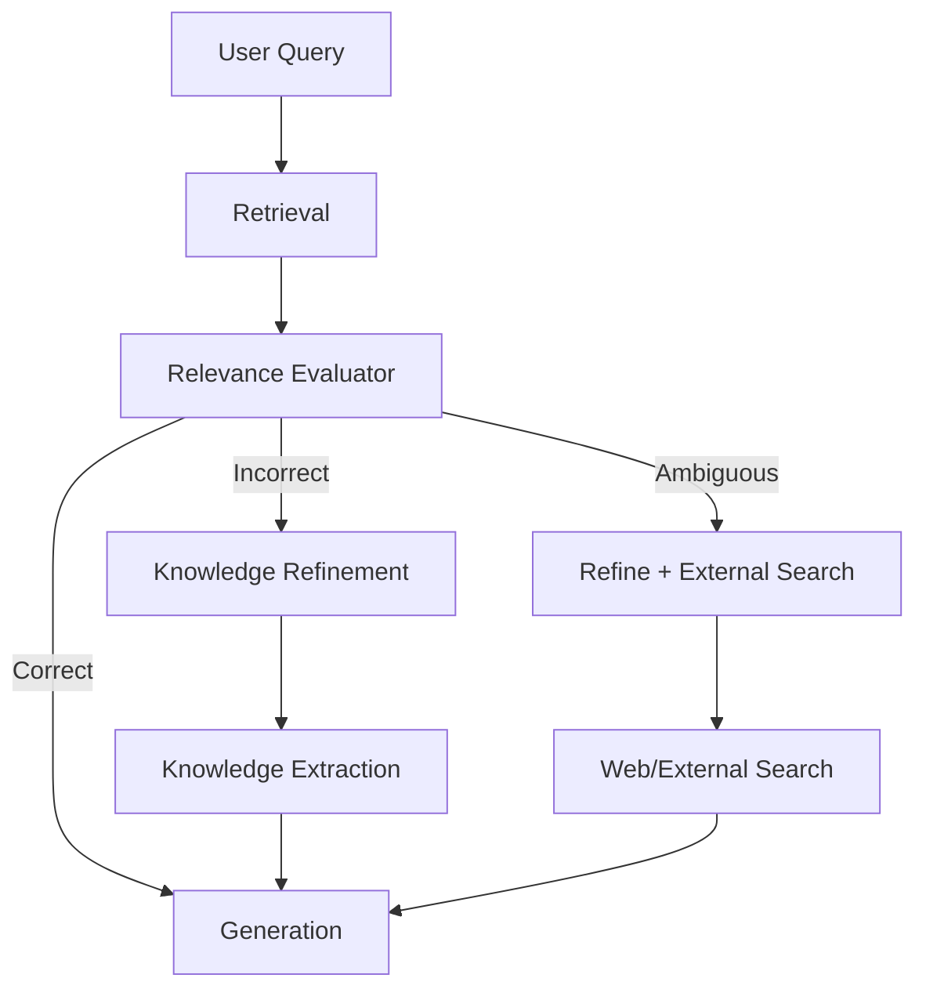
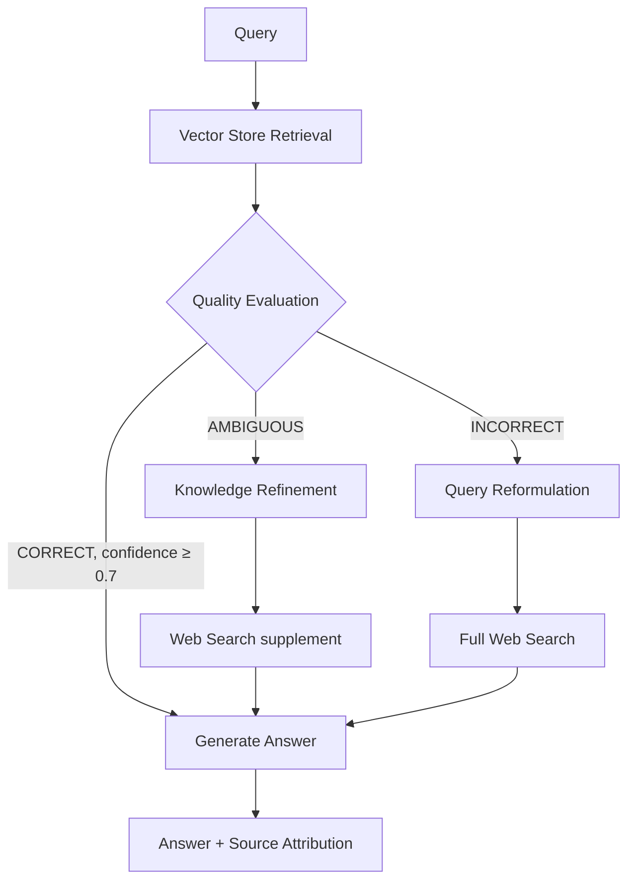

# 16. Corrective RAG

## Overview

Corrective RAG (CRAG) introduces a retrieval validation and self-correction mechanism into the RAG pipeline. Instead of blindly passing retrieved documents to the LLM, CRAG evaluates the quality of retrieved documents and triggers corrective actions — refining the retrieval or falling back to web search — when the initial retrieval is insufficient.

---

## Why This Exists

Naive RAG assumes retrieval succeeds. In practice, retrieval quality varies:
- Sometimes the top-K results are completely irrelevant
- Sometimes they're partially relevant but insufficient
- Sometimes the question is out-of-scope for the knowledge base

Without validation, the LLM receives bad context and hallucinates. CRAG adds a "retrieval quality gate" that catches these cases and corrects them before generation.

---

## Problem Being Solved

```
User: "What is the CVE score for CVE-2025-99999?"

Naive RAG:
  → Retrieves "similar" CVE documents (wrong CVE IDs, different scores)
  → LLM hallucinates: "CVE-2025-99999 has a CVSS score of 8.5"
  → User sees confident, wrong answer

CRAG:
  → Retrieves "similar" CVE documents
  → Evaluator: "These documents don't mention CVE-2025-99999" → INSUFFICIENT
  → Triggers web search for CVE-2025-99999
  → Gets fresh, authoritative data
  → LLM generates accurate answer from correct context
```

---

## Core Architecture



---

## Relevance Evaluator

The core of CRAG is a module that assesses whether retrieved documents are relevant to the query:

```python
from openai import AsyncOpenAI
from enum import Enum
from dataclasses import dataclass

class RetrievalQuality(str, Enum):
    CORRECT = "correct"       # Retrieved docs answer the question well
    INCORRECT = "incorrect"   # Retrieved docs are irrelevant
    AMBIGUOUS = "ambiguous"   # Partially relevant, uncertain

@dataclass
class EvaluationResult:
    quality: RetrievalQuality
    confidence: float
    reason: str
    relevant_chunks: list[str]

class RetrievalEvaluator:
    """
    Evaluates whether retrieved documents are sufficient to answer the query.
    Acts as the correction trigger in CRAG.
    """
    
    EVAL_PROMPT = """Evaluate whether the retrieved documents are relevant and sufficient 
to answer the user's question.

Question: {question}

Retrieved Documents:
{documents}

Respond with JSON:
{{
  "quality": "correct" | "incorrect" | "ambiguous",
  "confidence": 0.0-1.0,
  "reason": "brief explanation",
  "relevant_doc_indices": [list of 0-based indices of relevant docs]
}}

- "correct": Documents directly answer the question
- "incorrect": Documents are not relevant to the question  
- "ambiguous": Documents partially address the question or are unclear"""
    
    def __init__(self, client: AsyncOpenAI, model: str = "gpt-4o-mini"):
        self.client = client
        self.model = model
    
    async def evaluate(
        self,
        question: str,
        retrieved_docs: list[str],
    ) -> EvaluationResult:
        doc_text = "\n\n".join(
            f"[{i}] {doc}" for i, doc in enumerate(retrieved_docs)
        )
        
        import json
        response = await self.client.chat.completions.create(
            model=self.model,
            messages=[{
                "role": "user",
                "content": self.EVAL_PROMPT.format(
                    question=question, documents=doc_text
                )
            }],
            response_format={"type": "json_object"},
            temperature=0,
        )
        
        try:
            result = json.loads(response.choices[0].message.content)
            relevant_indices = result.get("relevant_doc_indices", [])
            relevant_chunks = [retrieved_docs[i] for i in relevant_indices if i < len(retrieved_docs)]
            
            return EvaluationResult(
                quality=RetrievalQuality(result.get("quality", "ambiguous")),
                confidence=float(result.get("confidence", 0.5)),
                reason=result.get("reason", ""),
                relevant_chunks=relevant_chunks,
            )
        except (json.JSONDecodeError, KeyError, ValueError):
            return EvaluationResult(
                quality=RetrievalQuality.AMBIGUOUS,
                confidence=0.5,
                reason="Evaluation failed",
                relevant_chunks=retrieved_docs,
            )
```

---

## Knowledge Refinement (Strip and Filter)

When quality is AMBIGUOUS, CRAG strips irrelevant portions from retrieved documents:

```python
class KnowledgeRefiner:
    """
    Refines retrieved documents by extracting only relevant knowledge strips.
    Applied when retrieval quality is AMBIGUOUS.
    """
    
    REFINE_PROMPT = """Extract the knowledge that is directly relevant to answering 
the question from each document. 

For each document, either:
1. Extract the relevant sentence(s) verbatim
2. Mark as SKIP if nothing is relevant

Question: {question}

Document {index}: {document}

Relevant extract (or SKIP):"""
    
    def __init__(self, client: AsyncOpenAI):
        self.client = client
    
    async def refine(self, question: str, documents: list[str]) -> list[str]:
        """Extract relevant knowledge strips from each document."""
        import asyncio
        
        async def refine_single(i: int, doc: str) -> str | None:
            response = await self.client.chat.completions.create(
                model="gpt-4o-mini",
                messages=[{"role": "user", "content": self.REFINE_PROMPT.format(
                    question=question, index=i, document=doc
                )}],
                temperature=0,
                max_tokens=300,
            )
            result = response.choices[0].message.content.strip()
            return None if result.upper() == "SKIP" else result
        
        results = await asyncio.gather(*[refine_single(i, d) for i, d in enumerate(documents)])
        return [r for r in results if r is not None]
```

---

## Web Search Fallback

When quality is INCORRECT, CRAG falls back to external search:

```python
import httpx

class WebSearchProvider:
    """
    External knowledge provider for CRAG fallback.
    Replace with actual search API (Tavily, Bing, Google, SerpAPI).
    """
    
    def __init__(self, api_key: str):
        self.api_key = api_key
    
    async def search(self, query: str, k: int = 3) -> list[str]:
        """Search web and return relevant snippets."""
        async with httpx.AsyncClient() as client:
            # Using Tavily as example
            response = await client.post(
                "https://api.tavily.com/search",
                json={
                    "api_key": self.api_key,
                    "query": query,
                    "max_results": k,
                    "search_depth": "advanced",
                },
                timeout=10,
            )
            data = response.json()
            results = data.get("results", [])
            return [r.get("content", "") for r in results if r.get("content")]
```

---

## Complete CRAG Pipeline

```python
from openai import AsyncOpenAI

class CorrectiveRAG:
    """
    Complete Corrective RAG pipeline:
    1. Retrieve from vector store
    2. Evaluate retrieval quality
    3. Based on evaluation:
       - CORRECT: Use retrieved docs directly
       - AMBIGUOUS: Refine (extract relevant knowledge strips)
       - INCORRECT: Fall back to web search
    4. Generate grounded answer
    """
    
    def __init__(
        self,
        retriever,
        evaluator: RetrievalEvaluator,
        refiner: KnowledgeRefiner,
        web_search: WebSearchProvider,
        generation_model: str = "gpt-4o-mini",
        confidence_threshold: float = 0.7,
    ):
        self.retriever = retriever
        self.evaluator = evaluator
        self.refiner = refiner
        self.web_search = web_search
        self.client = AsyncOpenAI()
        self.gen_model = generation_model
        self.threshold = confidence_threshold
    
    async def query(self, question: str, tenant_id: str = "default") -> dict:
        # Stage 1: Initial retrieval
        retrieved = await self.retriever.retrieve(question, tenant_id=tenant_id, k=5)
        doc_texts = [r["text"] for r in retrieved]
        
        # Stage 2: Evaluate retrieval quality
        evaluation = await self.evaluator.evaluate(question, doc_texts)
        
        # Stage 3: Corrective action based on quality
        final_context_chunks = []
        knowledge_source = "vector_store"
        
        if evaluation.quality == RetrievalQuality.CORRECT and evaluation.confidence >= self.threshold:
            # Use retrieved docs as-is
            final_context_chunks = evaluation.relevant_chunks or doc_texts
        
        elif evaluation.quality == RetrievalQuality.AMBIGUOUS:
            # Refine: extract relevant strips from retrieved docs
            refined = await self.refiner.refine(question, doc_texts)
            
            # Also do a reformulated web search for completeness
            reformulated = await self._reformulate_query(question)
            web_results = await self.web_search.search(reformulated, k=3)
            
            final_context_chunks = refined + web_results
            knowledge_source = "vector_store+web"
        
        else:  # INCORRECT or low confidence
            # Fallback to web search entirely
            reformulated = await self._reformulate_query(question)
            final_context_chunks = await self.web_search.search(reformulated, k=5)
            knowledge_source = "web_search"
        
        if not final_context_chunks:
            return {
                "answer": "I couldn't find relevant information to answer this question.",
                "knowledge_source": "none",
                "evaluation": evaluation.quality.value,
            }
        
        # Stage 4: Generate from final context
        context = "\n\n---\n\n".join(final_context_chunks[:5])
        
        response = await self.client.chat.completions.create(
            model=self.gen_model,
            messages=[
                {"role": "system", "content": "Answer based on the provided context only. Be accurate and concise."},
                {"role": "user", "content": f"Context:\n{context}\n\nQuestion: {question}"}
            ],
            temperature=0,
        )
        
        return {
            "answer": response.choices[0].message.content,
            "knowledge_source": knowledge_source,
            "evaluation": evaluation.quality.value,
            "confidence": evaluation.confidence,
            "reason": evaluation.reason,
        }
    
    async def _reformulate_query(self, question: str) -> str:
        """Reformulate query for web search (more searchable format)."""
        response = await self.client.chat.completions.create(
            model="gpt-4o-mini",
            messages=[{"role": "user", "content": f"Reformulate for web search: {question}\nSearch query:"}],
            temperature=0, max_tokens=100,
        )
        return response.choices[0].message.content.strip()
```

---

## Execution Flow



---

## Confidence-Based Threshold Tuning

```python
# Tune thresholds based on your domain
CRAG_CONFIG = {
    # Security/legal domain: high accuracy requirement
    "high_accuracy": {
        "correct_threshold": 0.85,
        "ambiguous_threshold": 0.6,
        "web_fallback_enabled": True,
    },
    # Internal support: moderate accuracy
    "standard": {
        "correct_threshold": 0.7,
        "ambiguous_threshold": 0.4,
        "web_fallback_enabled": True,
    },
    # Offline/private: no web access
    "private": {
        "correct_threshold": 0.65,
        "ambiguous_threshold": 0.4,
        "web_fallback_enabled": False,
    }
}
```

---

## Common Mistakes

1. **Using a large LLM for evaluation** — gpt-4o-mini is sufficient for relevance judgment
2. **No fallback when web search also fails** — Need graceful degradation chain
3. **Evaluating chunked text only** — Evaluate combined context, not individual chunks
4. **Binary CORRECT/INCORRECT** — Three-way with AMBIGUOUS is more nuanced and useful
5. **No caching of evaluations** — Repeated queries waste evaluation LLM calls

---

## Best Practices

- Use a fast, cheap LLM for evaluation (gpt-4o-mini)
- Tune CORRECT/AMBIGUOUS threshold on your domain's failure patterns
- Cache web search results (external searches are expensive and slow)
- Log evaluation results — analyze where your vector store fails
- Consider vector store quality improvement instead of web fallback for repeated failures

---

## Performance Considerations

| Stage | Added Latency | Notes |
|-------|-------------|-------|
| Retrieval evaluation | +100–200ms | gpt-4o-mini is fast |
| Knowledge refinement | +200–400ms | Parallel per-chunk calls |
| Web search fallback | +500–2000ms | Depends on search API |

Total overhead vs. Naive RAG: +100ms (happy path) to +2s (web fallback)

---

## Related Concepts

- [11. Naive RAG](11-naive-rag.md)
- [17. Self-RAG](17-self-rag.md)
- [23. Hallucination Reduction](./23-hallucination-reduction.md)
- [21. RAG Evaluation](21-rag-evaluation.md)

---

## Interview Questions

**Q: What is the key innovation in CRAG vs. Naive RAG?**  
A: CRAG adds a retrieval validation step that categorizes retrieval quality as CORRECT/AMBIGUOUS/INCORRECT, then takes corrective action. Naive RAG blindly trusts retrieval; CRAG verifies and corrects before generation.

**Q: How do you avoid the overhead of evaluation when retrieval is consistently good?**  
A: Use a lightweight embedding-based evaluation (cosine similarity between query and retrieved docs) as a pre-check before calling the LLM evaluator. If the average cosine score is > 0.7, skip LLM evaluation.

---

## References

- Yan, S. et al. (2024). [Corrective Retrieval Augmented Generation](https://arxiv.org/abs/2401.15884)

---

## Summary

Corrective RAG adds a retrieval quality gate between retrieval and generation. The evaluator classifies retrieved documents as CORRECT (use as-is), AMBIGUOUS (refine and supplement), or INCORRECT (fall back to web search). This prevents the LLM from hallucinating when the knowledge base doesn't contain the answer. The cost is additional latency (100–2000ms) and LLM calls; the benefit is dramatically fewer hallucinations on out-of-scope queries.
