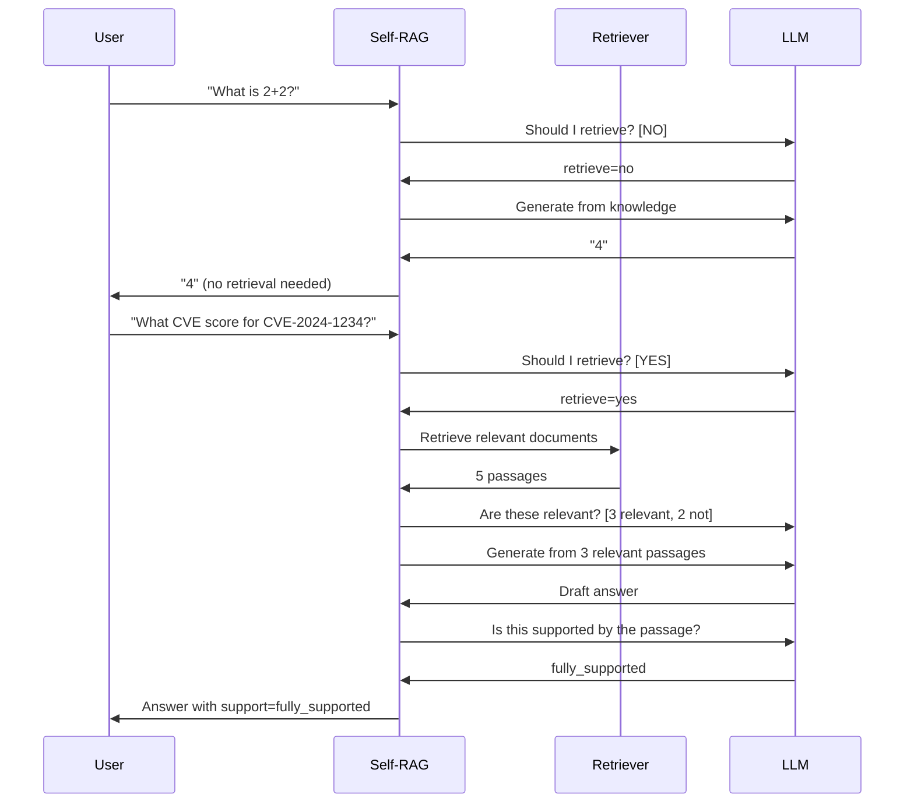

# 17. Self-RAG

## Overview

Self-RAG teaches an LLM to decide when to retrieve, what to retrieve, and how to critically assess its own outputs — including whether retrieved passages were used faithfully and whether the generated response is fully supported. It makes retrieval adaptive rather than always-on.

---

## Why This Exists

Standard RAG retrieves for every query, whether retrieval helps or not. For simple questions ("What is 2+2?"), retrieval wastes time and money. For complex queries requiring synthesis, standard RAG may not retrieve enough times.

Self-RAG frames retrieval as a learned decision, producing systems that:
- Retrieve only when needed
- Critically evaluate retrieved information
- Reflect on the quality of their own outputs

---

## Core Concepts

Self-RAG introduces four types of **reflection tokens** that the model generates:

| Token Type | Values | Meaning |
|-----------|--------|---------|
| `Retrieve` | yes / no / continue | Should retrieval be triggered? |
| `ISREL` | relevant / irrelevant | Is this retrieved passage relevant? |
| `ISSUP` | fully supported / partially / not supported | Is the generation grounded in the passage? |
| `ISUSE` | 1–5 | How useful is this response overall? |

These tokens allow the model to self-critique at each step.

---

## Internal Architecture

```mermaid
graph TD
    Q[Query] --> D{Retrieve?}
    D -- No --> G1[Generate without retrieval]
    D -- Yes --> R[Retrieve passages]
    R --> REL{ISREL?}
    REL -- Irrelevant → discard
    REL -- Relevant --> G2[Generate segment with passage]
    G2 --> SUP{ISSUP?}
    SUP -- Fully supported --> CONT{Continue?}
    SUP -- Partially/Not --> RETRY[Retrieve again or hedge]
    CONT -- Yes --> R
    CONT -- No --> USE{ISUSE score}
    G1 --> USE
    USE --> BEST[Select best response]
```

---

## Implementation

Self-RAG in its full form requires a fine-tuned model. However, we can approximate the behavior with a standard LLM + structured prompting:

```python
from openai import AsyncOpenAI
from dataclasses import dataclass
from enum import Enum
import json

class RetrieveDecision(str, Enum):
    YES = "yes"
    NO = "no"

class IsRelevant(str, Enum):
    RELEVANT = "relevant"
    IRRELEVANT = "irrelevant"

class IsSupported(str, Enum):
    FULLY = "fully_supported"
    PARTIALLY = "partially_supported"
    NOT = "not_supported"

@dataclass
class SelfRAGStep:
    retrieve_decision: RetrieveDecision
    passages: list[str]
    relevance_judgments: list[IsRelevant]
    generated_segment: str
    support_judgment: IsSupported
    utility_score: int

class ApproximateSelfRAG:
    """
    Approximates Self-RAG behavior using a standard LLM with structured prompting.
    For true Self-RAG, use the fine-tuned self-rag-llama-3b or self-rag-llama-7b models.
    """
    
    RETRIEVE_PROMPT = """Decide if external retrieval is needed to answer this query.

Query: {query}

Respond with JSON: {{"retrieve": "yes" | "no", "reason": "brief explanation"}}

Retrieve YES if the query requires:
- Specific facts, statistics, or current information
- Domain-specific knowledge you may not have
- Information about specific named entities

Retrieve NO if the query:
- Is a general reasoning/math question
- Asks for an explanation of a well-known concept
- Can be answered from common knowledge"""
    
    RELEVANCE_PROMPT = """Is this retrieved passage relevant to answering the query?

Query: {query}
Passage: {passage}

Respond with JSON: {{"relevant": "relevant" | "irrelevant", "reason": "brief"}}"""
    
    SUPPORT_PROMPT = """Is the generated response fully supported by the provided passage?

Query: {query}
Passage: {passage}
Response: {response}

Respond with JSON: 
{{"support": "fully_supported" | "partially_supported" | "not_supported",
  "unsupported_claims": ["list any claims not in passage"]}}"""
    
    def __init__(self, retriever, client: AsyncOpenAI):
        self.retriever = retriever
        self.client = client
        self.model = "gpt-4o-mini"
    
    async def _decide_retrieve(self, query: str) -> RetrieveDecision:
        response = await self.client.chat.completions.create(
            model=self.model,
            messages=[{"role": "user", "content": self.RETRIEVE_PROMPT.format(query=query)}],
            response_format={"type": "json_object"},
            temperature=0,
        )
        result = json.loads(response.choices[0].message.content)
        return RetrieveDecision(result.get("retrieve", "yes"))
    
    async def _judge_relevance(self, query: str, passage: str) -> IsRelevant:
        response = await self.client.chat.completions.create(
            model=self.model,
            messages=[{"role": "user", "content": self.RELEVANCE_PROMPT.format(
                query=query, passage=passage
            )}],
            response_format={"type": "json_object"},
            temperature=0,
        )
        result = json.loads(response.choices[0].message.content)
        return IsRelevant(result.get("relevant", "irrelevant"))
    
    async def _judge_support(self, query: str, passage: str, response_text: str) -> IsSupported:
        response = await self.client.chat.completions.create(
            model=self.model,
            messages=[{"role": "user", "content": self.SUPPORT_PROMPT.format(
                query=query, passage=passage, response=response_text
            )}],
            response_format={"type": "json_object"},
            temperature=0,
        )
        result = json.loads(response.choices[0].message.content)
        return IsSupported(result.get("support", "partially_supported"))
    
    async def generate_without_retrieval(self, query: str) -> str:
        response = await self.client.chat.completions.create(
            model=self.model,
            messages=[
                {"role": "system", "content": "Answer accurately from your knowledge."},
                {"role": "user", "content": query}
            ],
            temperature=0,
        )
        return response.choices[0].message.content
    
    async def generate_with_passages(self, query: str, passages: list[str]) -> str:
        context = "\n\n---\n\n".join(passages)
        response = await self.client.chat.completions.create(
            model=self.model,
            messages=[
                {"role": "system", "content": "Answer ONLY from the provided context. Be precise."},
                {"role": "user", "content": f"Context:\n{context}\n\nQuestion: {query}"}
            ],
            temperature=0,
        )
        return response.choices[0].message.content
    
    async def run(self, query: str, tenant_id: str = "default") -> dict:
        # Step 1: Decide whether to retrieve
        retrieve_decision = await self._decide_retrieve(query)
        
        if retrieve_decision == RetrieveDecision.NO:
            # Generate directly from model knowledge
            answer = await self.generate_without_retrieval(query)
            return {
                "answer": answer,
                "retrieved": False,
                "support": "model_knowledge",
                "steps": [{"retrieve_decision": "no"}]
            }
        
        # Step 2: Retrieve
        retrieved = await self.retriever.retrieve(query, tenant_id=tenant_id, k=5)
        passages = [r["text"] for r in retrieved]
        
        # Step 3: Judge relevance of each passage
        import asyncio
        relevance_tasks = [self._judge_relevance(query, p) for p in passages]
        relevance_judgments = await asyncio.gather(*relevance_tasks)
        
        relevant_passages = [
            p for p, rel in zip(passages, relevance_judgments)
            if rel == IsRelevant.RELEVANT
        ]
        
        if not relevant_passages:
            # All passages judged irrelevant
            answer = await self.generate_without_retrieval(query)
            return {
                "answer": answer + "\n\n[Note: Retrieved documents were not relevant to this query.]",
                "retrieved": True,
                "support": "not_supported",
                "relevant_passages": 0,
            }
        
        # Step 4: Generate from relevant passages
        answer = await self.generate_with_passages(query, relevant_passages)
        
        # Step 5: Check support for best passage
        best_passage = relevant_passages[0]
        support = await self._judge_support(query, best_passage, answer)
        
        # Step 6: Handle unsupported generation
        if support == IsSupported.NOT:
            # Re-generate with stricter prompt
            strict_answer = await self.generate_with_passages_strict(query, relevant_passages)
            answer = strict_answer
        
        return {
            "answer": answer,
            "retrieved": True,
            "relevant_passages": len(relevant_passages),
            "support": support.value,
            "retrieve_decision": retrieve_decision.value,
        }
    
    async def generate_with_passages_strict(self, query: str, passages: list[str]) -> str:
        context = "\n\n---\n\n".join(passages)
        response = await self.client.chat.completions.create(
            model=self.model,
            messages=[
                {
                    "role": "system",
                    "content": (
                        "Answer ONLY what the context explicitly states. "
                        "If the context doesn't answer the question, say 'The context doesn't contain this information.' "
                        "Do NOT add any information not in the context."
                    )
                },
                {"role": "user", "content": f"Context:\n{context}\n\nQuestion: {query}"}
            ],
            temperature=0,
        )
        return response.choices[0].message.content
```

---

## Execution Flow



---

## Adaptive Retrieval Scenarios

```python
# Different query types and expected Self-RAG behavior

EXAMPLES = [
    {
        "query": "What is the square root of 144?",
        "expected_retrieve": "no",   # Pure math, no retrieval needed
        "answer": "12",
    },
    {
        "query": "What are the main Python web frameworks?",
        "expected_retrieve": "no",   # General knowledge question
        "answer": "Django, FastAPI, Flask...",
    },
    {
        "query": "What is our company's Q3 revenue policy?",
        "expected_retrieve": "yes",  # Private knowledge
        "answer": "Retrieved from internal docs",
    },
    {
        "query": "Summarize the latest security advisories for today",
        "expected_retrieve": "yes",  # Time-sensitive, specific info
        "answer": "Retrieved from security feed",
    },
    {
        "query": "Compare PostgreSQL and MySQL",
        "expected_retrieve": "maybe",  # General + specific trade-offs
        "answer": "Mix of knowledge + retrieved benchmarks",
    }
]
```

---

## Production Considerations

```python
# Self-RAG with LangGraph for proper flow control
# (Conceptual — see topic 19 for full agentic implementation)

class SelfRAGGraph:
    """
    Self-RAG implemented as a LangGraph state machine.
    Enables:
    - Conditional edges based on retrieval decision
    - Loop back for continued retrieval
    - State tracking across steps
    """
    
    STATES = ["start", "decide_retrieve", "retrieve", "judge_relevance", 
              "generate", "judge_support", "end"]
    
    async def run_graph(self, query: str) -> dict:
        state = {
            "query": query,
            "passages": [],
            "relevant_passages": [],
            "answer": None,
            "retrieve_count": 0,
            "max_retrieve": 3,  # Prevent infinite loops
        }
        
        # The graph traversal logic
        retrieve = await self._decide_retrieve(state["query"])
        
        while retrieve and state["retrieve_count"] < state["max_retrieve"]:
            state["retrieve_count"] += 1
            new_passages = await self.retriever.retrieve(state["query"])
            state["passages"].extend(new_passages)
            
            # Filter relevant
            state["relevant_passages"] = await self._filter_relevant(state["query"], state["passages"])
            
            # Generate
            state["answer"] = await self.generate(state["query"], state["relevant_passages"])
            
            # Check if should continue retrieving
            support = await self._judge_support(state["query"], state["answer"], state["relevant_passages"])
            retrieve = (support != IsSupported.FULLY)
        
        return state
```

---

## Common Mistakes

1. **Skipping the retrieve decision** — Makes Self-RAG behave like standard RAG
2. **Not filtering irrelevant passages** — ISREL check is essential for quality
3. **Infinite retrieval loops** — Always cap at max_retrieve attempts
4. **Using Self-RAG for all queries** — Simple queries don't need this complexity
5. **Not tracking retrieve_count** — Can cause runaway API calls

---

## When To Use Self-RAG

| Use Case | Self-RAG Benefit |
|----------|----------------|
| Mixed query types (factual + reasoning) | Avoids unnecessary retrieval |
| High-stakes accuracy requirements | ISSUP check catches hallucination |
| Private + general knowledge hybrid | Selective retrieval from private store |
| Agentic workflows | Self-RAG is a key component of RAG agents |

---

## When Not To Use

- When all queries are factual and need retrieval → Standard RAG
- When latency is critical → 3–5 LLM calls per query adds 300–1000ms
- When the additional LLM calls are cost-prohibitive at your query volume

---

## Related Concepts

- [16. Corrective RAG](16-corrective-rag.md)
- [19. Agentic RAG](19-agentic-rag.md)
- [23. Hallucination Reduction](./23-hallucination-reduction.md)

---

## Interview Questions

**Q: What are the four reflection tokens in Self-RAG?**  
A: Retrieve (should I retrieve?), ISREL (is this passage relevant?), ISSUP (is my generation supported by the passage?), and ISUSE (how useful is this response?). These enable the model to self-critique at every stage of generation.

**Q: How does Self-RAG differ from Corrective RAG?**  
A: CRAG corrects retrieval quality *before* generation. Self-RAG makes adaptive retrieval decisions *during* generation and critically evaluates both retrieval and generation quality. Self-RAG is more integrated and supports multi-step generation; CRAG is a cleaner pre-generation validation step.

---

## References

- Asai, A. et al. (2023). [Self-RAG: Learning to Retrieve, Generate, and Critique through Self-Reflection](https://arxiv.org/abs/2310.11511)

---

## Summary

Self-RAG makes retrieval adaptive by training a model to decide when to retrieve, judge passage relevance, and assess whether its own outputs are grounded. It significantly reduces unnecessary retrieval and catches unsupported generation. In production without a fine-tuned model, it can be approximated with structured prompting. The overhead (3–5 LLM calls) is justified for high-stakes, mixed-query-type applications.
