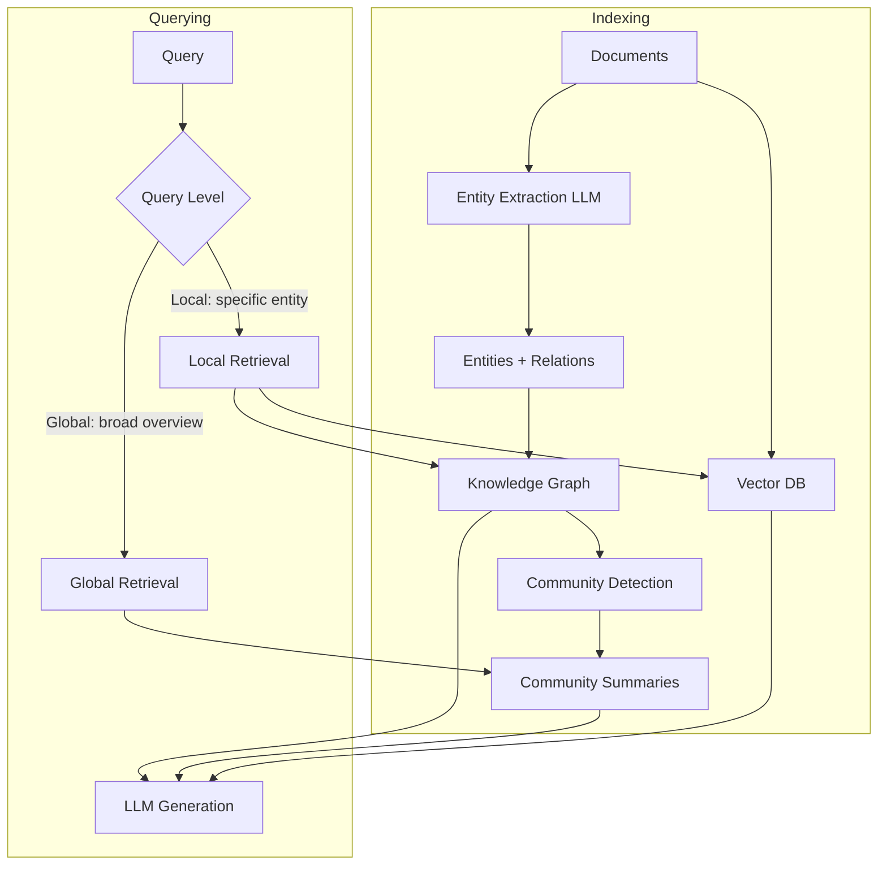

# 18. Graph RAG

## Overview

Graph RAG (GraphRAG) augments standard vector retrieval with a knowledge graph layer that encodes explicit entity relationships. For queries requiring multi-hop reasoning, relationship-aware retrieval, or community-level summarization, Graph RAG dramatically outperforms pure vector search.

---

## Why This Exists

Vector search finds semantically similar text. But it cannot answer questions that require traversing relationships:

```
"Which of our services are affected by the OpenSSL vulnerability fixed in CVE-2024-0001?"

This requires:
  1. Find: CVE-2024-0001 affects OpenSSL versions < 3.2
  2. Find: Our service X depends on openssl 3.1.4
  3. Find: Our service Y depends on openssl 3.2.1 (not affected)
  Conclusion: Service X is affected, Service Y is not

This is a GRAPH TRAVERSAL problem, not a similarity search problem.
```

---

## Core Concepts

### Knowledge Graph Structure

```
Entities (Nodes):
  CVE-2024-0001 [type: vulnerability]
  OpenSSL-3.1 [type: software_version]
  Service-X [type: service]
  
Relationships (Edges):
  CVE-2024-0001 --affects--> OpenSSL-3.1
  Service-X --depends_on--> OpenSSL-3.1
  Service-X --deployed_in--> production
```

### Graph vs. Vector Retrieval

| Capability | Vector Search | Graph RAG |
|------------|--------------|-----------|
| Semantic similarity | ✓ Excellent | ✓ (via vector nodes) |
| Multi-hop relationships | ✗ Cannot | ✓ Native |
| Entity relationships | ✗ Implicit | ✓ Explicit |
| Global summarization | ✗ Poor | ✓ Community detection |
| Structured queries | ✗ Poor | ✓ Cypher/SPARQL |

### Microsoft GraphRAG Architecture

Microsoft's GraphRAG (2024) extends this with:
1. **Entity extraction** — LLM extracts entities and relationships from documents
2. **Community detection** — Cluster entities into communities (Leiden algorithm)
3. **Community summarization** — Pre-generate summaries for each community
4. **Two-level retrieval** — Local (entity-centric) and global (community-centric)

---

## Internal Architecture



---

## Building a Knowledge Graph from Documents

```python
from openai import AsyncOpenAI
from dataclasses import dataclass, field
import json
import asyncio

@dataclass
class Entity:
    name: str
    entity_type: str
    description: str
    source_doc: str

@dataclass
class Relationship:
    source: str       # Entity name
    target: str       # Entity name
    relation: str     # Relationship type
    description: str
    weight: float = 1.0

class GraphExtractor:
    """
    Extract entities and relationships from text using an LLM.
    This is the indexing phase of Graph RAG.
    """
    
    EXTRACTION_PROMPT = """Extract entities and relationships from the text below.

Text: {text}

Extract:
1. Entities: Named things (people, places, systems, concepts, vulnerabilities, etc.)
2. Relationships: How entities relate to each other

Return JSON:
{{
  "entities": [
    {{"name": "entity_name", "type": "entity_type", "description": "brief description"}}
  ],
  "relationships": [
    {{"source": "entity1", "target": "entity2", "relation": "relationship_type", "description": "how they relate"}}
  ]
}}

Focus on factual, concrete relationships. Include only entities explicitly mentioned."""
    
    def __init__(self, client: AsyncOpenAI):
        self.client = client
    
    async def extract(self, text: str, source_doc: str = "") -> tuple[list[Entity], list[Relationship]]:
        response = await self.client.chat.completions.create(
            model="gpt-4o-mini",
            messages=[{"role": "user", "content": self.EXTRACTION_PROMPT.format(text=text)}],
            response_format={"type": "json_object"},
            temperature=0,
        )
        
        try:
            data = json.loads(response.choices[0].message.content)
            entities = [
                Entity(
                    name=e["name"],
                    entity_type=e.get("type", "unknown"),
                    description=e.get("description", ""),
                    source_doc=source_doc
                )
                for e in data.get("entities", [])
            ]
            relationships = [
                Relationship(
                    source=r["source"],
                    target=r["target"],
                    relation=r.get("relation", "related_to"),
                    description=r.get("description", "")
                )
                for r in data.get("relationships", [])
            ]
            return entities, relationships
        except (json.JSONDecodeError, KeyError):
            return [], []
    
    async def extract_from_chunks(
        self, chunks: list[str], source_docs: list[str] | None = None
    ) -> tuple[list[Entity], list[Relationship]]:
        source_docs = source_docs or ["unknown"] * len(chunks)
        
        tasks = [
            self.extract(chunk, source_doc)
            for chunk, source_doc in zip(chunks, source_docs)
        ]
        results = await asyncio.gather(*tasks)
        
        all_entities = []
        all_relationships = []
        for entities, relationships in results:
            all_entities.extend(entities)
            all_relationships.extend(relationships)
        
        return all_entities, all_relationships
```

---

## Graph Storage and Querying

```python
# Using NetworkX for in-memory graphs (production: Neo4j, Memgraph, or AWS Neptune)
import networkx as nx
from typing import Optional

class KnowledgeGraph:
    """In-memory knowledge graph using NetworkX."""
    
    def __init__(self):
        self.graph = nx.MultiDiGraph()  # Directed multigraph
        self.entity_texts: dict[str, str] = {}  # Entity name → description
    
    def add_entity(self, entity: Entity) -> None:
        self.graph.add_node(
            entity.name,
            entity_type=entity.entity_type,
            description=entity.description,
            source_doc=entity.source_doc
        )
        self.entity_texts[entity.name] = entity.description
    
    def add_relationship(self, rel: Relationship) -> None:
        # Add nodes if they don't exist
        if rel.source not in self.graph:
            self.graph.add_node(rel.source)
        if rel.target not in self.graph:
            self.graph.add_node(rel.target)
        
        self.graph.add_edge(
            rel.source, rel.target,
            relation=rel.relation,
            description=rel.description,
            weight=rel.weight
        )
    
    def get_entity_context(self, entity_name: str, depth: int = 2) -> dict:
        """Get entity and its neighborhood up to depth hops."""
        if entity_name not in self.graph:
            return {"entity": entity_name, "neighbors": [], "relationships": []}
        
        # BFS up to depth
        subgraph_nodes = {entity_name}
        frontier = {entity_name}
        
        for _ in range(depth):
            new_frontier = set()
            for node in frontier:
                successors = set(self.graph.successors(node))
                predecessors = set(self.graph.predecessors(node))
                new_frontier |= (successors | predecessors) - subgraph_nodes
            subgraph_nodes |= new_frontier
            frontier = new_frontier
        
        subgraph = self.graph.subgraph(subgraph_nodes)
        
        relationships = []
        for u, v, data in subgraph.edges(data=True):
            relationships.append({
                "from": u,
                "to": v,
                "relation": data.get("relation", "related_to"),
                "description": data.get("description", "")
            })
        
        return {
            "entity": entity_name,
            "attributes": dict(self.graph.nodes.get(entity_name, {})),
            "neighbors": list(subgraph_nodes - {entity_name}),
            "relationships": relationships,
        }
    
    def find_path(self, source: str, target: str) -> list[str]:
        """Find relationship path between two entities."""
        try:
            return nx.shortest_path(self.graph, source, target)
        except (nx.NetworkXNoPath, nx.NodeNotFound):
            return []
    
    def get_neighbors_by_relation(self, entity: str, relation: str) -> list[str]:
        """Get all entities connected by a specific relationship type."""
        neighbors = []
        for u, v, data in self.graph.edges(entity, data=True):
            if data.get("relation") == relation:
                neighbors.append(v)
        return neighbors
    
    def get_connected_entities(self, entity_type: str) -> list[str]:
        """Get all entities of a given type."""
        return [
            n for n, data in self.graph.nodes(data=True)
            if data.get("entity_type") == entity_type
        ]
```

---

## Graph RAG Retriever

```python
from sentence_transformers import SentenceTransformer
import numpy as np

class GraphRAGRetriever:
    """
    Hybrid retrieval combining:
    1. Entity-centric graph traversal (for specific entity queries)
    2. Vector similarity (for semantic search)
    3. Path-based reasoning (for multi-hop queries)
    """
    
    def __init__(
        self,
        knowledge_graph: KnowledgeGraph,
        vector_store,
        embedder,
        entity_embedder_model: str = "BAAI/bge-small-en-v1.5",
    ):
        self.kg = knowledge_graph
        self.vector_store = vector_store
        self.embedder = embedder
        self.entity_model = SentenceTransformer(entity_embedder_model)
        
        # Build entity embedding index
        self._entity_names = list(self.kg.entity_texts.keys())
        if self._entity_names:
            self._entity_embeddings = self.entity_model.encode(
                self._entity_names, normalize_embeddings=True
            )
        else:
            self._entity_embeddings = None
    
    def find_relevant_entities(self, query: str, k: int = 5) -> list[str]:
        """Find entities most relevant to the query using embedding similarity."""
        if self._entity_embeddings is None:
            return []
        
        q_emb = self.entity_model.encode([query], normalize_embeddings=True)[0]
        scores = self._entity_embeddings @ q_emb
        top_k = np.argsort(scores)[::-1][:k]
        return [self._entity_names[i] for i in top_k]
    
    async def retrieve(self, query: str, k: int = 5) -> dict:
        """
        Multi-mode retrieval:
        1. Find relevant entities
        2. Get their graph neighborhoods
        3. Get vector search results
        4. Combine for LLM context
        """
        # 1. Entity-centric retrieval
        relevant_entities = self.find_relevant_entities(query, k=3)
        
        graph_contexts = []
        for entity in relevant_entities:
            context = self.kg.get_entity_context(entity, depth=2)
            graph_contexts.append(self._format_graph_context(context))
        
        # 2. Vector search for additional semantic coverage
        vector_results = await self.vector_store.search(
            query_vector=await self.embedder.embed_single(query),
            limit=k,
        )
        vector_texts = [r.payload.get("text", "") for r in vector_results]
        
        return {
            "graph_contexts": graph_contexts,
            "vector_contexts": vector_texts,
            "relevant_entities": relevant_entities,
        }
    
    def _format_graph_context(self, context: dict) -> str:
        """Format graph neighborhood as readable text for LLM."""
        lines = [f"Entity: {context['entity']}"]
        
        attrs = context.get("attributes", {})
        if attrs.get("description"):
            lines.append(f"Description: {attrs['description']}")
        
        if context.get("relationships"):
            lines.append("Relationships:")
            for rel in context["relationships"][:10]:
                lines.append(f"  - {rel['from']} --[{rel['relation']}]--> {rel['to']}: {rel['description']}")
        
        return "\n".join(lines)
```

---

## Community Summarization (Microsoft GraphRAG Style)

```python
import networkx as nx

class CommunityDetector:
    """
    Detect communities in the knowledge graph using Louvain algorithm.
    Generate summaries for each community for global query answering.
    """
    
    def __init__(self, knowledge_graph: KnowledgeGraph, client: AsyncOpenAI):
        self.kg = knowledge_graph
        self.client = client
    
    def detect_communities(self) -> dict[int, list[str]]:
        """Detect communities and return community_id → [entity_names]."""
        undirected = self.kg.graph.to_undirected()
        
        # Louvain community detection
        try:
            communities = nx.community.louvain_communities(undirected, seed=42)
            return {i: list(community) for i, community in enumerate(communities)}
        except Exception:
            # Fallback: simple connected components
            components = nx.connected_components(undirected)
            return {i: list(comp) for i, comp in enumerate(components)}
    
    async def summarize_community(self, community_entities: list[str]) -> str:
        """Generate a summary for a community of entities."""
        # Build community context
        context_parts = []
        for entity in community_entities[:20]:  # Limit for token budget
            ctx = self.kg.get_entity_context(entity, depth=1)
            if ctx["relationships"]:
                for rel in ctx["relationships"][:3]:
                    context_parts.append(
                        f"{rel['from']} {rel['relation']} {rel['to']}: {rel['description']}"
                    )
        
        context = "\n".join(context_parts[:50])
        
        response = await self.client.chat.completions.create(
            model="gpt-4o-mini",
            messages=[{
                "role": "user",
                "content": f"Summarize the following related entities and their relationships in 2-3 sentences:\n\n{context}"
            }],
            temperature=0,
            max_tokens=300,
        )
        return response.choices[0].message.content
    
    async def build_community_summaries(self) -> dict[int, str]:
        """Build summaries for all detected communities."""
        communities = self.detect_communities()
        
        tasks = {
            community_id: self.summarize_community(entities)
            for community_id, entities in communities.items()
        }
        
        results = await asyncio.gather(*tasks.values())
        return dict(zip(tasks.keys(), results))
```

---

## When To Use Graph RAG

| Use Case | Why Graph RAG |
|----------|--------------|
| Dependency analysis | "What services depend on library X?" |
| Impact analysis | "What breaks if we change component Y?" |
| Multi-hop relationships | "Find vulnerabilities affecting our stack" |
| Organizational knowledge | "Who is responsible for system Z?" |
| Knowledge synthesis | "Summarize everything about entity X" |
| Supply chain analysis | "Trace the path from raw material to product" |

---

## When Not To Use

- **Simple Q&A** over unstructured text → Standard vector RAG is simpler
- **Small knowledge bases** → Graph overhead not justified for < 10K documents
- **No clear entity relationships** → If your domain doesn't have rich relationships, graph adds no value
- **Real-time ingestion** → Graph extraction is slow (LLM-based); not for streaming data

---

## Common Mistakes

1. **Building the graph from unclean text** — Garbage entities from noisy documents
2. **Not deduplicating entities** — "OpenSSL", "openssl", "Open SSL" treated as different entities
3. **Over-extracting relationships** — Every sentence creates edges; graph becomes too dense
4. **Not combining with vector search** — Graph alone misses semantic similarity
5. **Single-node queries** — For entities with few relationships, vector search is better

---

## Production Architecture with Neo4j

```python
# Production: Use Neo4j for large-scale graph storage
# from neo4j import AsyncGraphDatabase

# Example Cypher queries for production:
CYPHER_EXAMPLES = {
    "find_affected_services": """
        MATCH (vuln:Vulnerability)-[:AFFECTS]->(lib:Library)<-[:DEPENDS_ON]-(service:Service)
        WHERE vuln.id = $cve_id
        RETURN service.name, lib.version
    """,
    
    "shortest_path": """
        MATCH path = shortestPath(
            (a:Entity {name: $source})-[*..5]-(b:Entity {name: $target})
        )
        RETURN path
    """,
    
    "community_members": """
        MATCH (e:Entity)
        WHERE e.community_id = $community_id
        RETURN e.name, e.type, e.description
        LIMIT 50
    """
}
```

---

## Related Concepts

- [01. RAG Fundamentals](01-rag-fundamentals.md)
- [19. Agentic RAG](19-agentic-rag.md)
- [20. Multi-Hop Retrieval](20-multi-hop-retrieval.md)

---

## Interview Questions

**Q: When does Graph RAG outperform standard vector RAG?**  
A: Graph RAG outperforms when: (1) queries require multi-hop reasoning (A affects B which uses C), (2) entity relationships are as important as semantic similarity, (3) you need global summarization across the entire corpus (not just top-K chunks). For simple Q&A over unstructured text, vector RAG is simpler and often better.

**Q: How does Microsoft's GraphRAG differ from simple graph retrieval?**  
A: Microsoft GraphRAG adds community detection and pre-generated community summaries. This enables global query answering ("summarize all themes in this corpus") which standard local retrieval cannot do. The two-level architecture (local entity retrieval + global community retrieval) handles both specific and broad queries.

---

## References

- Edge, D. et al. (2024). [From Local to Global: A Graph RAG Approach to Query-Focused Summarization](https://arxiv.org/abs/2404.16130)
- [Microsoft GraphRAG GitHub](https://github.com/microsoft/graphrag)
- [Neo4j GraphRAG Documentation](https://neo4j.com/docs/graph-data-science/current/rag/)

---

## Summary

Graph RAG enhances vector retrieval with explicit entity-relationship knowledge. It excels at multi-hop reasoning, impact/dependency analysis, and global summarization. The pipeline: extract entities and relationships from documents → build knowledge graph → detect communities → generate summaries → at query time, find relevant entities → traverse graph → combine graph context with vector results → generate answer. For entity-rich domains (security, supply chain, software dependencies), Graph RAG is transformative. For simple Q&A, stick with standard vector RAG.
