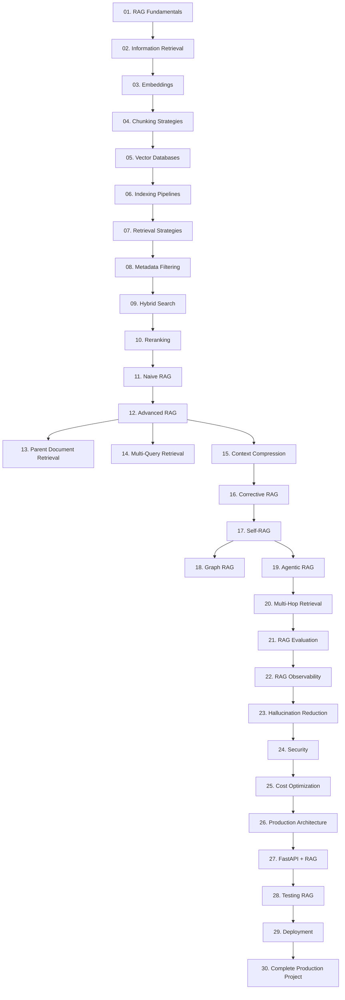

# RAG Mastery Knowledge Base

> **Audience**: Experienced backend developers who want deep, production-grade RAG knowledge  
> **Approach**: Concepts first, architecture second, code third  
> **Goal**: Go from "I know what RAG is" to "I can design and ship enterprise RAG systems"

---

## What Is This?

This knowledge base covers Retrieval-Augmented Generation (RAG) from first principles to production deployment. Every topic follows the same structure so you can jump in at any level and build mental models that transfer across frameworks.

---

## Learning Roadmap



---

## Study Order by Goal

### Goal: Understand RAG (1–2 days)
1. [01. RAG Fundamentals](01-rag-fundamentals.md)
2. [02. Information Retrieval Fundamentals](02-information-retrieval.md)
3. [03. Embeddings](03-embeddings.md)
4. [11. Naive RAG](11-naive-rag.md)

### Goal: Build a Basic RAG System (3–5 days)
5. [04. Chunking Strategies](04-chunking-strategies.md)
6. [05. Vector Databases](05-vector-databases.md)
7. [06. Indexing Pipelines](06-indexing-pipelines.md)
8. [07. Retrieval Strategies](07-retrieval-strategies.md)
9. [27. FastAPI + RAG](./27-fastapi-rag.md)

### Goal: Build Advanced RAG (1–2 weeks)
10. [08. Metadata Filtering](08-metadata-filtering.md)
11. [09. Hybrid Search](09-hybrid-search.md)
12. [10. Reranking](10-reranking.md)
13. [12. Advanced RAG](12-advanced-rag.md)
14. [13. Parent Document Retrieval](13-parent-document-retrieval.md)
15. [14. Multi-Query Retrieval](14-multi-query-retrieval.md)
16. [15. Context Compression](15-context-compression.md)

### Goal: Master RAG Architectures (2–3 weeks)
17. [16. Corrective RAG](16-corrective-rag.md)
18. [17. Self-RAG](17-self-rag.md)
19. [18. Graph RAG](18-graph-rag.md)
20. [19. Agentic RAG](19-agentic-rag.md)
21. [20. Multi-Hop Retrieval](20-multi-hop-retrieval.md)

### Goal: Production Readiness (1 week)
22. [21. RAG Evaluation](21-rag-evaluation.md)
23. [22. RAG Observability](./22-rag-observability.md)
24. [23. Hallucination Reduction](./23-hallucination-reduction.md)
25. [24. Security](./24-security.md)
26. [25. Cost Optimization](./25-cost-optimization.md)

### Goal: Ship to Production (1 week)
27. [26. Production Architecture](./26-production-architecture.md)
28. [28. Testing RAG Systems](./28-testing-rag.md)
29. [29. Deployment](./29-deployment.md)
30. [30. Complete Production Project](./30-complete-production-project.md)

---

## Topic Index

| # | Topic | Level | Time |
|---|-------|-------|------|
| 01 | [RAG Fundamentals](01-rag-fundamentals.md) | Beginner | 1h |
| 02 | [Information Retrieval Fundamentals](02-information-retrieval.md) | Beginner | 2h |
| 03 | [Embeddings](03-embeddings.md) | Beginner-Mid | 2h |
| 04 | [Chunking Strategies](04-chunking-strategies.md) | Mid | 2h |
| 05 | [Vector Databases](05-vector-databases.md) | Mid | 3h |
| 06 | [Indexing Pipelines](06-indexing-pipelines.md) | Mid | 2h |
| 07 | [Retrieval Strategies](07-retrieval-strategies.md) | Mid | 2h |
| 08 | [Metadata Filtering](08-metadata-filtering.md) | Mid | 1h |
| 09 | [Hybrid Search](09-hybrid-search.md) | Mid-Adv | 2h |
| 10 | [Reranking](10-reranking.md) | Mid-Adv | 2h |
| 11 | [Naive RAG](11-naive-rag.md) | Mid | 1h |
| 12 | [Advanced RAG](12-advanced-rag.md) | Advanced | 3h |
| 13 | [Parent Document Retrieval](13-parent-document-retrieval.md) | Advanced | 2h |
| 14 | [Multi-Query Retrieval](14-multi-query-retrieval.md) | Advanced | 2h |
| 15 | [Context Compression](15-context-compression.md) | Advanced | 2h |
| 16 | [Corrective RAG](16-corrective-rag.md) | Advanced | 2h |
| 17 | [Self-RAG](17-self-rag.md) | Advanced | 2h |
| 18 | [Graph RAG](18-graph-rag.md) | Advanced | 3h |
| 19 | [Agentic RAG](19-agentic-rag.md) | Expert | 3h |
| 20 | [Multi-Hop Retrieval](20-multi-hop-retrieval.md) | Expert | 2h |
| 21 | [RAG Evaluation](21-rag-evaluation.md) | Mid-Adv | 3h |
| 22 | [RAG Observability](./22-rag-observability.md) | Mid-Adv | 2h |
| 23 | [Hallucination Reduction](./23-hallucination-reduction.md) | Advanced | 2h |
| 24 | [Security](./24-security.md) | Mid-Adv | 2h |
| 25 | [Cost Optimization](./25-cost-optimization.md) | Mid-Adv | 2h |
| 26 | [Production Architecture](./26-production-architecture.md) | Expert | 4h |
| 27 | [FastAPI + RAG](./27-fastapi-rag.md) | Mid-Adv | 3h |
| 28 | [Testing RAG Systems](./28-testing-rag.md) | Mid-Adv | 2h |
| 29 | [Deployment](./29-deployment.md) | Mid-Adv | 3h |
| 30 | [Complete Production Project](./30-complete-production-project.md) | Expert | 8h |

---

## Dependency Graph

```
Fundamentals Layer:
  01 → 02 → 03 → 04 → 05 → 06

Retrieval Layer (requires Fundamentals):
  07 → 08 → 09 → 10

RAG Architecture Layer (requires Retrieval):
  11 → 12 → 13
            12 → 14
            12 → 15

Advanced Architectures (requires Advanced RAG):
  15 → 16 → 17
  17 → 18
  17 → 19 → 20

Production Layer (requires any RAG architecture):
  21 ← 22 ← 23 ← 24 ← 25

Deployment Layer (requires Production Layer):
  26 → 27 → 28 → 29 → 30
```

---

## Common Mistakes by Experience Level

### Junior Developers
- Chunking too small → fragmented context, poor answers
- Not cleaning documents before embedding
- Using cosine similarity as the only relevance signal
- Ignoring metadata entirely

### Mid-Level Developers
- Using only semantic search (missing keyword matches)
- Not reranking retrieved results before sending to LLM
- Embedding the full question without preprocessing
- Forgetting to handle empty retrieval results

### Senior Developers
- Over-engineering the retrieval pipeline for simple use cases
- Not measuring retrieval quality separately from generation quality
- Skipping evaluation frameworks because "it seems to work"
- Treating RAG as stateless when the use case needs memory

### Common Architecture Mistakes
- Single-stage retrieval for complex multi-hop questions
- No fallback strategy when retrieval confidence is low
- Missing tenant isolation in multi-user systems
- Storing embeddings and source documents in separate systems without linking

---

## Production Readiness Checklist

### Indexing
- [ ] Documents are cleaned and normalized before embedding
- [ ] Chunk size is tuned for your retrieval model
- [ ] Metadata schema is designed and consistent
- [ ] Incremental updates work without full re-indexing
- [ ] Embedding model version is pinned and documented

### Retrieval
- [ ] Hybrid search (dense + sparse) is implemented
- [ ] Reranking is applied after initial retrieval
- [ ] Metadata filtering is applied before vector search
- [ ] Top-K is tuned (not defaulted to 4)
- [ ] Empty retrieval results are handled gracefully

### Generation
- [ ] System prompt prevents hallucination on unknown topics
- [ ] Citations or source references are included in responses
- [ ] Context window overflow is handled
- [ ] Temperature and other sampling parameters are configured

### Evaluation
- [ ] Retrieval metrics: Precision@K, Recall@K, MRR, NDCG
- [ ] Generation metrics: Faithfulness, Relevance, Answer Correctness
- [ ] Evaluation dataset exists and is version-controlled
- [ ] Regression tests run on every pipeline change

### Observability
- [ ] Traces capture: query, retrieved chunks, prompt, response
- [ ] Latency breakdown by stage (embed, retrieve, rerank, generate)
- [ ] Error rates tracked per stage
- [ ] Retrieval quality dashboards exist

### Security
- [ ] Prompt injection mitigations in place
- [ ] Tenant data isolation verified
- [ ] PII is not stored in vector databases
- [ ] Access control checked before retrieval

### Operations
- [ ] Deployment is reproducible (Docker/K8s)
- [ ] Model can be swapped without code changes
- [ ] Index can be rebuilt from source of truth
- [ ] Rollback procedure is documented

---

## RAG Mastery Checklist

### Fundamentals Mastery
- [ ] Can explain why RAG exists without mentioning "hallucinations" as the only reason
- [ ] Can describe the difference between parametric and non-parametric knowledge
- [ ] Understands context window implications on retrieval design
- [ ] Can explain why embedding model choice affects chunking strategy

### Architecture Mastery
- [ ] Can design a naive RAG system from scratch
- [ ] Can identify when naive RAG will fail and why
- [ ] Can select the appropriate advanced RAG variant for a use case
- [ ] Can design a multi-tenant RAG system with isolation
- [ ] Can explain Graph RAG and when it beats vector RAG

### Engineering Mastery
- [ ] Has built and deployed a production RAG API
- [ ] Has implemented hybrid search (BM25 + dense)
- [ ] Has implemented a reranking stage
- [ ] Has built an evaluation pipeline with at least 3 metrics
- [ ] Has instrumented a RAG system with end-to-end tracing

### Advanced Mastery
- [ ] Has designed a Corrective RAG or Self-RAG system
- [ ] Has implemented multi-hop retrieval for complex questions
- [ ] Has optimized a RAG system for cost and latency
- [ ] Has handled prompt injection attacks in a RAG system
- [ ] Has built an agentic RAG system with tool use

---

## Key Mental Models

### RAG = Retrieval + Augmentation + Generation
The retrieval and augmentation steps are where 80% of the engineering work lives. Generation quality is bounded by retrieval quality.

### The Garbage In, Garbage Out Problem
Bad chunking → bad embeddings → bad retrieval → bad answers. Fix the pipeline, not the prompt.

### Retrieval is a Search Problem
Before thinking "RAG," think "search." Good IR fundamentals make you a better RAG engineer.

### The Context Window is a Budget
Every retrieved chunk costs tokens. Design retrieval to maximize signal-to-noise ratio in the context window.

### Evaluation is Not Optional
A RAG system without evaluation metrics is unmaintainable. You cannot improve what you do not measure.

---

## References

- Lewis et al. (2020). Retrieval-Augmented Generation for Knowledge-Intensive NLP Tasks. [arXiv:2005.11401](https://arxiv.org/abs/2005.11401)
- Gao et al. (2023). Retrieval-Augmented Generation for Large Language Models: A Survey. [arXiv:2312.10997](https://arxiv.org/abs/2312.10997)
- Asai et al. (2023). Self-RAG: Learning to Retrieve, Generate, and Critique through Self-Reflection. [arXiv:2310.11511](https://arxiv.org/abs/2310.11511)
- Edge et al. (2024). From Local to Global: A Graph RAG Approach to Query-Focused Summarization. [arXiv:2404.16130](https://arxiv.org/abs/2404.16130)
- Shi et al. (2023). REPLUG: Retrieval-Augmented Black-Box Language Models. [arXiv:2301.12652](https://arxiv.org/abs/2301.12652)
- [LangChain RAG Documentation](https://python.langchain.com/docs/use_cases/question_answering/)
- [LlamaIndex Documentation](https://docs.llamaindex.ai/)
- [RAGAS Evaluation Framework](https://docs.ragas.io/)
